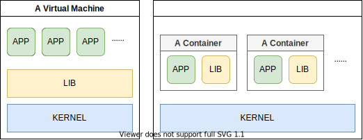

`Docker是基于GO开发的一种容器化技术（或虚拟化技术）`

Docker可以在开发-测试-部署时保证环境一致。这解决了很多奇怪的问题。开发人员在打包时不但将软件本身打包，还将整个运行环境打包。例如，你希望在Windows上直接运行一个以Linux为开发环境的软件，使用Docker可以解决平台和环境的问题。

Docker能够将不同环境进行隔离，与虚拟机技术不同，Docker并不会将庞大的运行环境全部打包，而是打包需要被记录的更改。例如，安装ubuntu并为系统添加一个环境变量，则Docker并不打包整个ubuntu，而是只打包你添加的环境变量。这使Docker很轻。

在历史上，Docker的产生是一家叫做dotClould的公司的几个年轻人将自己开发的容器化技术进行了规范和命名，称之为Docker。Docker刚刚诞生时并没能给开发者带来多少经济利益。后来，Docker在2013年开源。开源的Docker成为了开发者们喜爱的开发工具，并且被社区维护，日益强壮。

:::caution
虚拟机也属于虚拟化技术，但Docker并不是传统意义上的虚拟机，容器化技术并不是完全虚拟一整个操作系统。

上图简要说明了两者的区别。相较于左侧的虚拟机，容器化技术能够将不同的应用<strong>隔离</strong>在不同的运行环境，同时共用操作系统内核。也就是说，容器不包括内核。容器直接运行在宿主机内核。从部署上讲，Docker比虚拟机性能利用率更好。
:::

由于不同应用运行在隔离的环境中，不会产生动态链接库版本冲突等难以解决的问题，在部署上，运维也不需要查阅厚厚的安装和维护文档。

Docker具备以下优点：

- 应用快速交付部署  
    应用一键打包发布。
- 更简单的系统运维  
    打包为容器后，开发和部署环境完全一致，省去了环境配置的流程和很多兼容性问题。
- 更高效的系统资源利用  
    Docker是内核级别的虚拟化技术，在一台物理机上可以运行多个容器实例。

谁能不心动呢？