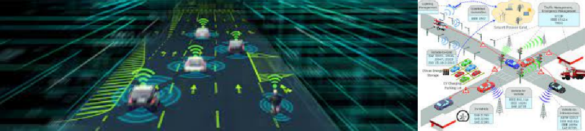
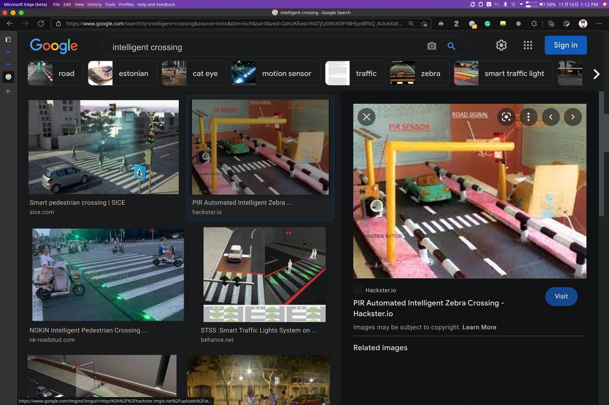
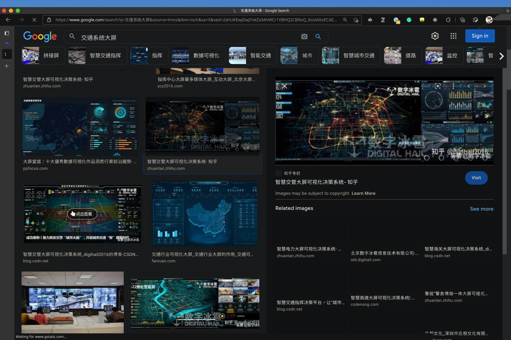

:::note
**问题说明**：
目前结合新兴人工智能、大数据、5G 技术的智能交通解决方案已经成为研究和工程应用的热点。但目前的技术方案无法精准满足个人出行需求,无法实现可控出行。如何把创新性的先进的交通流预测技术实现并应用，是急需解决的痛点问题。
:::

:::caution

本赛题更倾向于道路智能，而不是车辆智能。车辆智能是A02这样的赛题。

:::

### 用户期望

（1）使用**物联网**+**视觉分析**和机器学习等技术实现**智能信号灯控制**；  
（2）实现控制**交通信号灯疏导**算法；  
（3）能够实现自动**识别汽车**；  
（4）能够实现对违法车辆进行分析和预警；  
（5）能够实现智能监控中心大**屏数据可视化**，并实现**小屏（移动端）控大屏**。  

---

例如，在网络上搜索“Intellgent corssing”（智能斑马线），就会有许多相关的现有成果，甚至能找到一些简单的模型。不过，该赛题更加复杂。

---

### 开发说明

（1）利用物联网、智能分析技术、数据可视化技术，实现智能交通全息的可视化感知，提升运营管理水平、提高事件响应效率；  
（2）使用物联网技术，并制作自适应智能交通信号灯；  
（3）能够**获取车辆和行人交通数据**，提供实时交通反馈和报警；  
（4）能够**跟踪**指定车辆和行人； 

:::caution
在单镜头内实现跟踪YOLO+Deepsort即可。而在多镜头内实现跟踪需要Re-ID。
:::

（5）能够实现智能**可视化监控**中心；  
（6）实现**根据路况实现智能化导流**。

:::note
智能导流可以很简单也可以很复杂。简单的例如：十字路口某个通行方向上一直没有车，就一直红灯。这也算一种智能。复杂的例如：连续两个十字路口，使用拓扑优化使所有车辆等待红灯的时间总和最小。
:::
:::caution
请注意，红绿灯数量越多，调度的方法越复杂。可以先模拟简单的情况达到赛题要求，再慢慢扩展。
:::

---

### 技术要求

（1）要求该自制物联网智能交通信号灯；  
（2）要求有后台指挥控制系统管理端和数据监控可视化大屏监视端；  
（3）能够实现小屏控大屏；  
（4）能够运用大数据、机器学习、视觉分析领域的相关知识实现；  
（5）_可使用第三方 AI 相关接口_，实现智能识别车辆和行人，要求识别准确，且能识别中速车辆。至少能识别车辆；  

:::caution
使用第三方接口能节约开发时间，但是存在以下问题：
1. 难以找到非常合适的接口。  
2. 接口通过网络相应，难以满足具有高实时性要求的功能。
:::

（6）能够识别非法车辆，包括漏检、套牌、报废车辆等，并能够对非法车辆报警提示；  

:::note

这里说的非法车辆里面除了漏检之外都很难直接实现。漏检可以通过检测车窗上是否有年检标来实现（注意数据集能不能找到的问题，实在不行就用特征匹配器）。真正实现套牌等情况的检测可能需要接入公安的系统，比如判断车身与驾驶证是否相符。这难以实现，但可以自行实现Demo，只对特定的模型车进行判断。在比赛答辩的时候也比较好解释。

对于难以完成的非法车辆检测，可以偷换一下概念，将“非法”改为“违规”。可直接通过检测车辆的朝向实现。应该也是能拿到赛题一部分分数。

:::

（7）能够根据智能算法实现信号灯智能自动化控制；  
（8）**不限于上面功能指标描述，可自行扩展其他功能。**  

---

### 简单的想法

边缘计算的思路：

例如，在上述结构中，交通灯等硬件设施由嵌入式控制器（例如，STM\*\*\*、树莓派等）实现控制，视觉算法搭载于边缘计算终端。来自终端的信息可通过MQTT（或任何其他允许加密的广播系统或协议）将信息发送至服务器或直接显示在大屏。而画面等信息可以通过各种TCP协议（例如：socket）发送至大屏显示。

:::note

可以理解为，每一个摄像机配一块计算板，在终端实现计算，减轻服务器压力。大屏上只显示信息，不做任何处理。

:::

上图：大屏的示例。

:::note
大屏可以东拼西凑或使用现成产品。例如：Apache Echarts。阿里、百度等公司也提供现成的大屏产品。同时，你可以在开源社区找到帮助。
:::

---

中心计算的思路：

---

### 关于组队的想法

全队一共五个人。

**对大一的同学**：嵌入式、前端、后端（主要是维护）、视觉x2。  

:::caution
Re-ID对大一的同学来说不是很轻松。同时考虑到可能还需要其他的视觉算法，所以推荐大一的找两个人。
:::

**对大二的同学**：全栈、视觉各一个，嵌入式方面用树莓派解决。剩下三个空位自由分配。

技术栈上，由于要求移动端控制大屏，可以考虑找安卓。这里推荐的方法是前端解决大屏和移动端，大屏用React，移动端用React Native。

---

### 困难

