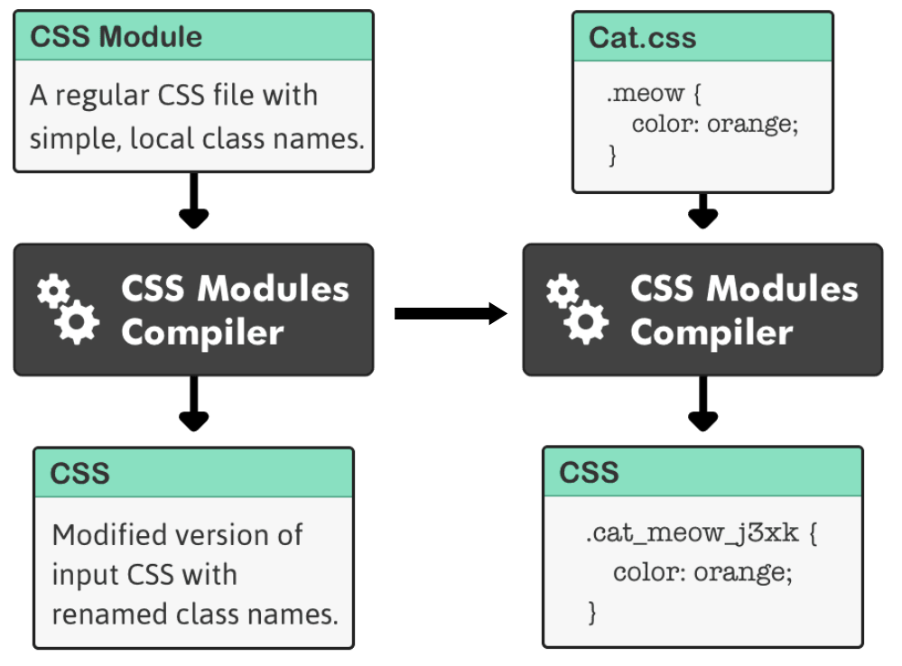
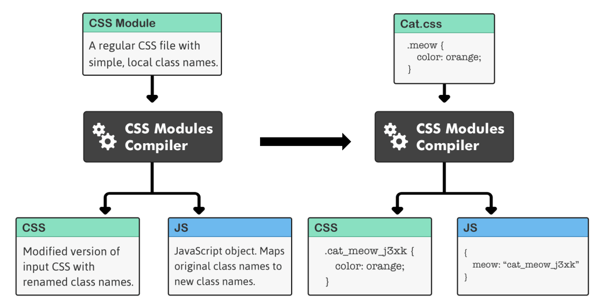

import Tabs from '@theme/Tabs';
import TabItem from '@theme/TabItem';

## 简述

有时想给一个组件加一个style，结果之前写className的时候没弄好导致这个style出现在了一堆无关组件上，结果就得去疯狂refactor,或者到处加`!important`，或者通过什么其他肮脏的手段解决。之前光知道后缀为`.module.css`代替`.css`能防止手忙脚乱，但是一直不知道它有个专门的名字。

> A CSS Module is a CSS file in which all class names and animation names are scoped locally by default.

使用 css modlues 能在javascript中像变量名那样使用css的className。

:::warning
css module 文件也只不过是一个 css 文件而已。仅当你使用一个 CSS Module Compiler 的时候，它才会被当作 CSS Module。
:::



例如，在上例中，CSS Module对应的文件被输入进Compiler，产生一个普通的CSS文件。左侧为该过程的抽象描述，右侧为具体举例。

在这个例子中， `meow` 类被重名名为 `cat_meow_j3xk` 。其中：

- `cat` 表示的是文件名
- `meow` 表示的是原来的类名
- `j3xk` 是一个随机哈希值

__由于CSS对浏览器并没有Local scope这种概念__，所以如果需要在产生的作用于全局的CSS文件中产生类似`Local`作用域的概念，就需要通过这种命名方式。CSS Module 编译器通过帮你进行这些重名名产生局部作用域的效果。

同时，CSS Module编译器还会产生已经替换好CSS类名的javascript对象，和你最初写的代码一一对应。所以上述过程的实际抽象描述应该是：




## 配合React使用CSS Module

在React中，css文件被当作对象使用。直接调用你需要的css类，CSS Module Compiler会在编译时帮你做好剩下的工作。

<Tabs groupId="intro-css-module">
  <TabItem value="react code" default>

  ```typescript
  import React, { useState } from 'react';
  import type from "./type.css";

  function Example() {
    return (
      <h1 class="${type.display}">
        This is a heading
      </h1>
    );
  }
  ```
  
  </TabItem>
  <TabItem value="type.css">

  ```css
  .serif-font {
    font-family: Georgia, serif;
  }
  
  .display {
    composes: serif-font;
    font-size: 30px;
    line-height: 35px;
  }
  ```

  </TabItem>
</Tabs> 