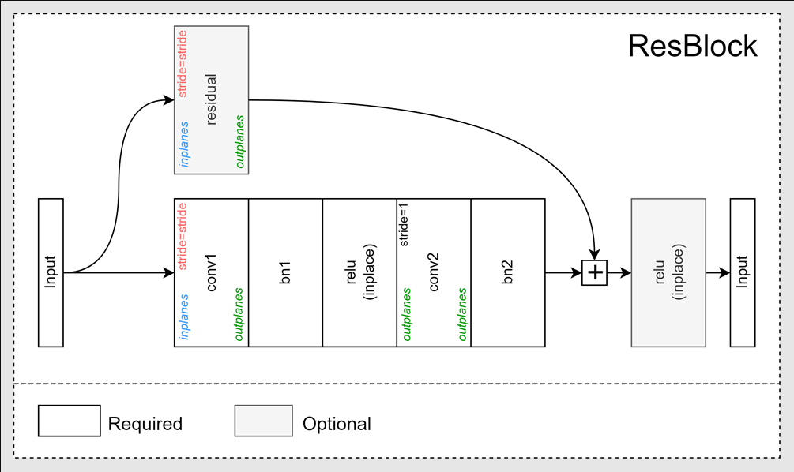

ResNet 算得上是超经典的backbone了，其网络提出了残差结构，可有效缓解随网络层数的加深而导致的梯度消失和梯度爆炸现象。结构和设计在[这里](https://ml.akasaki.space/ch2p2/[11]ResNet)有讨论。这里主要尝试一下复现。ResNet的常见形式有：

|Name|Top-1 error|Top-5 error|
|:---:|:---:|:---:|
|ResNet-18 |30.43|10.76|
|ResNet-34 |26.73|8.74|
|ResNet-50 |24.01|7.02|
|ResNet-101|22.44|6.21|
|ResNet-152|22.16|6.16|

除了上述常见形式，也有将channel数减半的half形式，以及使用膨胀卷积的形式等。但是每次写的时候都要重新写一份或者重新找一份很麻烦。干脆自己封装一个可以调整结构的版本。初步设想是这样的：



<!--truncate-->

为了方便调整结构，封装的时候参数也多给一些，最后封装成了这样：

```python
class ResBlock(nn.Module):
    def __init__(
        self,
        inplanes,
        outplanes,
        kernel_size=3,
        stride=1,
        padding=True,
        residual=False,
        spatial_separable=False,
        dilation=1,
        depthwise=False,
        pool_on_residual_downsample=False,
        bn_momentum=0.1,
        skip_last_relu=False,
    ):
        """ResBlock

        Args:
            inplanes (int): num of channel input
            outplanes (int): num of channel output
            kernel_size (int, optional): kernel size. Defaults to 3.
            stride (int, optional): stride for downsampling layer. Defaults to 1.
            padding (bool, optional): decide if use padding. Defaults to True.
            residual (bool, optional): wether use residual. Defaults to False.
            spatial_separable (bool, optional): set spatial separable for non-downsamping layers. Defaults to False.
            dilation (int, optional): dilation rate. Defaults to 1.
            depthwise (bool, optional): wether to use depthwise convolution. Defaults to False.
            pool_on_residual_downsample (bool, optional): 'maxpool' or 'averagepool' if you want to use pooling instead of conv2d on residual path. Defaults to False.
            bn_momentum (float, optional): momentum of batch norms. Defaults to 0.1.
            skip_last_relu (bool, optional): wether to skip the last relu. Defaults to False.
        """
        super(ResBlock, self).__init__()
        residual_padding_size = kernel_size // 2 if padding else 0
        self.conv1 = ConvNxN(
            inplanes=inplanes,
            outplanes=outplanes,
            kernel_size=kernel_size,
            stride=stride,
            padding=padding,
            dilation=dilation,
            depthwise=depthwise,
        )
        self.bn1 = nn.BatchNorm2d(num_features=outplanes, momentum=bn_momentum)
        self.relu_inplace = nn.ReLU(inplace=True)
        if not spatial_separable:
            self.conv2 = ConvNxN(
                inplanes=outplanes,
                outplanes=outplanes,
                kernel_size=kernel_size,
                stride=1,
                padding=padding,
                dilation=dilation,
                depthwise=depthwise,
            )
        else:
            self.conv2 = SpatialSeparableConvNxN(
                planes=outplanes,
                kernel_size=kernel_size,
                dilation=dilation,
                depthwise=depthwise,
            )
        self.bn2 = nn.BatchNorm2d(num_features=outplanes, momentum=bn_momentum)
        self.residual = None
        if residual:
            if pool_on_residual_downsample:
                assert inplanes == outplanes
                assert pool_on_residual_downsample in ["maxpool", "averagepool"]
                if pool_on_residual_downsample == "maxpool":
                    self.residual = nn.MaxPool2d(
                        kernel_size=kernel_size,
                        stride=stride,
                        padding=residual_padding_size,
                    )
                elif pool_on_residual_downsample == "averagepool":
                    self.residual = nn.AvgPool2d(
                        kernel_size=kernel_size,
                        stride=stride,
                        padding=residual_padding_size,
                    )
            else:
                self.residual = nn.Sequential(
                    ConvNxN(
                        inplanes=inplanes,
                        outplanes=outplanes,
                        kernel_size=1,
                        stride=stride,
                    ),
                    nn.BatchNorm2d(num_features=outplanes, momentum=bn_momentum),
                )
        self.skip_last_relu = skip_last_relu

    def forward(self, x):
        _x = self.conv1(x)
        _x = self.bn1(_x)
        _x = self.relu_inplace(_x)
        _x = self.conv2(_x)
        _x = self.bn2(_x)
        if self.residual:
            _x_res = self.residual(x)
            _x = _x + _x_res
        if not self.skip_last_relu:
            _x = self.relu_inplace(_x)
        return _x
```

然后可以这样使用（参数设计往下翻）：

```python
res_block = cnn.ResBlock(
    inplanes=64, outplanes=128, kernel_size=3, stride=2, residual=True, dilation=2
)
res_block.eval()
```
output:
```
ResBlock(
  (conv1): Conv2d(64, 128, kernel_size=(3, 3), stride=(2, 2), padding=(2, 2), dilation=(2, 2))
  (bn1): BatchNorm2d(128, eps=1e-05, momentum=0.1, affine=True, track_running_stats=True)
  (relu_inplace): ReLU(inplace=True)
  (conv2): Conv2d(128, 128, kernel_size=(3, 3), stride=(1, 1), padding=(2, 2), dilation=(2, 2))
  (bn2): BatchNorm2d(128, eps=1e-05, momentum=0.1, affine=True, track_running_stats=True)
  (residual): Sequential(
    (0): Conv2d(64, 128, kernel_size=(1, 1), stride=(2, 2), dilation=(2, 2))
    (1): BatchNorm2d(128, eps=1e-05, momentum=0.1, affine=True, track_running_stats=True)
  )
)
```


参数设计：
- `conv1` 表示下采样（如果步幅不为 1）`Conv2d` 层。 如果“depthwise”设置为 true，则它将是深度卷积；如果“dilation”未设置为 1，则它将是扩张卷积。
- `conv2` 表示步长为 1 的 `Conv2d` 层。如果 `depthwise` 设置为 true，则它将是深度卷积，如果 `dilation` 未设置为 1，则它将是扩张卷积。
- 如果“residual”设置为 true，则“residual”表示“Conv2d”层，后跟“BatchNorm2d”（如果“pool_on_residual_downsample”设置为 false）。 否则，如果“pool_on_residual_downsample”设置为“maxpool”，则表示“MaxPool2d”层；如果“pool_on_residual_downsample”设置为“averagepool”，则表示“AvgPool2d”层。
- 如果 `skip_last_relu` 设置为 false，那么最后会有一个 `ReLu`。

| 名称 | 类型 | 描述 |
|------|------|-------------|
|inplanes  | 整数 | 输入通道数|
|outplanes  | 整数 | 输出通道数|
| kernel_size  | 整数（可选）| 内核大小。 默认为 3。
| stride | 整数（可选）| 下采样层的步幅。 默认为 1。
| padding | 布尔（可选）| 决定是否使用填充。 如果为 true，则将自动计算填充大小。 默认为 True。 |
| residual  | 布尔（可选）| 是否使用残差。 默认为 False。 |
| spatial_separable| 布尔（可选）| 为非下采样层设置空间可分离。 默认为 False。 |
| dilation | 整数（可选）| 膨胀率。 默认为 1 表示不使用扩张卷积。 |
| depthwise  | 布尔（可选）| 是否使用深度卷积。 默认为 False。 |
| pool_on_residual_downsample  | 布尔（可选）| 如果您想在残差路径上使用 pooli 而不是 conv2d，请使用“maxpool”或“averagepool”。 默认为 False。 |
| bn_momentum  | 浮动（可选）| 批量规范的势头。 默认为 0.1。 |
| skip_last_relu  | 布尔（可选）| 是否跳过最后一个 relu。 默认为 False。 |
