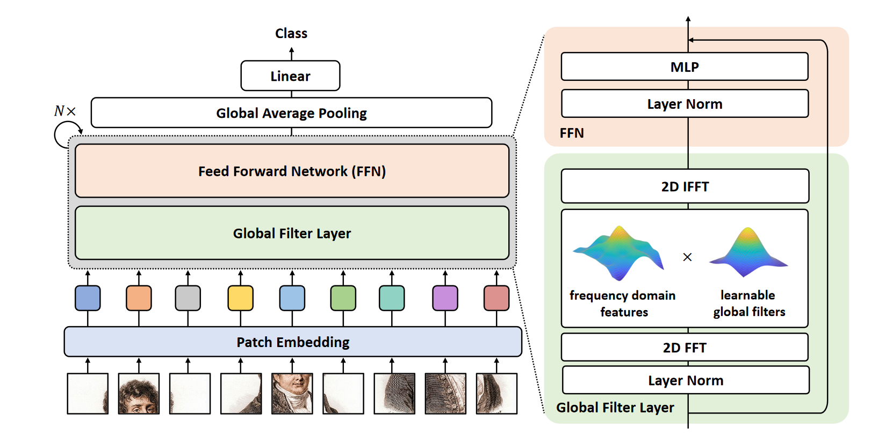

论文作者：Yongming Rao, Wenliang Zhao, Zheng Zhu Jiwen Lu, Jie Zhou。论文原文点此[URL](http://arxiv.org/abs/2107.00645)。

本文提出概念简洁、计算性能优异的 Global Filter Network (GFNet)，该模型主要结构框架基于 Vision Transformer ，在频域中学习空间长距离（long-term spatial dependencies）关系，其具有较小的对数线性复杂性。



<center>图：Global Filter Network 的整体结构</center>

其主要创新是使用 Global Filter Layer 替换了 Vision Transformer 中的 self-attention 层中的每一个子层。该模型取得了可喜的高精度，同时仅具有 CNN 的复杂度。

<!--truncate-->

最近基于self-attention的模型和MLP模型往往在达到不错的性能时使用更少的归纳偏置（inductive biases）。

:::note

此处的归纳偏置应该是指在网络中针对图像的设计。例如：卷积操作。相对的，更少的归纳偏置往往使模型更难以训练。

:::

这类模型的学习往往是使用一组键值对空间中不同位置的关系进行建模，由于更少的归纳偏置，这类模型在通用性上具有显著的优势。同时，这类模型的复杂程度随着输入大小的增长呈指数级增加，使得其很难被应用于需要高分辨率输入输出的情况。本文提出的 GFNet 遵循从视觉模型中消除归纳偏差的趋势，同时具有对数线性复杂性。


## Global Filter Layer

本文的一大创新是使用 Global Filter Layer 代替了高复杂性的 self-attention 层。**Global Filter Layer 由一个 2D 离散傅里叶变换、一个在频域内的矩阵点乘（element-wise multiplication）、一个可学习的全局滤波（global filter）、以及一个傅里叶逆变换以恢复到空间域这四个操作组成**，其设计目的是在频域上捕获各种关系。由于 Global Filter Layer 如同其字面意思能够在频域上覆盖整个输入，因此能够同时捕获长距离（long-term）和短距离（short-term）的关系。

<br/>

<center><strong>完蛋啦这个设计怎么和之前去跟卢畅畅提的那个这么像啊，这就是传说中的撞 idea 吗</strong></center>

<center>不过人家写的更深刻一些，应该学习一下</center>

<br/>

上文中的 global filter 是在频域内建立关系的关键，也是本网络结构与 Vision Transformer 的主要区别。在 Vision Transformer 中，关系是通过 token 表示的。在本文中，作者将离散傅里叶变换后的特征理解为一种“按频域顺序罗列的query”，因此产生 token 的过程可以理解为在该特征上的矩阵点乘，复杂度相比于 self-attention layer 大大降低了。通俗地说，作者设计使用频域上的点乘模拟空间域上不同位置的的键值对，建立的关系被储存在一个矩阵中，其参数量对比其他操作的参数量如下表：


|                           | 复杂度（FLOPs）                                              | 参数量    |
| ------------------------- | ------------------------------------------------------------ | --------- |
| 深度可分离卷积            | $O(k^2 HWD)$                                                 | $k^2 D$   |
| self-attention            | $O(HWD^2 + H^2 W^2 D)$                                       | $4D^2$    |
| 全连接                    | $O(H^2W^2D)$                                                 | $H^2 W^2$ |
| **Global Filter**（本文） | $O(HWD)\lceil \log_2(HW) \rceil+HWD$                         | $HWD$     |


Global Filter Layer 表示成伪代码是：

```python
x_f = rfft2(x, dim=(1, 2))
x_tilde = x_f * K
x = irfft2(x_tilde, dim=(1, 2))
```

其中 $x$ 表示输入，$K$ 为在频域上表示关系的矩阵，$rfft2$ 和 $irfft2$ 分别表示 2D 离散傅里叶变换和其逆变换。

## 网络结构

整体上和 Vision Transformer 相近。有空会把整体的网络结构和数学描述补充进来。

太 sad 了先不继续看了