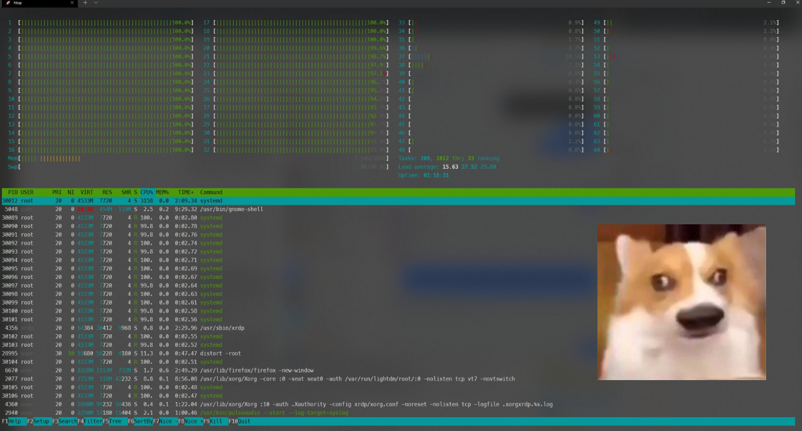

## 故事背景

事情起因是这样的：


这台服务器大概是塞了几块A100跑深度学习用的。我第一秒想到的可能是装包的这个 operation 太长了，触发了什么 timeout。

<!--truncate-->

所以就试探性的打算一点一点装试试：


从输出来看，被kill只发生在几秒内，不太可能是触发了什么timeout了。后来折腾了半天，journalctl 没有暴露任何有用的信息。进程就被，很单纯的 kill 了，没有啥理由。不过后来 hotp 了一下发现了关键线索：


阿这，是不是有别人在跑计算任务把CPU干满了然后人家的进程优先级太高就把你的安装进程杀了呢？结果问了一圈，没人在用这台服务器。甚至有研究生学长也遇到了完全一样的问题：


我又重新点开htop的图定睛一看，`systemd` 占了3202%的CPU。

<br/>
<center><strong>卧草，不会是变成矿场了吧</strong></center>
<br/>

但是这是学校内网的机器啊，应该不会随便被塞 mining virus。需要确认一下具体情况，一句一句qq问太慢了。我不在学校，不太好直接修内网的东西，就曲线救国了一下从家里走虚拟内网ssh进放在学校的一台电脑，再ssh进这台工作站。

连进去了之后确认没人在跑计算任务，直接kill了一下上面这几个高占用的 `systemd`：


CPU占用直接掉下来了。检查了磁盘IO、端口占用，没有发现什么值得注意的。包也能装了，进程也不kill了，可能只是单纯systemd出了啥事吧，也许这样就算好了？

<br/>
<center><strong>一分钟后，又回来了</strong></center>
<br/>



---

## 正题

太好了多半是已经变成矿场了 ~~这么好的卡拿来挖矿还不如给我打原神~~ 。开着 journalctl kill 了一下 高占用的 `systemd`，在它卷土重来的时候看到了：


好了，crontab里塞了个病毒实锤。看看脚本内容是啥：

in:
```bash
cat /etc/opt/.systemd/-bash
```
out:
```bash
#!/bin/bash
cd -- /etc/opt/systemd
mkdir -- .-bash
cp -f -- x86_64 .-bash/-bash
./.-bash/-bash -c
rm -rf --.-bash
```

好嘛，启动一下还删了避免被发现是吧。之后把这个文件夹里的内容打了个压缩包scp回来看看是啥，然后直接把东西全删了：

```bash
cd /etc/opt/.systemd/
rm -rf ./*
```

又去把 root 用户的任务计划干掉了，又kill了一下 `systemd`，然后就好了：


---

## 事后

问题来了，这个病毒是怎么来的呢。大概率是ssh被爆了。~~用户root密码123456反正内网安全啊对对对~~


这几个二进制文件我还留着，等有空了研究一下内容是啥


内网的机器被爆破，感觉大概率是校内人士干的，哪个学生道德这么败坏啊