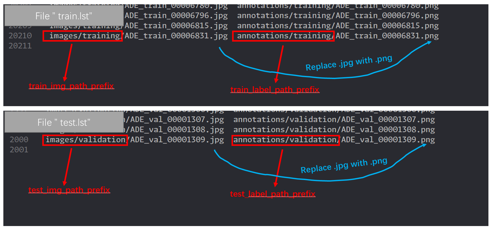

import Tabs from '@theme/Tabs';
import TabItem from '@theme/TabItem';

In this page I will use the [cityscapes dataset](https://www.cityscapes-dataset.com/) and the [ADE20k](https://groups.csail.mit.edu/vision/datasets/ADE20K/) dataset (specifically ADEChallengeData2016) as examples to demonstrate a general approach to generate trainning file list and validation file list.

## Motivation

Sometimes you try to run deep learning codes that require training file lists and validation file lists in the configuration file. For example, HRNet requires a training file list in [its config file](https://github.com/HRNet/HRNet-Semantic-Segmentation/blob/HRNet-OCR/experiments/cityscapes/seg_hrnet_ocr_w48_train_512x1024_sgd_lr1e-2_wd5e-4_bs_12_epoch484.yaml), looks like:

```yaml
...
DATASET:
  DATASET: cityscapes
  ROOT: data/
  TEST_SET: 'list/cityscapes/val.lst'
  TRAIN_SET: 'list/cityscapes/train.lst'
  NUM_CLASSES: 19
 ...
```

Or sometimes you want to generate a list of training pictures and related annotations for training, building a dataset via `torch.utils.data.Dataset`. For example:

<!--truncate-->

```python
from torch.utils import data

class Cityscapes(data.Dataset):
    def __init__(self, root, list_path, num_classes=19):
        self.num_classes = num_classes      
        self.list_path = list_path
        # some other init
    
    def __getitem__(self, index):
        image = cv2.imread(... # read from a path in self.list_path
        label = cv2.imread(... # read from a path in self.list_path
        # some post processing

        return image.copy(), label.copy()
```

It's a simple approach to build a dataset from a file list. **However, datasets may not provide those lists** and you have to generate `train.lst` and `val.lst` by your self. 

:::tip
The key to solving this problem is how to establish the corresponding relationship between training data and annotations.
:::


## Solution

`.lst` files simply look like:

<figure>



<figcaption>figure: `train.lst` and `test.lst` for ADE20k</figcaption>
</figure>

The `.lst` file could be simple, image path on the left, label/annotation path on the right. It seems that you just need to:

1. find all images in training image folder
2. replace `.jpg` with `.png` (or any conversion that you can figure out the file name of label from the name of image)
3. write `{image path prefix}{image path.jpg}`, `{label path prefix}{label path.png}` into file

I have implemented most of the codes for this process:

```python
from dataclasses import dataclass
from neetbox.integrations.resource import ImagesLoader

@dataclass
class LstGenConfig:
    train_img_folder: str  # where are the train images
    test_img_folder: str  # where are the test images
    get_label_name_of_img_name: callable  # how to convert a image path to it's label path
    train_img_path_prefix: str  # prefix path of train images
    train_label_path_prefix: str  # prrfix path of train labels
    test_img_path_prefix: str  # prefix path of test images
    test_label_path_prefix: str  # prrfix path of test labels
    split_str: str  # split between image path and label path in the lst file
    train_lst_file_path: str  # where to place train.lst
    test_lst_file_path: str  # where to place test.lst


def generate_list(config: LstGenConfig):
    # define how to build {img -> label} mapping for a list of image
    def imgs_to_imgs2label(img_list, remove_base_path, img2label):
        image2label = {}
        for img_path in img_list.file_path_list:  # for every image in given list
            img_path = img_path.replace(remove_base_path, "")
            label_path = img2label(img_path)
            image2label[img_path] = label_path
        return image2label

    # define how to write List[str] into file
    def write_lst(str_list, filepath):
        with open(filepath, "w", encoding="utf-8") as f:
            for line in str_list:
                f.write(f"{line}\n")

    # list of all training images
    train_img_list = ImagesLoader(config.train_img_folder)
    # list of all testing images
    test_img_list = ImagesLoader(config.test_img_folder)
    # {img -> label} mapping of train imgs
    train_img2label = imgs_to_imgs2label(
        train_img_list,
        remove_base_path=config.train_img_folder,
        img2label=config.get_label_name_of_img_name,
    )
    # {img -> label} mapping for test imgs
    test_img2label = imgs_to_imgs2label(
        test_img_list,
        remove_base_path=config.test_img_folder,
        img2label=config.get_label_name_of_img_name,
    )
    # {dict -> list[str \t str]} convert built mappings into a list of strs
    lines_trainlst = [
        f"{config.train_img_path_prefix}{trainfp}{config.split_str}{config.train_label_path_prefix}{testfp}"
        for trainfp, testfp in train_img2label.items()
    ]
    lines_testlst = [
        f"{config.test_img_path_prefix}{trainfp}{config.split_str}{config.test_label_path_prefix}{testfp}"
        for trainfp, testfp in test_img2label.items()
    ]
    # write things into lst files
    write_lst(lines_trainlst, config.train_lst_file_path)
    write_lst(lines_testlst, config.test_lst_file_path)

```


## How to use


Here is an example to generate `.lst` files for Cityscapes and ADE20K (and of course they are the same):

<Tabs groupId="generate-lst-file">
  <TabItem value="For Cityscapes" default>

  ```python
  # define how to convert image file name to a label file name
  def img_name_to_label_name_cityscapes(train_img_path):
      label = train_img_path
      # in cityscapes dataset, files are all pngs but part of the name is different
      for o, t in {"leftImg8bit": "gtFine_labelIds"}.items():
          label = label.replace(o, t)
      return label
  
  
  config_cityscapes = LstGenConfig(
      train_img_folder="/home/visualdust/workspace/datasets/public/cityscapes/leftImg8bit/train/",
      test_img_folder="/home/visualdust/workspace/datasets/public/cityscapes/leftImg8bit/test/",
      get_label_name_of_img_name=img_name_to_label_name_cityscapes,
      train_img_path_prefix="leftImg8bit/train/",
      train_label_path_prefix="gtFine/train/",
      test_img_path_prefix="leftImg8bit/test/",
      test_label_path_prefix="gtFine/test/",
      split_str="\t",
      train_lst_file_path="train.lst",
      test_lst_file_path="test.lst",
  )
  
  generate_list(config=config_cityscapes)
  ```

You may see outputs like this:

```bash
$ 2023-11-15-08:51:45 > neetbox.integrations.resource/ImagesLoader/_scan >  Scanning started at '/data/datasets/public/ADEChallengeData2016/images/training' for 2 file types. 
$ [OK]2023-11-15-08:51:47 > neetbox.integrations.resource/ImagesLoader/perform_scan >  Resource loader '/data/datasets/public/ADEChallengeData2016/images/training' ready with 2 file types(20210 files). 
$ 2023-11-15-08:51:47 > neetbox.integrations.resource/ImagesLoader/_scan >  Scanning started at '/data/datasets/public/ADEChallengeData2016/images/validation' for 2 file types. 
$ [OK]2023-11-15-08:51:47 > neetbox.integrations.resource/ImagesLoader/perform_scan >  Resource loader '/data/datasets/public/ADEChallengeData2016/images/validation' ready with 2 file types(2000 files). 
```

 </TabItem>
  <TabItem value="For ADE20k">

  ```python
  # define how to convert image file name to a label file name
  def img_name_to_label_name_ade(train_img_path):
      label = train_img_path
      # in ade dataset, the file names are the same, the only difference is that label ends with .png while image ends with .jpg
      for o, t in {".jpg": ".png"}.items():
          label = label.replace(o, t)
      return label
  
  
  config_adechallenge = LstGenConfig(
      train_img_folder="/data/datasets/public/ADEChallengeData2016/images/training/",
      test_img_folder="/data/datasets/public/ADEChallengeData2016/images/validation/",
      get_label_name_of_img_name=img_name_to_label_name_ade,
      train_img_path_prefix="images/training/",
      train_label_path_prefix="annotations/training/",
      test_img_path_prefix="images/validation/",
      test_label_path_prefix="annotations/validation/",
      split_str="\t",
      train_lst_file_path="train.lst",
      test_lst_file_path="test.lst",
  )
  
  generate_list(config=config_adechallenge)
  ```
You may see outputs like this:

```bash
$ 2023-11-15-08:53:22 > neetbox.integrations.resource/ImagesLoader/_scan >  Scanning started at '/home/visualdust/workspace/datasets/public/cityscapes/leftImg8bit/train' for 2 file types. 
$ [OK]2023-11-15-08:53:22 > neetbox.integrations.resource/ImagesLoader/perform_scan >  Resource loader '/home/visualdust/workspace/datasets/public/cityscapes/leftImg8bit/train' ready with 2 file types(2975 files). 
$ 2023-11-15-08:53:22 > neetbox.integrations.resource/ImagesLoader/_scan >  Scanning started at '/home/visualdust/workspace/datasets/public/cityscapes/leftImg8bit/test' for 2 file types. 
$ [OK]2023-11-15-08:53:22 > neetbox.integrations.resource/ImagesLoader/perform_scan >  Resource loader '/home/visualdust/workspace/datasets/public/cityscapes/leftImg8bit/test' ready with 2 file types(1525 files). 
```
  </TabItem>
</Tabs> 

After generate, your `.lst` file should be at the target location.