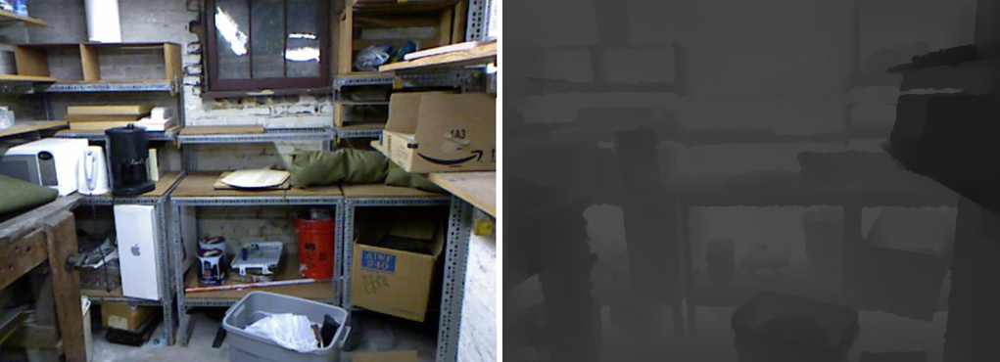

# Get Started With 3D Reconstruction

3D reconstruction is familiar with self-driving cars and augmented reality. One of the most prevailing approach to achieve 3D construction using camera is the point cloud approach. We mainly discuss point cloud approach in this page. This article was written when I first got a glimpse of it. It does not necessarily use a very cutting-edge network model, but chooses a more classic and well-known model. This page will briefly introduce the principles of point cloud 3D reconstruction and show some basic examples and codes. 

Discover 3d constructions in these steps:

1. Get familiar with the 3d data
2. Get familiar with basic deep learning approaches
3. Acknowledge recent challenges and related solutions
4. read few cutting edge papers

<!--truncate-->

## How The Data Looks Like

Although both point clouds and depth maps can present certain three-dimensional information, a point cloud can be seen as a depth map in three dimensions. While a depth map only contains the distance or $Z$ information for each pixel, a point cloud is a collection of 3D points $(X,Y,Z)$ that represent the external surface of the scene and can contain color information.

There are many [3d modeling formats](https://en.wikipedia.org/wiki/Category:Graphics_file_formats) around, some hold information about polygons, and some point clouds. When it comes to data from radar for object tracking purposes, point cloud formats are the appropriate subset of the available 3D modeling formats to use.

### Depth Map

The figure shows that the depth map can only present three-dimensional information in a certain direction, but cannot present three-dimensional information in all directions.

### Point Cloud Files

The two main categories point cloud files are ASCII and binary. ASCII formats include `XYZ`, `PCD`, `OBJ`, `PTX ` and `ASC`. Common binary formats include `FLS`, `PCD`, and `LAS`. And some are capable of both ASCII and binary formats.

With ASCII files, each line of text represents a single point $(x, y, z)$. The main benefit of ASCII files is that they are usually well supported, can be edited with a regular text editor, and do not require specialist propriety software.

The ModelNet40 dataset contains synthetic object point clouds. As the most widely used benchmark for point cloud analysis, ModelNet40 is popular because of its various categories, clean shapes, well-constructed dataset, etc. The original ModelNet40 consists of 12,311 CAD-generated meshes in 40 categories (such as airplane, car, plant, lamp), of which 9,843 are used for training while the rest 2,468 are reserved for testing. The corresponding point cloud data points are uniformly sampled from the mesh surfaces, and then further preprocessed by moving to the origin and scaling into a unit sphere.

The [Point Cloud Library](https://pointclouds.org/) (PCL) is a standalone, large scale, open project for 2D/3D image and point cloud processing. PCL is released under the terms of the BSD license, and thus free for commercial and research use.

## Beginner's Model

(Wait, I am sorting out the papers I read)