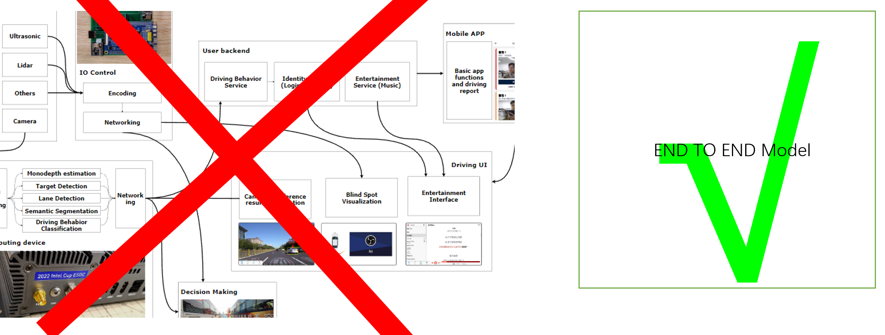
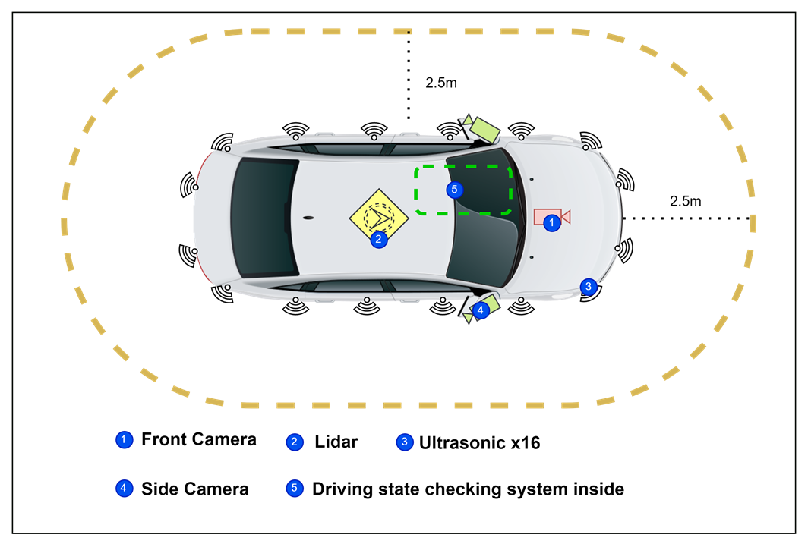
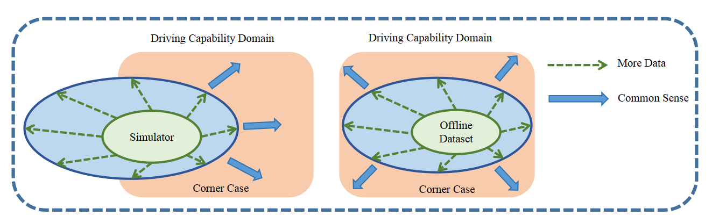
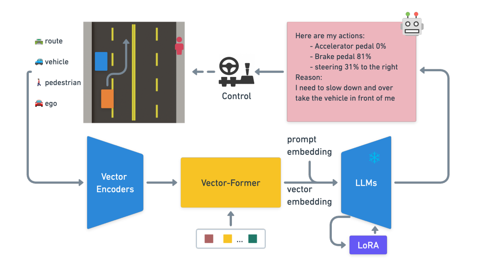
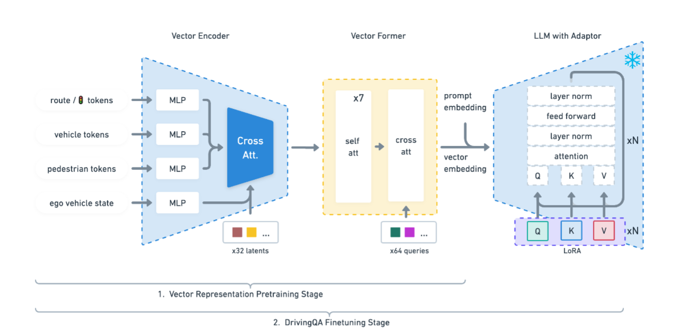

I look back at the assisted driving systems project I created during my undergraduate studies. As we continue to improve it, it is gradually becoming more bloated and difficult to scale. As I continued to learn, I found that an end-to-end approach would be the right solution. In this page, I will record my review of this project and my gradual understanding of the end-to-end approach as a beginner.

<!--truncate-->

## A look back

In the past year, I tried to launch an assisted driving project and formed a team. After a period of hard work, we created an assisted driving system from scratch with many parts, including in-vehicle edge computing devices, sensor groups (including cameras, Lidar and ultrasound), in-vehicle central control interactive applications, User backend, and user APP. Looking back at this project, I admit that our technology was very backward - at least not cutting-edge. We use multiple computer vision models to process information from sensors, including semantic segmentation (used to segment drivable areas), object detection and monocular depth estimation (used to estimate vehicle distance), and a lane line detection model, and illegal driving detector.

<figure>

<figcaption>figure: What does my system look like</figcaption>

</figure>

I structured this project in a very intuitive way. I used a traditional spot scanning lidar (I know there are solid state lidars but I don't own one) on the roof of the car and placed ultrasonic sensors all around the car. I placed a stable high frame rate camera in front of the car as a forward view. In addition, there is a camera in the car to detect the driver's status. We also developed various hardware related to it, but that is irrelevant to the topic of this discussion.

<figure>

<figcaption>figure: How did I construct the system</figcaption>

</figure>

As you can see in the picture above, in my previous architecture, I had the various parts working separately. Especially the Edge Computing Device part, where I had to run multiple models at the same time to implement most of the assisted driving functions. Although it at least has these functions, it inevitably brings a lot of problems.

## Motivation

**Such an immature architecture makes it difficult for the project to continue to develop**. I think the reasons are as follows:

1. The optimization goals between multiple modules are inconsistent, and the decision maker has to be readjusted for the adjustment of each module. At the same time, local optimization of modules does not mean global optimization. The more modules there are, the more difficult it becomes to adjust the system.
2. The calculation of the module has considerable redundancy. Although I have optimized it from the software level, for example, dynamically allocating computing resources to required modules. But in order to ensure the real-time nature of the information, it becomes very difficult to continue optimizing, especially when our goal is to use edge computing device deployment.
3. The input, output and intermediate processes of the entire system are very complex, and the difficulty of maintenance is gradually increasing.

So I started thinking about solutions to the above problems. **I came to understand that an end-to-end approach could solve my problem from multiple perspectives**. I drew a diagram to represent the benefits of an end-to-end approach:

<figure>

<figcaption>figure: The very obvious difference between the two approaches</figcaption>
</figure>

The **end-to-end approach obviously has the following benefits**:

1. Eliminate the computing redundancy just mentioned and improve system speed and performance
2. Eliminate cumulative errors caused by the existence of multiple modules
3. The optimization goal becomes single, and all problems can be solved in a single training session
4. It is no longer necessary to design too many rules in the decision maker, data-driven training becomes possible

However, the **end-to-end approach will also bring new challenges**:

1. The end-to-end approach is completely black box. Reliability and security issues as well as interpretability issues become challenges
2. Although the optimization goal seems to become "single", in fact, the end-to-end method cannot directly learn the correct reasons for decision-making. For example, the decision-making method learned at a traffic light intersection using a data-driven model is to start when the car in front starts to move, rather than when the red light ends (because the car in front will move when the red light ends)

In any case, the end-to-end approach is a topic that I cannot avoid as I continue to learn. Therefore, I will start to gradually understand the end-to-end autonomous driving method as a beginner. On this page I will record my experience as I gradually learn about each technology and individual components.

## The world model

(Wait, I am sorting out the papers I read)

## LLM for autonomous driving (LLM4AD)

LLM-for-Autonomous-Driving (LLM4AD) refers to the application of Large Language Models(LLMs) in autonomous driving. LLM becomes  special medicine in some situations, that is, **LLM can use common sense to assist decision-making and has strong interactive capabilities. It was also able to handle unstructured data(for example, ethical and moral issues or decision-making under complex conditions) easily, and detect as well as provide feedback on driving behavior **, even other capabilities that the system I had envisioned was not capable of. Therefore, I started searching for successful cases of LLM applied to autonomous driving.

<figure>

<figcaption>figure: The limitation of current autonomous driving paradigm (green arrow) and where LLMs can potentially enhance autonomous driving</figcaption>
</figure>

I went through the survey [\[2311.01043\] A Survey of Large Language Models for Autonomous Driving (arxiv.org)](https://arxiv.org/abs/2311.01043) and found  it is of great significance that I would like to share it with anyone who is reading this page. In the survey of large language models (LLMs) for autonomous driving, the authors discuss the transition from rule-based systems to data-driven strategies in autonomous driving technology and the limitations of traditional module-based systems. The paper highlights the potential of LLMs in empowering autonomous driving by combining them with vision models to enable open-world understanding, reasoning, and few-shot learning. The authors systematically review the current state of LLMs for autonomous driving, outline the challenges and future directions in the field, and provide real-time updates and resources for researchers. The paper also discusses the motivation behind using LLMs in autonomous driving and the application of LLMs in planning, perception, question answering, and generation tasks. 

In short, the **main points are**:

- Autonomous driving is transitioning from rule-based systems to data-driven strategies.
- Traditional module-based systems have limitations due to cumulative errors and inflexible rules. 
- Large language models (LLMs) have the potential to empower autonomous driving by combining them with vision models. 
- LLMs can enable open-world understanding, reasoning, and few-shot learning. LLMs can be applied in planning, perception, question answering, and generation(e.g. the world model) tasks in autonomous driving.

<figure>

<figcaption>figure: LLMs in Autonomous Driving Pipelines</figcaption>
</figure>

Moreover, according to the paper, LLMs can be integrated into autonomous driving pipelines to enhance various aspects of the system's capabilities. Here is a breakdown of **how LLMs are applied** in different areas of autonomous driving pipelines and **the evaluation metrics used** in different research papers related to autonomous driving and large language models:

1. Perception: **LLMs can be used for perception tasks** such as object detection, tracking, and segmentation. By integrating LLMs with visual networks, multimodal models can be created to improve the system's perception abilities.  

   Different metrics are used to evaluate perception tasks such as object detection, tracking, and segmentation. These include Average Multiple Object Tracking Precision (AMOTP), Average Multiple Object Tracking Accuracy (AMOTA), Identity Switches (IDS), BLEU-4, METEOR, CIDER, SPICE, and IoU (Intersection over Union).

2. Planning: **LLMs can assist in the planning stage of autonomous driving**. This involves using LLMs for decision-making, behavior prediction, path planning, and motion trajectory generation. LLMs can provide open-world cognitive and reasoning capabilities, enabling the system to make more informed and context-aware decisions. 

   Metrics used for evaluating planning tasks include Root Mean Squared Error (RMSE), threshold accuracies, and success rates. Additionally, metrics like L2 error (in meters) and collision rate (in percentage) are used to measure the accuracy and safety of planned trajectories.

3. Question Answering: **LLMs can be utilized for question-answering tasks related to autonomous driving**. This involves using LLMs to understand and respond to queries about the driving environment, vehicle dynamics, and other relevant information. 

   For evaluating question-answering tasks, metrics commonly used in natural language processing (NLP) are employed. These include BLEU-4, METEOR, CIDER, and chatGPT score.

4. Generation: **LLMs can be employed for generating various outputs in autonomous driving systems**. This includes generating driving instructions, explanations for the system's actions, and other forms of natural language generation. 

   In the context of generating driving scenarios or videos, metrics such as BLEU-4, METEOR, CIDER, and SPICE are used to assess the quality and realism of the generated content.

## LLM understands the driving environment

LLMs can be applied in the World Model of autonomous driving systems to enhance their capabilities. The World Model refers to the representation of the environment and the vehicle's understanding of it and LLMs can enhance the World Model by providing open-world understanding, reasoning, and few-shot learning capabilities. By combining LLMs with foundation vision models, autonomous driving systems can benefit from the extensive knowledge base and generalization capabilities of LLMs. This integration allows for better perception of the environment, more accurate prediction of future states, and improved decision-making. 

<figure>

<figcaption>figure: (a) The relationships between human driving and existing autonomous driving systems, especially highlights the limitations of current approaches and why they cannot solve all long-tail cases. (b) The schema of a system that can drive like a human. The agent can explore and interact with the environment and conduct self-reflection based on the expert’s feedback, finally accumulating the experience.</figcaption>
</figure>

In  [\[2307.07162\] Drive Like a Human: Rethinking Autonomous Driving with Large Language Models (arxiv.org)](https://arxiv.org/abs/2307.07162), the author uses multiple simple and easy-to-understand examples with example pictures to fully illustrate how LLMs cope with various traffic scenarios.
The paper explores the potential of using large language models (LLMs) to understand the driving environment in a human-like manner. The authors argue that **traditional optimization-based and modular autonomous driving systems face limitations when dealing with complex scenarios and long-tail corner cases**. To address this, they propose that an ideal autonomous driving system should drive like a human, accumulating experience through continuous driving and using common sense to solve problems. **The paper identifies three key abilities necessary for an autonomous driving system: reasoning, interpretation, and memorization**. The authors demonstrate the feasibility of employing an LLM in driving scenarios by building a closed-loop system to showcase its comprehension and environment-interaction abilities. The experiments show that the LLM exhibits impressive reasoning and problem-solving abilities, providing valuable insights for the development of human-like autonomous driving.

**This article does a great job of explaining a lot of my dissatisfaction with the system I originally constructed**:

- Traditional optimization-based and modular autonomous driving systems face limitations with complex scenarios and long-tail corner cases.
- An ideal autonomous driving system should drive like a human, accumulating experience and using common sense.
- There are three key abilities necessary for an autonomous driving system: reasoning, interpretation, and memorization.

The paper points out that LLMs can be employed in driving scenarios to achieve human-like driving and demonstrate impressive reasoning and problem-solving abilities in handling complex scenarios and long-tail corner cases.

<figure>

<figcaption>figure: GPT-3.5 closed-loop driving in HighwayEnv: (a) GPT-3.5 observes its environment in HighwayEnv using perception tools and makes decisions to control vehicles, forming a closed loop. (b) GPT-3.5 employs the ReAct strategy to plan actions and use tools, while perceiving its surroundings through a cycle of thought, action, and observation.</figcaption>
</figure>

In the above figure, the author uses a simple traffic scene to show how GPT3.5 handles driving on the highway. In the paper, the author also introduces various other situations, such as lane-change decision-making process, and introduces the self-reflection and memorization ability of LLM. If you want to refer to other examples, check out this paper.

## Combining LLMs into the system

Here is an interesting example of how to adapt LLM into an autonomous driving system.

[\[2310.01957\] Driving with LLMs: Fusing Object-Level Vector Modality for Explainable Autonomous Driving (arxiv.org)](https://arxiv.org/abs/2310.01957) **introduces a unique object-level multimodal Large Language Model (LLM) architecture for autonomous driving.** The author proposes a methodology for integrating numeric vector modality into pre-trained LLMs to improve context understanding in driving situations. 

<figure>

<figcaption>figure: An overview of the architecture for Driving with LLMs, demonstrating how object-level vector input from our driving simulator is employed to predict actions via LLMs</figcaption>
</figure>

The main contributions of the paper include the novel object-level multimodal LLM architecture, the driving scenario question-answering task and dataset, and the evaluation metric for driving QA. The paper also discusses related works in end-to-end autonomous driving systems, interpretability of autonomous driving systems, and multi-modal LLMs in driving tasks. The paper present a new dataset of 160k question-answer pairs derived from 10k driving scenarios, paired with high-quality control commands collected with a reinforcement learning (RL) agent and question-answer pairs generated by a teacher LLM.

<figure>

<figcaption>figure: The architecture of the Driving LLM Agent</figcaption>
</figure>

To be specific about adapting the proposed methodology, it **involves aligning numeric vector modalities with static LLM representations using vector captioning language data**. A custom 2D simulator is used to train an RL agent to solve driving scenarios, and a language generator is introduced to translate numerical data into textual descriptions for representation pretraining. A teacher LLM is used to generate question-answer pairs conditioned on the language descriptions of different driving scenarios.

**The training of the Driving LLM Agent involves a two-stage process.** In the first stage, the vector representation is grounded into an embedding that can be decoded by the LLMs. In the second stage, the model is fine-tuned to the Driving Question Answering (DQA) task, training it to answer driving-related questions and take appropriate actions based on its understanding of the environment.

During inference, the input data of the proposed model consists of object-level vectors that describe various aspects of the driving scenario. These vectors are structured and organized into different categories. Here is a breakdown of the input data:

1. **Route Descriptors**: A 2D array per ego vehicle that describes the route to follow. Each route point is represented by a new row and includes attributes such as (x, y, z) coordinates, direction, pitch, speed limit, junction information, road width, traffic light state, and roundabout information. 
2. **Vehicle Descriptors**: A 2D array per ego vehicle that describes nearby vehicles. The array is allocated with a fixed maximum size (around 30) and contains information about each nearby vehicle. Attributes include whether a vehicle is present in the row, dynamic or static nature, speed, relative position in ego coordinates, relative orientation, pitch, size, and vehicle class. 
3. **Pedestrian Descriptors**: A 2D array per ego vehicle that describes nearby pedestrians. Similar to vehicle descriptors, the array is allocated with a fixed maximum size (around 20) and contains information about each nearby pedestrian. Attributes include whether a pedestrian is present in the row, pedestrian speed, relative position in ego coordinates, relative orientation, pedestrian type, and intent of crossing the road. 
4. **Ego Vehicle Descriptor**: A 1D array per ego vehicle that describes the state of the ego vehicle. This includes attributes such as vehicle dynamics state (acceleration, steering, pitch, etc.), vehicle size, vehicle class, vehicle dynamics type, previous action, and lidar distance arrays placed on the front corner of the vehicle.

These object-level vectors are fed into the model to generate predictions and responses related to the driving scenario. The model utilizes the information encoded in these vectors to reason about the driving environment, make decisions, and generate outputs that can be explained based on its internal reasoning. **The structured output includes perception and action predictions.** The model predicts perception-related information such as the state of nearby vehicles, pedestrian presence, and the state of the ego vehicle. It also predicts action-related information such as the anticipated future actions of the ego vehicle based on the driving scenario.

The paper also evaluates the perception and action prediction capabilities of the model. The results show that the pretraining stage significantly enhances the model's perception and action prediction capabilities. The pretrained model exhibits higher accuracy in perceiving and quantifying the number of cars and pedestrians and shows improvement in token predictions.

## Adapting vision model outputs to LLM inputs

(Wait, I am sorting out the papers I read)
