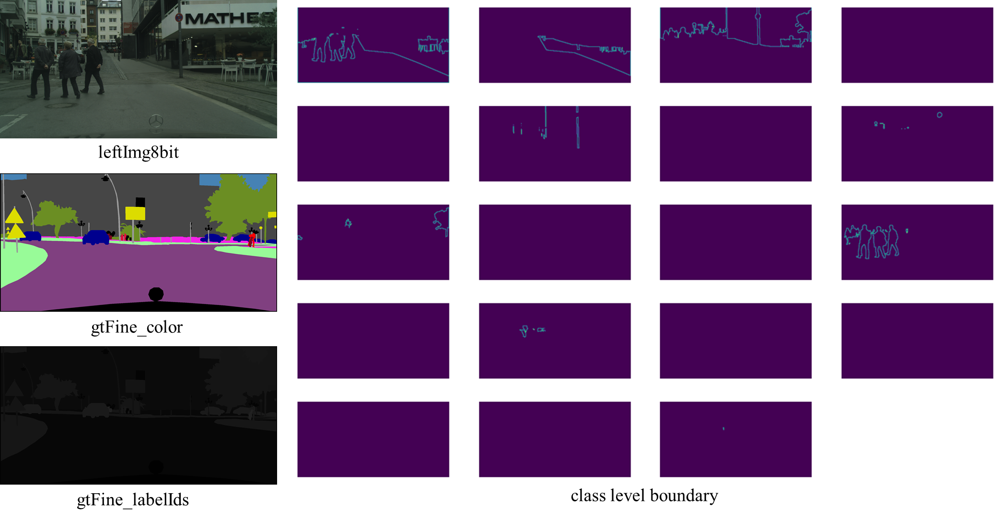
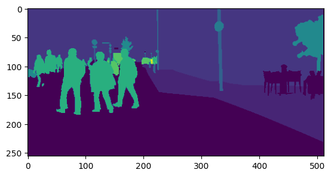
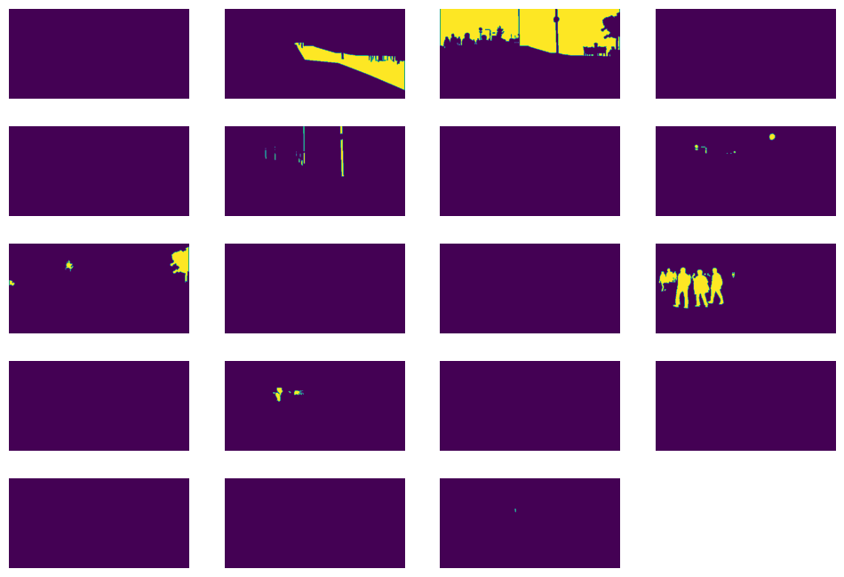
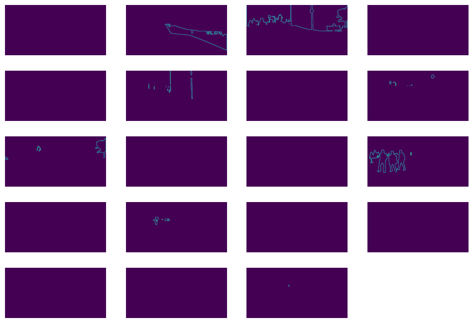

## Why

I'm working on some semantic segmentation related code, where I need to enhance segmentation accuracy on boundaries. Therefore, I tried to use boundary loss to assist model training. This article is my attempt and codes.



Our purpose is clear. In Cityscapes, we have indexed image that represents pixels of each class named `gtFine_labelIds`. What we want is to generate class level boundary from  `gtFine_labelIds` so that we can use it to optimize boundary regions for specific class.

<!--truncate-->

## Background information

First thing comes first:

```python
import numpy as np
import torch
from PIL import Image
import matplotlib.pyplot as plt
import torch.nn.functional as F
import torchvision.transforms as T
```

Since Cityscapes provides a variety of labels, such as `gtFine_color` and `gtFine_labelIds`, We first need to convert these formats into indexed images with valid `train id`, and drop ignored label by the way. You can find mappings for those labels easily with google, or you may copy them from [cityscapesScripts(github.com)](https://github.com/mcordts/cityscapesScripts/blob/master/cityscapesscripts/helpers/labels.py)。I've put a table here for easy reference:


|name                 |    id| train id |   category| category id | has instances | ignore in eval | color in `gtFine_Color` |
|:---:|:---:|:---:|:---:|:---:|:---:|:---:|:---:|
|unlabeled            |  0 |      255 | void            | 0       | False        | True         | (  0,  0,  0)|
|ego vehicle          |  1 |      255 | void            | 0       | False        | True         | (  0,  0,  0)|
|rectification border |  2 |      255 | void            | 0       | False        | True         | (  0,  0,  0)|
|out of roi           |  3 |      255 | void            | 0       | False        | True         | (  0,  0,  0)|
|static               |  4 |      255 | void            | 0       | False        | True         | (  0,  0,  0)|
|dynamic              |  5 |      255 | void            | 0       | False        | True         | (111, 74,  0)|
|ground               |  6 |      255 | void            | 0       | False        | True         | ( 81,  0, 81)|
|road                 |  7 |        0 | flat            | 1       | False        | False        | (128, 64,128)|
|sidewalk             |  8 |        1 | flat            | 1       | False        | False        | (244, 35,232)|
|parking              |  9 |      255 | flat            | 1       | False        | True         | (250,170,160)|
|rail track           | 10 |      255 | flat            | 1       | False        | True         | (230,150,140)|
|building             | 11 |        2 | construction    | 2       | False        | False        | ( 70, 70, 70)|
|wall                 | 12 |        3 | construction    | 2       | False        | False        | (102,102,156)|
|fence                | 13 |        4 | construction    | 2       | False        | False        | (190,153,153)|
|guard rail           | 14 |      255 | construction    | 2       | False        | True         | (180,165,180)|
|bridge               | 15 |      255 | construction    | 2       | False        | True         | (150,100,100)|
|tunnel               | 16 |      255 | construction    | 2       | False        | True         | (150,120, 90)|
|pole                 | 17 |        5 | object          | 3       | False        | False        | (153,153,153)|
|polegroup            | 18 |      255 | object          | 3       | False        | True         | (153,153,153)|
|traffic light        | 19 |        6 | object          | 3       | False        | False        | (250,170, 30)|
|traffic sign         | 20 |        7 | object          | 3       | False        | False        | (220,220,  0)|
|vegetation           | 21 |        8 | nature          | 4       | False        | False        | (107,142, 35)|
|terrain              | 22 |        9 | nature          | 4       | False        | False        | (152,251,152)|
|sky                  | 23 |       10 | sky             | 5       | False        | False        | ( 70,130,180)|
|person               | 24 |       11 | human           | 6       | True         | False        | (220, 20, 60)|
|rider                | 25 |       12 | human           | 6       | True         | False        | (255,  0,  0)|
|car                  | 26 |       13 | vehicle         | 7       | True         | False        | (  0,  0,142)|
|truck                | 27 |       14 | vehicle         | 7       | True         | False        | (  0,  0, 70)|
|bus                  | 28 |       15 | vehicle         | 7       | True         | False        | (  0, 60,100)|
|caravan              | 29 |      255 | vehicle         | 7       | True         | True         | (  0,  0, 90)|
|trailer              | 30 |      255 | vehicle         | 7       | True         | True         | (  0,  0,110)|
|train                | 31 |       16 | vehicle         | 7       | True         | False        | (  0, 80,100)|
|motorcycle           | 32 |       17 | vehicle         | 7       | True         | False        | (  0,  0,230)|
|bicycle              | 33 |       18 | vehicle         | 7       | True         | False        | (119, 11, 32)|
|license plate        | -1 |       -1 | vehicle         | 7       | False        | True         | (  0,  0,142)|

According to the table, all the label marked `ignore in eval = True` (or `train id = 255` and `train id = -1` ) should be ignored during train. If you read from  `gtFine_labelIds`, it is already made with `train id`, what you have to do is to drop all the IDs marked as `ignore in eval`, or mark them with "ignore label". On the other hand, if you read labels from colored images, you need to convert them into `train id` first. Once you get the indexed image in `train id` format, **code below helps with dropping ignored labels**:

```python
ignore_label = -1
label_mapping = {-1: ignore_label, 0: ignore_label, 
                  1: ignore_label, 2: ignore_label, 
                  3: ignore_label, 4: ignore_label, 
                  5: ignore_label, 6: ignore_label, 
                  7: 0, 8: 1, 9: ignore_label, 
                  10: ignore_label, 11: 2, 12: 3, 
                  13: 4, 14: ignore_label, 15: ignore_label, 
                  16: ignore_label, 17: 5, 18: ignore_label, 
                  19: 6, 20: 7, 21: 8, 22: 9, 23: 10, 24: 11,
                  25: 12, 26: 13, 27: 14, 28: 15, 
                  29: ignore_label, 30: ignore_label, 
                  31: 16, 32: 17, 33: 18, 255:-1}

def convert_cityscapes_label(label, inverse=False):
    """convert label image into indexed image with train ids

    Args:
        label (np.array): you may read the image file using opencv
        inverse (bool, optional): inverse convert. Defaults to False.

    Returns:
        _type_: _description_
    """
    temp = label.copy()
    if inverse:
        for v, k in label_mapping.items():
            label[temp == k] = v
    else:
        for k, v in label_mapping.items():
            label[temp == k] = v
    return label
```

We use `gtFine/train/aachen/aachen_000020_000019_gtFine_labelIds.png` as an example:

```python
label_img = "cityscapes/gtFine/train/aachen/aachen_000020_000019_gtFine_labelIds.png"
label_img = Image.open(label_img)
transform = T.Resize((256,512),interpolation=T.InterpolationMode.NEAREST)
label_img = transform(label_img) # Resize image into (256,512) to reduce computation cost
label = np.array(label_img) # convert into numpy array
label = convert_cityscapes_label(label) # drop ignored label
label = np.array(label_img, dtype=int) # convert into numpy array
label = convert_cityscapes_label(label) # drop ignore labels by turning them into -1
plt.imshow(label)
```



:::tip

The reason why the labels are adjusted to (256,512) resolution in the above code is to reduce the amount of calculation. The original image resolution in Cityscapes is 2048x1024. However, in fact, when training the semantic segmentation network, the output scale of the model will not maintain the original size, but will be down-sampled to a certain extent. For example, a common downsampling rate for semantic segmentation is 1/8, which means that the final network output resolution is 256x128. Therefore, downsampling the label to a certain extent does not affect the calculation of loss and helps speed up the calculation.

:::

## Improved one-hot encoding

Intuitively, you only need to use one hot to decode the single channel mask into a class level mask with channel of num_channel(19 in cityscapes). However, **PyTorch API does not provide one hot encoding functions that can ignore labels**. In other words, you need to implement this function yourself. **The simple idea to implement this function is to create a tensor with a number of channel more than num_classes and eventually reduce the excess.**

```python
def one_hot_encode(
    mask: torch.Tensor,
    num_classes: int,
    ignored_label: Union[str, int] = "negative",
):
    """Convert the mask to a one-hot encoded representation by @visualDust

    Args:
        mask (torch.Tensor): indexed label image. Should types int
        num_classes (int): number of classes
        ignored_label (Union[str|int], optional): specify labels to ignore, or ignore by pattern. Defaults to "negative".

    Returns:
        torch.Tensor: one hot encoded tensor
    """
    original_shape = mask.shape
    for _ in range(4 - len(mask.shape)):
        mask = mask.unsqueeze(0)  # H W -> C H W -> B C H W, if applicable
    # start to handle ignored label
    # convert ignored label into positive index bigger than num_classes
    if type(ignored_label) is int:
        mask[mask == ignored_label] = num_classes
    elif ignored_label == "negative":
        print(mask.shape, mask.min())
        mask[mask < 0] = num_classes
        print(mask.shape, mask.min())

    # check if mask image is valid
    if torch.max(mask) > num_classes:
        raise RuntimeError("class values must be smaller than num_classes.")
    B, _, H, W = mask.shape
    one_hot = torch.zeros(B, num_classes + 1, H, W)
    one_hot.scatter_(1, mask, 1)  # mark 1 on channel(dim=1) with index of mask
    one_hot = one_hot[:, :num_classes] # remove ignored label(s)
    for _ in range(len(one_hot.shape) - len(original_shape)):
        one_hot.squeeze_(0)  # B C H W -> H W ->  C H W, if applicable
    return one_hot
```

Code takes a labeled mask, the number of classes, and an optional parameter for ignored labels. It converts the input mask into a one-hot encoded representation. 

If `ignored_label` is an integer, occurrences of that label in the `mask` are replaced with a value greater than `num_classes`. If `ignored_label` is set to "negative," values less than 0 in the `mask` are replaced with a value greater than `num_classes`. This step effectively transforms the ignored label into a positive index larger than the specified number of classes.

### Usage

```python
gt_tensor = torch.tensor(label).type(torch.int64) # convert label into tensor
class_level_mask = one_hot_encode(gt_tensor, num_classes=19) # get class level mask using above mentioned one hot encoding
plt.figure(figsize=(12,10))
sub_idx = 1 # for figure line wrapping
for m in class_level_mask: # draw each class
    plt.subplot(6, 4, sub_idx)
    plt.imshow(m)
    plt.axis('off')
    sub_idx += 1
plt.show() # show result
```



:::tip

Dont worry if some of visible classes in color map are missing in boundary maps. This is because they are marked as ignore labels so that we dropped them in one hot encoding. For example, grounds are missing because they are ignored in training. 

:::

## obtain per-class boundary

Since you want to identify boundaries between different classes or regions in the ground truth mask, code below  **computes boundary targets from ground truth masks using a Laplacian kernel**. The function takes a ground truth mask (`gt_mask`) and calculates the boundary targets based on a Laplacian kernel convolution.

```python
def get_boundary_of_gt(gt_mask, boundary_threshold=0.1):
    laplacian_kernel = (
        torch.tensor(
            [-1, -1, -1, -1, 8, -1, -1, -1, -1],
            dtype=torch.float32,
            device=gt_mask.device,
        )
        .reshape(1, 3, 3)
        .requires_grad_(False)
    )
    C = 1
    original_shape = gt_mask.shape
    if len(gt_mask.shape) == 2:  # add channel dim
        gt_mask = gt_mask.unsqueeze(0)
    if len(gt_mask.shape) == 3:
        C, _, _ = gt_mask.shape  # get num_of_classes
    elif len(gt_mask.shape) == 4:
        _, C, _, _ = gt_mask.shape  # get num_of_classes
    laplacian_kernel = [laplacian_kernel] * C  # conv on each channel individually
    laplacian_kernel = torch.stack(laplacian_kernel, dim=0)
    _conv = functools.partial(
        F.conv2d, weight=laplacian_kernel, padding=1, groups=C
    )  # conv on each channel individually
    boundary_targets = _conv(gt_mask)
    boundary_targets = boundary_targets.clamp(min=0)
    boundary_targets[boundary_targets > boundary_threshold] = 1
    boundary_targets[boundary_targets <= boundary_threshold] = 0
    for _ in range(len(boundary_targets.shape) - max(3, len(original_shape))):
        boundary_targets.squeeze_(0)  # reduce dim if applicable
    return boundary_targets
```

:::tip

Note that the Laplacian kernel's shape is modified to be `(1, 3, 3)` and stacked along channel. It also takes `groups = C` in `F.conv2d` to make sure that the Laplacian kernel is applied separately to each channel of the input. In PyTorch documentation, it says `torch.nn.functional.conv2d` takes those arguments:

- **input**: input tensor of shape $(minibatch,in\_channels,iH,iW)$
- **weight**: filters of shape $(out\_channels,\frac{in\_channels}{groups},kH,kW)$
- **groups** – split input into groups, both **$in\_channels$** and $out\_channels$ should be divisible by the number of groups. Default: 1

In order to apply Laplacian kernels separately  on each channel, we use `groups = C`. Check the doc if you're interested: [torch.nn.functional.conv2d — PyTorch 2.1 documentation](https://pytorch.org/docs/stable/generated/torch.nn.functional.conv2d.html)

:::

### Usage

```python
gt_tensor = torch.tensor(label).type(torch.int64) # convert label into tensor
class_level_mask = one_hot_encode(gt_tensor, num_classes=19) # get class level mask using above mentioned one hot encoding
gt_boundary_class_level = get_boundary_of_gt(class_level_mask)
plt.figure(figsize=(12,10))
sub_idx = 1
for b in gt_boundary_class_level:
    plt.subplot(6, 4, sub_idx)
    plt.imshow(b)
    plt.axis('off')
    sub_idx += 1
plt.show()
```

