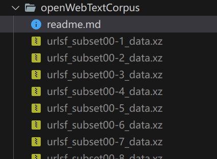
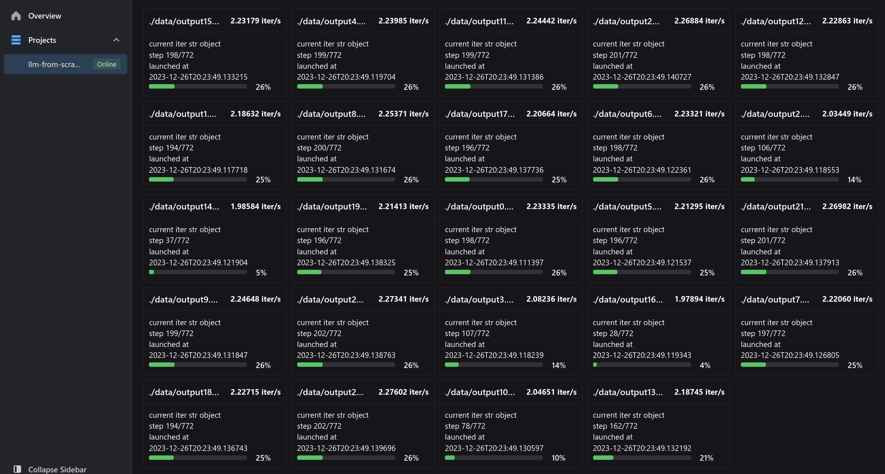
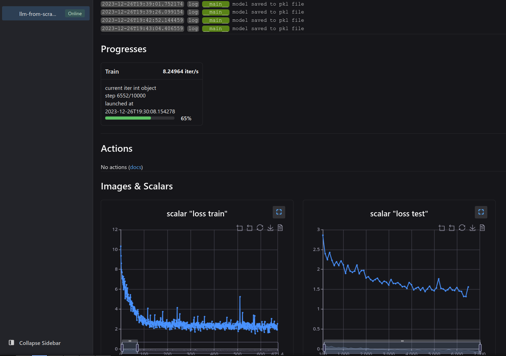
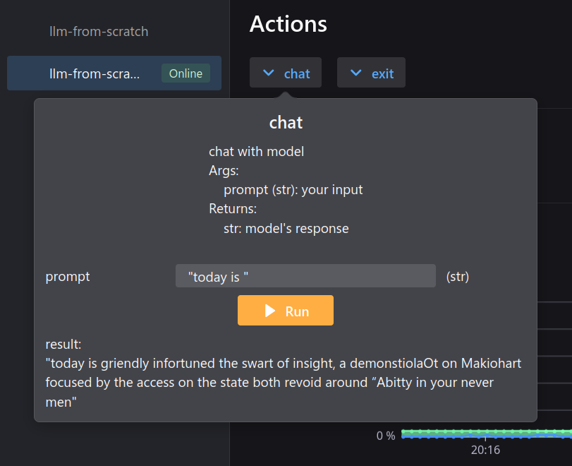

## Abstract

The main purpose of this article is to use basic self-attention blocks to build a simple large language model for learning purposes. Due to limitations in model scale and embedding methods, the model built in this article will not be very effective, but this does not affect the ability to learn various basic concepts of language models similar to Transformer through the code provided in this article.

What happens on this page:

- [x] get full code of a basic Large(?) Language Model (data preparation, model architecture, model training and predicting)
- [x] understand the general architecture of transformer with a few illustrations
- [x] understand how self regressive training works
- [x] understand how to load very large text dataset into limited memory (OpenWebTextCorpus)
- [x] train and observe the training procedure
- [x] load the trained model into a simple ask-and-answer interactive script

## Get full code

:::tip

Code available at [github.com/visualDust/naive-llm-from-scratch](https://github.com/visualDust/naive-llm-from-scratch). Download the code via git clone before continue.

:::

## Concepts

### Self-attention and transformer architecture

### Self-regressive training

Self-regressive training, often used in sequence modeling (like language models), is the key approach of training language model in which the model predicts the next element in a sequence based on its preceding elements.

### The vocabulary table

## Prepare data

We use **[OpenWebText Corpus](https://skylion007.github.io/OpenWebTextCorpus)** as dataset for training. Download and learn to convert and read dataset from file in this section.

The OpenWebText Corpus is a large-scale, open-source text corpus that was created as a response to the increasing need for large text datasets in the field of natural language processing (NLP). It is particularly significant for training and evaluating language models like those developed by OpenAI. The idea was inspired by OpenAI's WebText dataset, which was used to train the GPT-2 language model. However, unlike WebText, the OpenWebText Corpus is open-source, making it accessible to researchers and developers worldwide.

The corpus contains a large volume of text, encompassing a wide range of genres, topics, and styles. This includes news articles, blog posts, essays, and more, providing a rich resource for training language models. OpenWebText Corpus gathers its content from the internet, specifically from web pages linked by Reddit posts that received a certain level of popularity or engagement. This approach ensures a diverse range of topics and writing styles, representing the broad array of content available on the web.

Like any large-scale web-scraped dataset, the OpenWebText Corpus may contain biases, inaccuracies, and offensive content, reflecting the broad range of human expression found online. There are ongoing efforts in the NLP community to address these challenges and improve the quality of such datasets.

### Download dataset

Download from Google drive: [https://drive.google.com/drive/folders/1IaD_SIIB-K3Sij_-JjWoPy_UrWqQRdjx](https://drive.google.com/drive/folders/1IaD_SIIB-K3Sij_-JjWoPy_UrWqQRdjx)

download the file named `openwebtext.tar.xz` from google drive link and **extract** all the `.xz` files in folder `openWebTextCorpus`. 

The files should look like:




### Convert .xz data

in terminal:

```bash
python convert_data.py
```

> source code of `convert_data.py`: [convert_data.py](https://github.com/visualDust/naive-llm-from-scratch/blob/main/convert_data.py)

The program automatically convert all the `.xz` files you have extracted in folder `openWebTextCorpus` and put the converted `.txt` files in folder `data`.

:::tip

Since we are using [neetbox][neetbox] for monitoring, open [localhost:20202](http://localhost:20202/) (neetbox's default port) in your browser and you can check the progresses.

:::




### Start training

in terminal:

```bash
python train.py --config gptv1_s.toml
```

>  source code of `train.py`: [train.py](https://github.com/visualDust/naive-llm-from-scratch/blob/main/train.py)


:::tip

Since we are using [neetbox][neetbox] for monitoring, open [localhost:20202](http://localhost:20202/) (neetbox's default port) in your browser and you can check the progresses.

[neetbox]: https://neetbox.550w.host

:::



### Chat with the model

in terminal:

```bash
python inference.py --config gptv1_s.toml
```

> source code of `inference.py`: [inference.py](https://github.com/visualDust/naive-llm-from-scratch/blob/main/inference.py)


Open [localhost:20202](http://localhost:20202/) (neetbox's default port) in your browser and feed text to your model via action button.




## Further challenges

There are three main challenges:

1. Error Propagation: Since the above architecture predicts new token based on previously generated tokens, and the newly generated token later becomes input for the next comming tokens, errors made in early predictions can propagate and magnify in later stages.
2. Long-Term Dependency Handling: Capturing dependencies over long sequences is difficult, as the model above takes fixed size input, early inputs can be 'forgotten' in long sequences.
3. Computationally Intensive: Generating sequences one element at a time can be slow and computationally expensive, especially for long sequences.