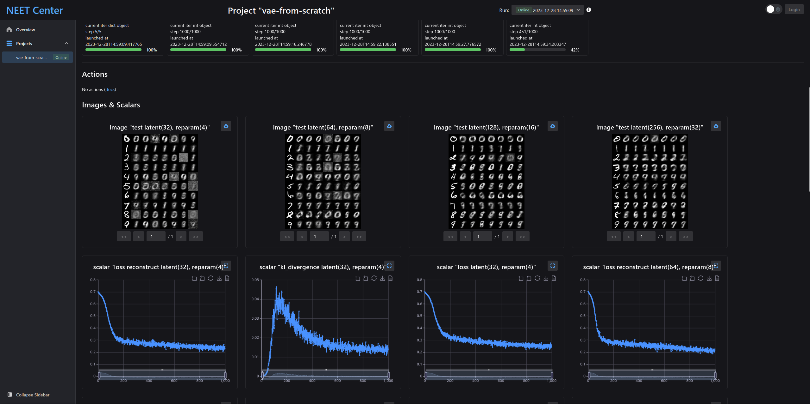
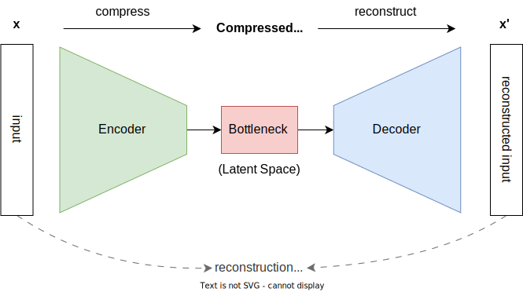
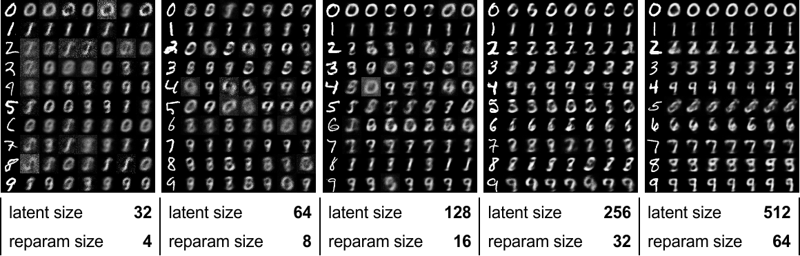
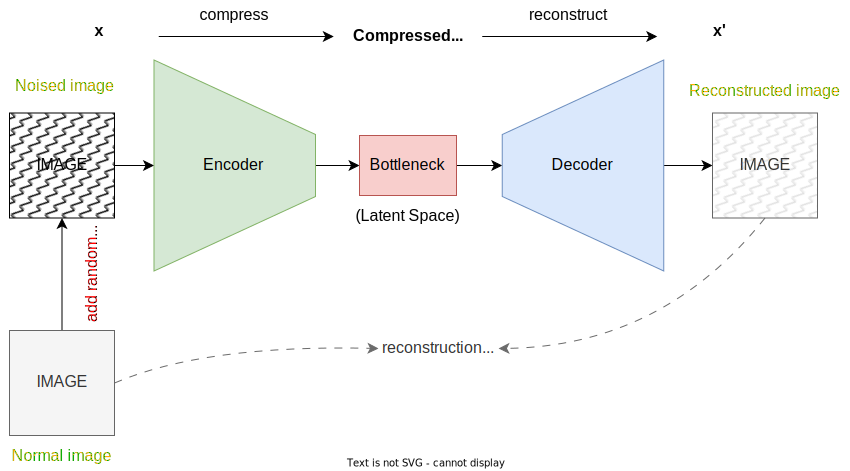
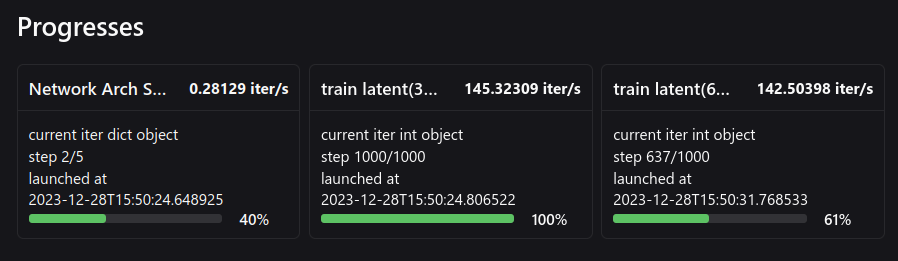
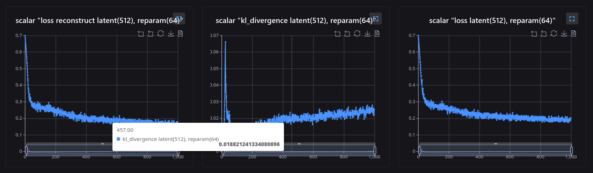
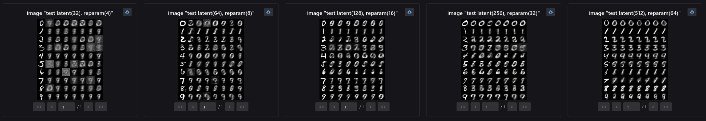

## AutoEncoders

AutoEncoders are a type of artificial neural network used primarily for unsupervised learning tasks, particularly in the field of dimensionality reduction and feature learning. Their general purpose is to learn a representation (encoding) for a set of data, typically for the purpose of dimensionality reduction or noise reduction.

The main components of an autoencoder are:

1. **Encoder**: This part of the network compresses the input into a **latent space** representation. It encodes the input data as an encoded representation in a reduced dimension. **The encoder layer is typically composed of a series of layers that gradually decrease in size**.

2. **Bottleneck**: This is the layer that contains the encoded representation of the input data. It is the heart of the network, which holds the compressed knowledge of the input data. The bottleneck is where the dimensionality reduction takes place.

3. **Decoder**: The decoder network performs the reverse operation of the encoder. It takes the encoded data from the bottleneck and reconstructs the input data as closely as possible. This part of the network is typically symmetrical to the encoder, with layers increasing in size.

The objective of an autoencoder is to minimize the difference between the original input and its reconstruction, typically measured by a loss function like mean squared error. By learning to reconstruct the input data, the network learns valuable properties about the data and its structure. AutoEncoders are used in various applications like anomaly detection, image denoising, and as a pre-training step for deep learning models.



**The objective of an autoencoder is to minimize the difference between the original input and its reconstruction**, typically measured by a loss function like mean squared error. By learning to reconstruct the input data, the network learns valuable properties about the data and its structure.

## Get full code before continue

Code available at [gist : single-file-linear-ave.py](https://gist.github.com/visualDust/96b387c4d70af8234f3687fcc8fb2fa1)

:::tip

This is a single file approach consists of model architecture, training code, testing code, and inference code. We will talk about each part of the code separately later. If you're in hurry, run this single file python script and open [localhost:20202](http://localhost:20202/) to see the result.

:::

:::warning
Please make a new directory for putting this file, once you run this file, it automatically download MNIST dataset to the relative path `./data`. You might not want the code download data into unwanted place.
:::

<!--truncate-->

## Variational AutoEncoder

A Variational Autoencoder (VAE) is a type of artificial neural network  used for generative modeling. It's an advanced form of an autoencoder, a type of neural network used for unsupervised learning of efficient  codings. The key difference between a VAE and a traditional autoencoder  is how they are trained; VAEs are designed to generate new data that's  similar to the training data.

### 

Figure above shows reconstructed handwritten digits from a VAE. Don't worry, you don't need to understand for now, just retain the impression of this picture.

### Variational Aspect

The **"variational"** aspect of VAEs comes from the way the encoder not only compresses the data but also learns to describe the data in terms of a probability distribution (usually Gaussian) in the latent space. Instead of encoding an input as a single point, it is encoded as a distribution over the latent space. Variational AutoEncoders (VAEs) require the latent space to be a standard Gaussian distribution primarily for two reasons: to enable efficient sampling and to facilitate the learning of a smooth, continuous latent space. This design choice has important implications for how VAEs function and what they can achieve. Let's break down the reasons:

1. **Enabling Efficient Sampling**: By constraining the latent space to follow a standard Gaussian distribution, VAEs can generate new data points by efficiently sampling from this space. In the context of generative models, this is a crucial feature. The standard Gaussian distribution (with a mean of zero and a variance of one) is a well-understood, mathematically convenient distribution that allows for easy random sampling.

2. **Learning a Continuous and Complete Representation**: A Gaussian distribution in the latent space encourages the model to learn a continuous and complete representation of the input data. This means that small changes in the latent space will result in small variations in the output, leading to more meaningful and interpretable interpolations. This property is particularly desirable in tasks like semi-supervised learning, data imputation, and generative modeling.

3. **Regularization and Generalization**: The use of a standard Gaussian distribution acts as a form of regularization. It prevents the model from overfitting to the training data by not allowing the latent space to memorize specific training examples. Instead, the model is encouraged to capture the overall distribution of the data.

4. **Variational Inference and the Evidence Lower Bound (ELBO)**: VAEs are based on the principles of variational inference. They aim to approximate the posterior distribution of the latent variables given the input data. By constraining this approximate posterior to be a Gaussian distribution, VAEs simplify the otherwise intractable problem of calculating the true posterior. The model optimizes the Evidence Lower Bound (ELBO), which balances the reconstruction fidelity with the Kullback-Leibler (KL) divergence between the learned latent distribution and the standard Gaussian distribution. This balance is crucial for learning meaningful representations.

5. **Mathematical Convenience**: Gaussian distributions have desirable mathematical properties that simplify the computation, especially when calculating the KL divergence, which is a part of the loss function in VAEs. The KL divergence between two Gaussian distributions has a closed-form solution, making the training process more computationally efficient.

In summary, requiring the latent space in a VAE to be a standard Gaussian distribution facilitates efficient sampling, ensures a continuous and complete representation, provides regularization, aligns with the principles of variational inference, and offers mathematical convenience. These factors together enable VAEs to be effective generative models capable of learning useful representations of data.

### What does the model learn

During training, a VAE learns to:

1. Encode the input data into the latent space.
2. Sample points from this space (using the learned probability distribution).
3. Decode these points back into data.

The loss function for a VAE includes two terms:

1. **Reconstruction Loss:** This ensures that the decoded samples match the original inputs, aiming to minimize the difference between the input and its reconstruction.
2. **KL Divergence:** This part of the loss function ensures that the learned distribution is close to a predefined distribution (often a normal distribution), which helps in generating new data points.

To generate new data, points are sampled from the learned distribution in the latent space and passed through the decoder. The output is new data that resembles the training data.


## What we do today

Variational AutoEncoders (VAEs) can be effectively used for image denoising, sue to it's special ability to learn the distribution of given data. Going through these to applications helps with better understanding. During the decoding phase, the autoencoder reconstructs the image from the latent representation. Since this representation is more likely to contain features of the clean image and less of the noise, the reconstructed image is a denoised version of the original input. For effective denoising, autoencoders can be specifically trained on pairs of noisy and clean images. The network learns to map a noisy image to its clean counterpart. This supervised learning approach can significantly improve the denoising capability of the autoencoder.



Our code today trains a Variational Autoencoder (VAE) in an unsupervised  manner, which is a key characteristic of VAEs. Unsupervised learning  means that the model learns to identify patterns and structures in the  data without the need for labeled outcomes or targets. In the case of a  VAE, the goal is typically to learn efficient representations  (encodings) of the input data and to be able to generate new data that  resembles the input data. Here's how the code achieves unsupervised  training:

- Instead of encoding an input as a single point, a VAE encodes it as a distribution over the latent space. This is done by learning two parameters: a mean (`mu`) and a standard deviation (`sigma`), which define a Gaussian distribution.
- The `reparamererize` process then samples from this distribution to generate a latent representation. This is crucial for the generative aspect of the VAE and helps in learning a smooth latent space.
- During training, the model learns by adjusting its parameters to minimize the combined loss. The encoder learns to produce effective latent representations, and the decoder learns to reconstruct the input data from these representations.
- The VAE does not need labels for this process; it learns from the input data itself, which is why it's considered unsupervised.


## Code from scratch

Code available at [gist : single-file-linear-ave.py](https://gist.github.com/visualDust/96b387c4d70af8234f3687fcc8fb2fa1), we split the code into part below for discussion, but the file content are the same. You may choose to copy directly from the [gist](https://gist.github.com/visualDust/96b387c4d70af8234f3687fcc8fb2fa1), or you can copy each part of the code below and paste them into the same file.

### [part] Import packages

```python
import time
import torch
import torch.nn as nn
import torch.nn.functional as F
import torchvision.datasets as datasets
import neetbox
from torchvision import transforms
from torch.utils.data import DataLoader
from neetbox import logger
```

### [part] for Model Architecture

```python
class LinearVAE(nn.Module):
    def __init__(
        self,
        in_channel,
        latent_channel,
        reparam_channel,
        out_channel=None,
        *args,
        **kwargs,
    ) -> None:
        super().__init__(*args, **kwargs)
        # [encode] input -> latent space
        self.input2latent = nn.Linear(in_channel, latent_channel)
        # [encode] latent space -> \mu
        self.latent2mu = nn.Linear(latent_channel, reparam_channel)
        # [encode] latent space -> \sigma
        self.latent2sigma = nn.Linear(latent_channel, reparam_channel)
        # [reparamererize] \mu and \sigma -> latent space
        self.reparam2latent = nn.Linear(reparam_channel, latent_channel)
        # [decode] latent space -> reconstruction
        self.latent2output = nn.Linear(latent_channel, out_channel or in_channel)

        self.relu_inplace = nn.ReLU(inplace=True)

    def encode(self, x):
        latent = self.input2latent(x)
        latent = self.relu_inplace(latent)
        mu = self.latent2mu(latent)
        sigma = self.latent2sigma(latent)
        return mu, sigma

    def reparamererize(self, mu, sigma):
        std = torch.exp(sigma / 2)
        epsilon = torch.randn_like(std)
        reparam = mu + epsilon * std
        return reparam

    def decode(self, reparam):
        latent = self.reparam2latent(reparam)
        latent = self.relu_inplace(latent)
        reconstructed = self.latent2output(latent)
        return F.sigmoid(reconstructed)

    def forward(self, x):
        mu, sigma = self.encode(x)
        reparam = self.reparamererize(mu, sigma)
        reconstructed = self.decode(reparam)
        return reconstructed, mu, sigma
```

#### Layer Definition

The model consists of several linear layers that define the encoder and decoder parts of the VAE.

- `input2latent`: Encodes the input to a latent representation.
- `latent2mu`: Maps the latent representation to the mean ($\mu$) of the latent space distribution.
- `latent2sigma`: Maps the latent representation to the log variance ($\sigma$) of the latent space distribution.
- `reparam2latent`: Maps the reparameterized latent variables back to the latent space for decoding.
- `latent2output`: Maps the latent representation back to the reconstructed output, which has the same size as the input or a specified `out_channel`.
- `relu_inplace`: An in-place ReLU activation function.

#### Encode (`encode` method)

1. **Input to Latent Space:** The input data `x` is first passed through the `input2latent` layer, converting it to a latent space representation.
2. **Activation Function:** The ReLU activation function is applied to the latent representation.
3. **Computing $\mu$ and $\sigma$:** The latent representation is then split into two paths to calculate $\mu$ (`latent2mu`) and $\sigma$ (`latent2sigma`). These represent the mean and log variance of the latent space distribution.

#### Reparameterization (`reparamererize` method)

1. **Standard Deviation:** The log variance $\sigma$ is converted to standard deviation by applying `exp(sigma / 2)`.
2. **Random Sampling:** An epsilon value is sampled from a standard normal distribution with the same shape as the standard deviation.
3. **Reparameterization Trick:** This step is crucial for backpropagation through a random process. It calculates the reparameterized latent variable by `mu + epsilon * std`.

#### Decode (`decode` method)

1. **Latent to Reparameterized Latent Space:** The reparameterized latent variable is mapped back to the latent space using the `reparam2latent` layer.
2. **Activation Function:** The ReLU activation function is applied.
3. **Reconstruction:** Finally, the `latent2output` layer maps the latent representation back to the reconstructed output. The sigmoid function is applied to ensure the output values are between 0 and 1 (assuming the input data is normalized in this range).

#### Forward Pass (`forward` method)

1. **Encoding:** The input `x` is encoded to $\mu$ and $\sigma$ using the `encode` method.
2. **Reparameterization:** The reparameterization step generates the latent variable from $\mu$ and $\sigma$.
3. **Decoding:** The latent variable is then decoded back to the reconstructed output.
4. **Output:** The model returns the reconstructed output, along with $\mu$ and $\sigma$, which can be used for calculating the loss function (including both reconstruction loss and KL divergence loss typical in VAEs).

:::warning

This model is a basic VAE with linear transformations and can be used for tasks like dimensionality reduction, generative modeling, etc. However, in more complex datasets, nonlinear transformations (e.g., using convolutional layers) might be necessary for capturing more intricate data patterns.

:::

### [part] Configs and Hyper parameters

```python
config = {
    "epoch": 1000,
    "batch_size": 32,
    "input_width": 28,
    "input_height": 28,
    "lr": 3e-4,
}

# check if cuda is available
device = torch.device("cuda" if torch.cuda.is_available() else "cpu")
```

### [part] Prepare Data

The dataset used in the provided code is the MNIST dataset. MNIST is a  classic dataset in the field of machine learning and computer vision,  consisting of 28x28 pixel grayscale images of handwritten digits (0  through 9). It's widely used for training and testing in the field of  machine learning, particularly for tasks involving image recognition.

```python
train_loader = DataLoader(
    dataset=datasets.MNIST(
        root="data/", train=True, transform=transforms.ToTensor(), download=True
    ),
    batch_size=config["batch_size"],
    shuffle=True,
)  # data loader for train

test_loader = DataLoader(
    dataset=datasets.MNIST(
        root="data/", train=True, transform=transforms.ToTensor(), download=True
    ),
    batch_size=1,
    shuffle=True,
)  # data loader for test
```

### [part] Loss Calculation and Training method

The loss function of VAE consists of two parts: the reconstruction loss (BCE) and the KL divergence (KLD).

```
def loss_function(x, reconstructed_x, mu, sigma):
    BCE = F.binary_cross_entropy(reconstructed_x, x.view(-1, 784), reduction="sum")
    BCE /= x.size(0) * 784  # Normalize over batch size and image dimensions
    KLD = -0.5 * torch.sum(1 + sigma - mu.pow(2) - sigma.exp())
    KLD /= x.size(0) * 784  # Normalize over batch size and image dimensions
    return BCE, KLD


def train(model: LinearVAE, loss_func, train_loader: DataLoader):
    for _, (x, _) in enumerate(train_loader):
        input_dim = config["input_height"] * config["input_width"]
        x: torch.Tensor = x.to(device).view(-1, input_dim)  # flat it
        # model forwarding
        reconstructed, mu, sigma = model(x)
        # compute loss
        BCE, KLD = loss_func(x, reconstructed, mu, sigma)
        return BCE, KLD
```

The two part of the loss are responsible for different optimization aspects:

1. **Binary Cross-Entropy (BCE):** The reconstruction loss is calculated using binary cross-entropy between the reconstructed output and the original data. This loss measures how well the reconstructed output matches the original input. The loss function is implemented for a standard VAE, where BCE is used for reconstruction loss and KLD for the latent space regularization.
2. **KL Divergence (KLD):** This part of the loss function acts as a regularizer. It calculates the KL divergence between the learned latent distribution and a standard normal distribution. It encourages the latent variables to follow a distribution close to a standard normal distribution. The loss is also normalized over the batch size and the image dimensions.

:::tip

Notice that the loss is normalized over the batch size and the total number of pixels in the image (784 in this case, assuming 28x28 images). The normalization over batch size and image dimensions in the loss function is a crucial step in training this model, or the loss value can be very big (over 1000) during training. By dividing by `784`, the code ensures that the loss is averaged over all pixels in the image, making the loss scale invariant to the image size.

:::

### [part] Function that Generate digit images

The `generate` function is designed to  generate new images using a specific model. It specifically focuses on generating images of  handwritten digits from the MNIST dataset.

```python
def generate(
    model: LinearVAE, data_loader: DataLoader, target_digit: int, num_samples=7
):
    # stop train status
    model.eval()
    # pick input of target_digit
    input_image = None
    for x, label in data_loader:
        if target_digit == label:
            input_image = x
            break
    assert (
        input_image is not None
    ), f"something wrong, could not find target digit {target_digit} in data loader, the target digit should be in 1 to 9"
    # encode input image
    input_dim = config["input_height"] * config["input_width"]
    input_image = input_image.to(device)
    mu, sigma = model.encode(input_image.view(-1, input_dim))

    output_images = []
    for _ in range(num_samples):
        # add noise
        epsilon = torch.randn_like(sigma)
        reparam = mu + sigma * epsilon
        # decode from noise image
        reconstructed = model.decode(reparam)
        out = reconstructed.view(
            -1, 1, config["input_height"], config["input_width"]
        )  # reshape back to image
        output_images.append(out)

    # resmue model status
    model.train()
    return input_image, output_images
```


### [part] Run Ablation Training

Since we want to know the difference between different latent space size, we are using Network Architecture Search (NAS) to train the model with different architecture. NAS is a process in machine learning that  aims to automate the design of neural network architectures. Instead of  manually designing a neural network's structure, the purpose of NAS is to find the optimal architecture for a given task. This can include the  number and types of layers, their connections, and other  hyperparameters. The goal is to discover network architectures that are  more efficient, accurate, or suitable for specific tasks than those that could be designed by hand.

```python
# for network architecture search
nas_configs = [
    {"latent": 32, "reparam": 4},
    {"latent": 64, "reparam": 8},
    {"latent": 128, "reparam": 16},
    {"latent": 256, "reparam": 32},
    {"latent": 512, "reparam": 64},
]

neetbox.add_hyperparams(
    {"train": config, "nas": nas_configs}
)  # just show hyperparams in web page that you can view

logger.log("starting Network Architecture Search")
for nas_cfg in neetbox.progress(nas_configs, name="Network Arch Search"):
    nas_name = f"latent({nas_cfg['latent']}), reparam({nas_cfg['reparam']})"
    input_dim = config["input_height"] * config["input_width"]
    model = LinearVAE(
        in_channel=input_dim,
        latent_channel=nas_cfg["latent"],
        reparam_channel=nas_cfg["reparam"],
    )
    model.to(device)
    optimizer = torch.optim.Adam(model.parameters(), lr=config["lr"])

    # train loop
    logger.info(f"start training for NAS config {nas_cfg}")
    for epoch in neetbox.progress(config["epoch"], name=f"train {nas_name}"):
        loss_reconstruct, kl_divergence = train(model, loss_function, train_loader)
        loss = loss_reconstruct + kl_divergence
        neetbox.add_scalar(
            f"loss reconstruct {nas_name}",
            epoch,
            loss_reconstruct.item(),
        )
        neetbox.add_scalar(f"kl_divergence {nas_name}", epoch, kl_divergence.item())
        neetbox.add_scalar(f"loss {nas_name}", epoch, loss.item())
        optimizer.zero_grad()
        loss.backward()
        optimizer.step()

    # test loop
    logger.info(f"start testing for NAS config {nas_cfg}")
    test_outputs = []
    for i in range(10):
        input_image, output_images = inference(model, test_loader, target_digit=i)
        showcase = torch.cat([input_image, torch.cat(output_images)])
        test_outputs.append(showcase)
    neetbox.add_image(
        name=f"test {nas_name}", image=torch.cat(test_outputs), dataformats="NCHW"
    )
```

In the provided code, NAS is implemented in the context of training The Linear Variational Autoencoder. Here's how the code conducts NAS:

1. **Set of Configurations**: The code sets up a series of configurations (`nas_configs`) for the autoencoder. Each configuration specifies different values for `latent` and `reparam` channels. These configurations represent different architectures to be tested.
2. **Iterative Training and Evaluation**: The code iterates over these configurations (`for nas_cfg in neetbox.progress(nas_configs, name="Network Arch Search")`). For each configuration:
   - A new `LinearVAE` model is instantiated with the specified `latent` and `reparam` channels.
   - The model is trained using the MNIST dataset, which consists of handwritten digits. This training is performed for a predefined number of epochs (`config["epoch"]`).
   - During training, the model's performance is evaluated by computing the reconstruction loss and KL divergence. These metrics help assess how well the model is learning to encode and decode the input data.
3. **Logging and Visualization**: The code logs various metrics such as reconstruction loss and KL divergence for each NAS configuration. This information can be used to compare the performance of different architectures.
4. **Testing Different Digit Reconstructions**: After training, the code tests the model by generating reconstructions of different digit images. This showcases the model's ability to reconstruct inputs it has never seen before, which is a critical aspect of autoencoders.

### [part] Visualization

We use [neetbox](https://neetbox.550w.host/) for one click visualization.

```python
@neetbox.action(name="generate digit")
def generate_digit(digit: int):
    input_image, output_images = inference(
        model, test_loader, target_digit=digit, num_samples=39
    )
    showcase = torch.cat([input_image, torch.cat(output_images)])
    neetbox.add_image(name=f"test {nas_name}", image=showcase, dataformats="NCHW")

logger.info("serving the model via neetbox action. press ctrl+C to terminate.")
while True:
    time.sleep(1)
```

code above will add a button to neetbox fontend, once you click, it generates handwritten digits images as you wish. 


## Run the code and check the result

Install required packages and run the code (code available at [gist : single-file-linear-ave.py](https://gist.github.com/visualDust/96b387c4d70af8234f3687fcc8fb2fa1)) (yes, it is a single file script):

```bash
python single-file-linear-ave.py
```

The code will download the dataset and start the training process for you.

:::tip

Since we are using [neetbox](https://neetbox.550w.host) for monitoring, open [localhost:20202](http://localhost:20202/) (neetbox's default port) in your browser and you can check the progresses.

:::

Once you start training, the progress section will show you the model training progress:



Take a close look at reconstruction loss and kl divergence, as well as the whole loss term, the kl divergence increase sharply at the start of training before reconstruction loss meets its magnitude:



After training and testing on different groups of hyper parameters, you can see the difference between the reconstruction ability of the models:



The results are as expected, with the latent space size increasing, the model gradually obtains more comprehensive representation for the dataset, and generate clearer images when the latent space size increase.


 
