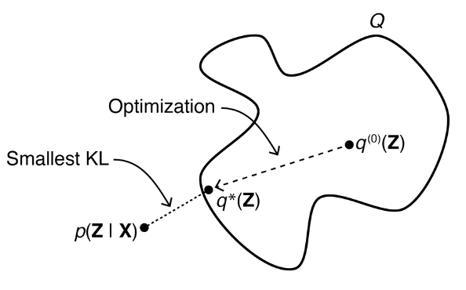

## Foundation Knowledge

### Keywords

- **Probability**
- **i.i.d.** (also written as iid or IID, is a short for Independent and Identically Distributed): In probability theory and statistics, a collection of random variables is Independent and Identically Distributed if each random variable has the same probability distribution as the others and all are mutually independent.
- **Likelihood**
- **Likelihood Function**
- **Maximum Likelihood Estimation (MLE)**: In statistics, maximum likelihood estimation is a method used to estimate the parameters of a probabilistic model.

###  Definitions

- $X$: random variable(s), can be sampled from data, implicitly obeys some distribution.
-  $\theta$: model's parameters. (e.g. $p$ for binomial distribution and $\mu, \sigma$ for gaussian distribution)

### MLE to VAE

When it comes to machine learning models, people usually think that there are two schools: frequentists and Bayesians. 

For the frequentists, the main points are:

- $X$ is random variable
- $\theta$ is unknown constant representing the model's parameters 
- $\theta$ can be estimated through $X$ using the maximum likelihood estimation method

that is:
$$
\theta_{MLE} = argmax \log P(X|\theta)
$$
In the above estimation, $\log$ is taken for $P$, this is because in most cases, in order to simplify calculations, people usually take the $\log$ of this expression, that is:
$$
\begin{aligned}
\because & \ x_i \sim p(x|\theta)\\
\therefore & \ P(X|\Theta) = \prod_{i=1}^N p(x_i|\theta)\\
\therefore & \ \log P(X|\Theta) = \sum_{i=1}^N \log p(x_i|\theta)\\
\end{aligned}
$$

:::note

If the continuous random variable X satisfies the following density function:
$$
f(x) = \frac{1}{\sqrt{2\pi}\sigma}e^{-\frac{(x-\mu)^2}{2\sigma^2}} \ \ \ (\mu \in R, \sigma \gt 0)
$$
Then it is said that $X$ obeys the gaussian(normal) distribution with parameters $(\mu,\sigma^2)$, written as:
$$
X\sim (\mu,\sigma^2)
$$
:::

## Variational Inference

