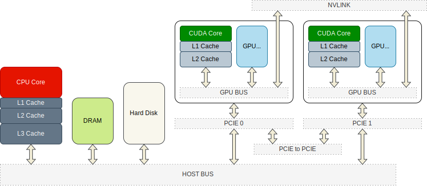
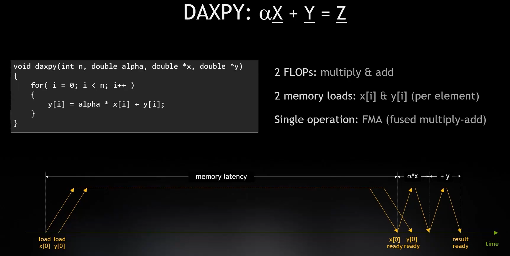
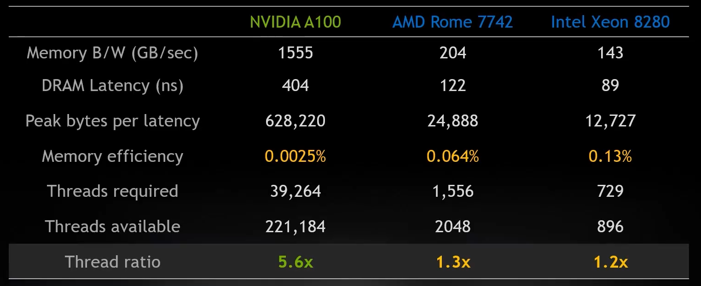
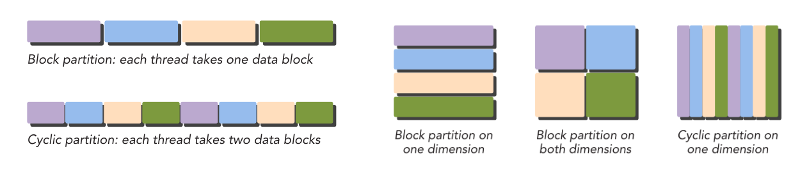
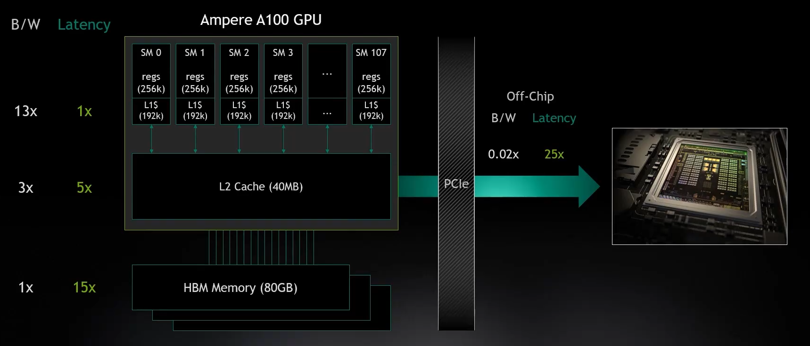
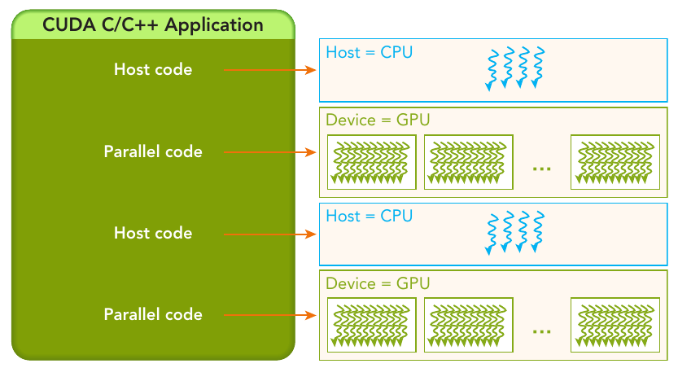
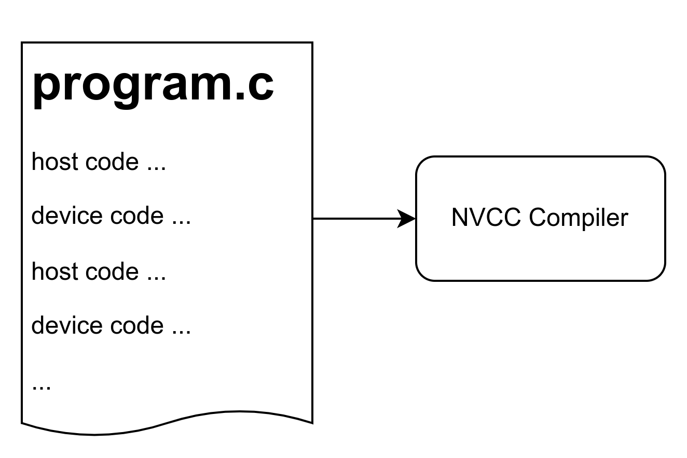
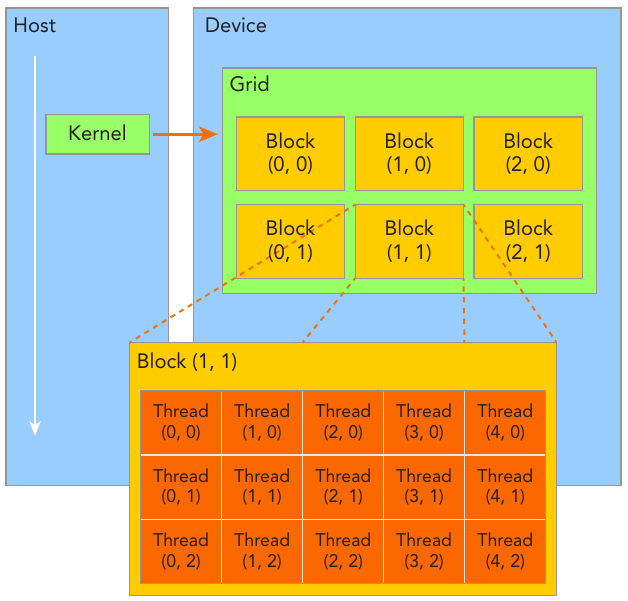
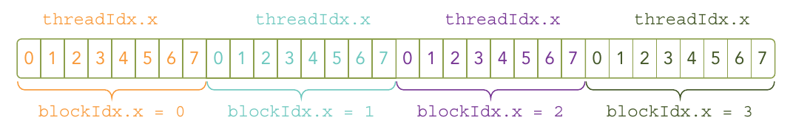
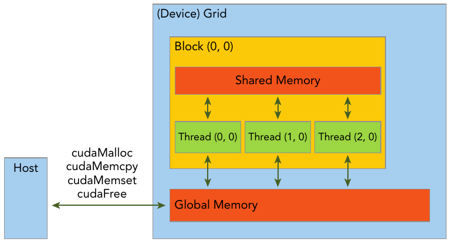

:::danger
**WARNING**  
This is a short version of the first five chapters of [Professional CUDA C Programming](https://www.cs.utexas.edu/~rossbach/cs380p/papers/cuda-programming.pdf), summarized by [VisualDust](https://gavin.gong.host). The content on this page does not completely refer to the content in the book, but adds additional new content to facilitate understanding. Please refer to the original document for more accurate information. 
:::

## Parallelism

In most prevalent cases, the purposes of applying parallelism are:
- Decrease latency
- Increase bandwidth
- Increase throughput

<!--truncate-->

### Motivation

Memory latency is the huge part of a computation process for most modern computers. Processor has to wait for memory latency until the data arrive, no matter how small the data is. Therefore, most applications won't run at a peak memory bandwidth.


Figure: The calculation process of $Z = \alpha X + Y$, during which CPU loads the value of $X$ and $Y$ from memory, and do multiplication and plus operation. For those simple operations, CPU has to wait more time while reading from memory than doing operations on data. Most applications (approximately about $\frac{3}{4}$ of them) are reaching the limitation of memory speed (both latency of bancwidth), instead of running out of cores.

For CPUs and GPUs, they are two different extremes on the way of improving memory performance:
- CPU are expected to reduce memory latency. The expectation to CPU is to do a lot of work using a single thread, and it's really expensive to switch between those threads due to context switching. So CPUs are not expected to "wait" for coming data in the process of handling a lot of instructions, and they are designed to reduce the latency to run things fast, instead of adding more threads.
- GPUs typically have much higher bandwidth as well as much higher latency. The principle here is that the GPU is designed to run a lot of tasks at the same time so that it has much more threads available than regular processors. The key of CUDA device is to perform parallel computation on a large amount of data, and they read chunk of data from memory at once. Therefore, it's really important to do data parallel on GPU.



And, of course, there is an imbalance between computation power and memory speed, that's the main conflict while designing GPU programs. For NVIDIA GPUs, the time it takes to read unit-sized data from memory is long enough for the GPU core to perform several operations on the same-sized data. Therefore, CUDA programming mostly care about where is the data.

:::success
CPUs and GPUs use different types of physical memory. The key difference here is that CPUs are running with single thread and GPUs are running a single task using alot of threads. The differences reflect to the differences between memory design for CPUs and GPUs. For GPUs, GDDR (Graphics Double Data Rate, [SDRAM](https://en.wikipedia.org/wiki/Synchronous_dynamic_random-access_memory)) is a storage medium for graphics cards. To understand GDDR, you can use [DDR](https://en.wikipedia.org/wiki/DDR_SDRAM) for CPU as a reference comparison. At present, the mainstream memory modules in our computers are mainly DDR, and the most commonly used ones are DDR4/DDR5. As a RAM that serves the CPU, DDR meets the characteristics of CPU computing and is targeted at scenarios such as small data and multiple operations. Therefore, DDR memory modules are generally designed to have small latency and do not care about large bandwidth; The characteristics of GPU are large data and few operations, or large batches of data processing in a single operation. Therefore, based on ordinary DDR, GDDR increases the bandwidth. Besides, there is another type of memory called [HBM](https://en.wikipedia.org/wiki/High_Bandwidth_Memory) for GPUs.
:::

### Data Parallelism

Data parallel is a fundamental and one of the most important aspect of improving effeciency and make full use of memory bandwidth to reach the processor's peak performance. **Typically, you can run a lot of tasks symotenuously to keep memory busy.** Compilers may optimize pipline(e.g. loop unrolling) for better efficiency, but pipelining could be limited due to the archetecture, or the optimization clould be done by the programmer manually to achieve both paralelism and concurrency. 

The first step in designing a data parallel program is to partition data across threads, with each thread working on a portion of the data. 

In general, there are two approaches to partitioning data: block partitioning and cyclic partitioning. In block partitioning, many consecutive elements of data are chunked together. Each chunk is assigned to a single thread in any order, and threads generally process only one chunk at a time. In cyclic partitioning, fewer data elements are chun- ked together. Neighboring threads receive neighboring chunks, and each thread can handle more than one chunk. Selecting a new chunk for a thread to process implies jumping ahead as many chunks as there are threads.


Figure: Examples of block partitioning and cyclic partitioning.

:::success
Specifically, for a machine consists of both CPU and GPU as well as their own memory, the topic of transfering data between physical memory of CPU and GPU is very important for the entire machine to util both CPU and GPU to do heterogeneous computing. There are typically two different types of data operation between devices:
- Host(CPU) $\leftarrow\rightarrow$ Device(GPU), via PCIE
- Device(GPU) $\leftarrow\rightarrow$ Device(GPU), via PCIE or NVLink
:::

### Heterogeneous Computing

[Heterogeneous computing](https://en.wikipedia.org/wiki/Heterogeneous_computing) refers to systems that use more than one kind of processor or core. These systems gain performance or energy efficiency not just by adding the same type of processors, but by adding dissimilar coprocessors, usually incorporating specialized processing capabilities to handle particular tasks.

Thats how a system with both CPU and GPU looks like. For a regular computer with NVIDIA GPU, CUDA devices refer to the GPUs installed on PCIE slot. 


Figure: How a modern computer system hardware consists, in which all the components communicate via host bus.

:::success
A common sense is that the data transfer speeds between components such as cache, GPU memory, PCIE channels, etc. are very different. A computer system should reasonably coordinate these components to balance their speeds so that they can work together.



When writing a program, you should also consider whether the transfer of data between host memory and device memory will cause performance losses. This is also a key issue in CUDA programming.
:::

A heterogeneous environment consists of CPUs complemented by GPUs, each with its own memory separated by a PCI-Express bus. Therefore, you should note the following distinction:
- Host: the CPU and its memory (host memory)
- Device: the GPU and its memory (device memory)

Since CPU cores and CUDA cores have their own cache and physical memory, they of course run different code on their own, but they can transfer/share data via PCIE to cooperate a complex task. Since we are talking about CUDA programming here, so the key terms of a heterogeneous application consists of two parts:
- Host code (runs on CPU)
- Device code (runs on GPU)

## CUDA Programming Model

The CUDA programming model provides the following special features to harness the computing power of
GPU architectures.
-  A way to organize threads on the GPU through a hierarchy structure
- A way to access memory on the GPU through a hierarchy structure

A typical processing flow of a CUDA program follows this pattern:
1. Copy data from CPU memory to GPU memory.
2. Invoke kernels to operate on the data stored in GPU memory.
3. Copy data back from GPU memory to CPU memory.


Figure: The serial code (as well as task parallel code) is executed on the host, while the parallel code is executed on the GPU device. 

The host code is written in ANSI C, and the device code is written using CUDA C. You can put all the code in a single source file, or you can use multiple source files to build your application or libraries. 


Figure: The NVIDIA C Compiler (nvcc) generates the executable code for both the host and device.

### Kernel function

A kernel function is the code to be executed on the device side. In a kernel function, you define the computation for a single thread, and the data access for that thread. When the kernel is called, many different CUDA threads perform the same computation in parallel. A kernel is defi ned using the `__global__` declaration specification. In CUDA programming, `__global__` and `__device__` are CUDA-specific keywords used to define functions that will be executed on the GPU.

1. `__global__`:
   - The `__global__` keyword is used to declare functions (called **kernel functions**) that will be executed on the GPU. These functions can be invoked from the CPU but run on the GPU. They can be called with a special syntax that includes grid and block dimensions to specify how the GPU should organize and execute these functions.
   - When a function is declared with `__global__`, it can be called from the CPU, but it executes on the GPU and can be launched in parallel by multiple threads. These functions typically operate on data stored in GPU memory.
   - Example:
     ```cppda
     __global__ void kernelFunction(int* array, int size) {
         int idx = blockIdx.x * blockDim.x + threadIdx.x;
         if (idx < size) {
             array[idx] *= 2;
         }
     }
     ```

:::danger
A kernel function **must have a `void` return type**. Besides, The following restrictions apply for all kernels:
- Access to device memory only
- Must have void return type
- No support for a variable number of arguments
- No support for static variables
- No support for function pointers
- Exhibit an asynchronous behavior
:::


2. `__device__`:
   - The `__device__` keyword is used to declare functions that can be called and executed on the GPU, similar to `__global__` functions. However, `__device__` functions **are not kernel functions and cannot be launched directly from the CPU**. Instead, they are typically called from `__global__` or other `__device__` functions.
   - `__device__` functions are useful for breaking down complex computations into smaller parts that can be executed in parallel on the GPU.
   - Example:
     ```cppda
     __device__ int add(int a, int b) {
         return a + b;
     }
     ```
   - `__device__` functions can be called from within `__global__` functions or other `__device__` functions.


|  QUALIFIERS  |       EXECUTION        |                           CALLABLE                           |              NOTE              |
| :----------: | :--------------------: | :----------------------------------------------------------: | :----------------------------: |
| `__global__` | Executed on the device | Callable from the host, Callable from the device for devices of compute capability 3 | Must have a `void` return type |
| `__device__` | Executed on the device |                Callable from the device only                 |                                |
|  `__host__`  |  Executed on the host  |                 Callable from the host only                  |       **Can be omitted**       |

:::success
The `__device__` and `__host__` qualifiers can be used together, in which case the function is compiled for both the host and the device.
:::

### Organizing Threads

CUDA programming is about to do a lot of work on data, and that's all about multi-threading. Fortunately, one of CUDA’s distinguishing features is that it exposes a two-level thread hierarchy through the programming model, and its relatively easier.

When a kernel function is launched from the host side, execution is moved to a device where a large number of threads are generated and each thread executes the statements specifi ed by the kernel function.


Figure: CUDA exposes a thread hierarchy abstraction to enable you to organize your threads. This is a two-level thread hierarchy decomposed into blocks of threads and grids of blocks.

Usually, a grid is organized as a 2D array of blocks, and a block is organized as a 3D array of threads. Both grids and blocks use the `dim3` type with three unsigned integer fields. The unused fi elds will be initialized to 1 and ignored.

Because the grid and block dimensionality of a kernel launch affect performance, exposing this simple abstraction provides the programmer with an additional avenue for optimization. There are several restrictions on the dimensions of grids and blocks. One of the major limiting factors on block size is available compute resources, such as registers, shared memory, and so on. Some limits can be retrieved by querying the GPU device.

Grids and blocks represent a logical view of the thread hierarchy of a kernel function. In Chapter 3, you will see that this type of thread organization gives you the ability to efficiently execute the same application code on different devices, each with varying amounts of compute and memory resources.

:::info
There are two distinct sets of grid and block variables in a CUDA program: manually-defined dim3 data type and pre-defined uint3 data type. On the host side, you defi ne the dimensions of a grid and block using a dim3 data type as part of a kernel invocation. When the kernel is executing, the CUDA runtime generates the corresponding built-in, pre-initialized grid, block, and thread variables, which are accessible within the kernel function and have type uint3. The manually-defined grid and block variables for the dim3 data type are only visible on the host side, and the built-in, pre-initialized grid and block variables of the uint3 data type are only visible on the device side.
:::

### Launching a CUDA kernel

You are familiar with the following C function call syntax:
```cpp
function_name (argument list);
```

Then, the CUDA kernel call semantics `<<<...>>>` are a specific syntax used to specify the execution configuration of a kernel function when launching it from the CPU. This syntax defines how the GPU threads are organized into a grid of thread blocks and how those thread blocks are organized into a grid of blocks.

A CUDA kernel call is a direct extension to the C function syntax that adds a kernel’s execution configuration inside triple-angle-brackets:
```cpp
kernel_name <<<grid, block>>>(argument list);
```

Where:
- `kernelFunction` is the name of the kernel function to be executed on the GPU.
- `<<<gridDim, blockDim>>>` specifies the execution configuration.
- `gridDim` defines the dimensions of the grid of thread blocks.
- `blockDim` defines the dimensions of each thread block.
- `args` are the arguments passed to the kernel function.

For example, if you want to launch a kernel function `kernelFunction` with a grid of 2D blocks, each consisting of 16x16 threads, you would use:

```cppda
kernelFunction<<<dim3(gridDimX, gridDimY), dim3(blockDimX, blockDimY)>>>(args);
```

Where `gridDimX` and `gridDimY` specify the number of blocks in the x and y dimensions of the grid, and `blockDimX` and `blockDimY` specify the number of threads per block in the x and y dimensions, respectively. The CUDA runtime system uses this information to schedule the execution of the kernel function across the available GPU resources. The actual number of threads and blocks that can be launched depends on the capabilities of the GPU device.

As explained in the previous section, the CUDA programming model exposes the thread hierarchy. With the execution configuration, you can specify how the threads will be scheduled to run on the GPU. The first value in the execution configuration is the grid dimension, the number of blocks to launch. The second value is the block dimension, the number of threads within each block. By specifying the grid and block dimensions, you configure:
- The total number of threads for a kernel
- The layout of the threads you want to employ for a kernel
The threads within the same block can easily communicate with each other, and threads that belong to different blocks cannot cooperate. For a given problem, you can use a different grid and block layout to organize your threads. For example, suppose you have 32 data elements for a calculation.
You can group 8 elements into each block, and launch four blocks as follows:
```cpp
kernel_name<<<4, 8>>>(argument list);
```



Terminologies and concepts here:
- All threads spawned by a single kernel launch are collectively called a grid. All threads in a grid share the same global memory space. 
- A grid is made up of many thread blocks. A thread block is a group of threads that can cooperate with each other using:
    - Block-local synchronization
    - Block-local shared memory
- Threads from different blocks cannot cooperate.
- Threads rely on the following two unique coordinates to distinguish themselves from each other:
    - blockIdx (block index within a grid)
    - threadIdx (thread index within a block)

CUDA organizes grids and blocks in three dimensions. When a kernel function is executed, the coordinate variables blockIdx and threadIdx are assigned to each thread by the CUDA runtime. **Based on the coordinates, you can assign portions of data to different threads**. The coordinate variable is of type uint3, a CUDA built-in vector type, derived from the basic integer type. It is a structure containing three unsigned integers, and the 1st, 2nd, and 3rd components are accessible through the fields x, y, and z respectively. You can get them through variables:

```cpp
blockIdx.x
blockIdx.y
blockIdx.z

threadIdx.x
threadIdx.y
threadIdx.z
```

The dimensions of a grid and a block are specified by the following two built-in variables:

- `blockDim` (block dimension, measured in threads)
- `gridDim` (grid dimension, measured in blocks)

Example code:
```cpp
#include <cuda_runtime.h>
#include <cstdio>
__global__ void checkIndex(void) {
  printf("threadIdx:(%d, %d, %d) blockIdx:(%d, %d, %d) blockDim:(%d, %d, %d) "
         "gridDim:(%d, %d, %d)\n",
         threadIdx.x, threadIdx.y, threadIdx.z, blockIdx.x, blockIdx.y,
         blockIdx.z, blockDim.x, blockDim.y, blockDim.z, gridDim.x, gridDim.y,
         gridDim.z);
}
int main(int argc, char **argv) {
  // define total data element
  int nElem = 6;
  // define grid and block structure
  dim3 block(3);
  dim3 grid((nElem + block.x - 1) / block.x);
  // check grid and block dimension from host side
  printf("grid.x %d grid.y %d grid.z %d\n", grid.x, grid.y, grid.z);
  printf("block.x %d block.y %d block.z %d\n", block.x, block.y, block.z);
  // check grid and block dimension from device side
  checkIndex<<<grid, block>>>();
  // reset device before you leave
  cudaDeviceReset();
  return (0);
}
```
output:
```
grid.x 2 grid.y 1 grid.z 1
block.x 3 block.y 1 block.z 1
threadIdx:(0, 0, 0) blockIdx:(1, 0, 0) blockDim:(3, 1, 1) gridDim:(2, 1, 1)
threadIdx:(1, 0, 0) blockIdx:(1, 0, 0) blockDim:(3, 1, 1) gridDim:(2, 1, 1)
threadIdx:(2, 0, 0) blockIdx:(1, 0, 0) blockDim:(3, 1, 1) gridDim:(2, 1, 1)
threadIdx:(0, 0, 0) blockIdx:(0, 0, 0) blockDim:(3, 1, 1) gridDim:(2, 1, 1)
threadIdx:(1, 0, 0) blockIdx:(0, 0, 0) blockDim:(3, 1, 1) gridDim:(2, 1, 1)
threadIdx:(2, 0, 0) blockIdx:(0, 0, 0) blockDim:(3, 1, 1) gridDim:(2, 1, 1)
```

:::success
Remember,

- The size of a grid (number of blocks) is not constant and can be specified when launching the kernel.
- The number of threads in a block is constant and specified when launching the kernel, with a maximum limit determined by the GPU architecture.

Figure above shows a logical concept instead of a physical one. In CUDA programming, the size of a grid (i.e., the number of blocks in a grid) can vary depending on the problem being solved and the hardware constraints. When you launch a kernel in CUDA, you specify the dimensions of the grid using the ` <<<...>>>` syntax, indicating the number of blocks in each dimension. For example:
```cpp
dim3 gridDim(2, 3); // 2 blocks in the x-dimension, 3 blocks in the y-dimension
kernel<<<gridDim, blockDim>>>(...);
```
This code snippet launches a kernel with a grid of 2x3 blocks, resulting in a total of 6 blocks.

The number of threads in a block is constant and is specified when launching the kernel. Each block can contain a maximum number of threads, which depends on the specific CUDA-capable GPU you are targeting. This maximum number is typically 512, 1024, or 2048 threads per block, depending on the GPU architecture. You specify the number of threads per block when launching the kernel, like this:
```cpp
dim3 blockDim(256); // 256 threads per block
kernel<<<gridDim, blockDim>>>(...);
```
In this example, each block contains 256 threads.
:::

:::warning
It is important to distinguish between the host and device access of grid and block variables. For example, using a variable declared as block from the host, you define the coordinates and access them as follows:
```cpp
block.x , block.y, block.z
```
On the device side, you have pre-initialized, built-in block size variable available as: 
```cpp
blockDim.x, blockDim.y, blockDim.z
```
In summary, you define variables for grid and block on the host before launching a kernel, and access them there with the x, y and z fields of the vector structure from the host side. When the kernel is launched, you can use the pre-initialized, built-in variables within the kernel.
:::

:::danger
Unlike a C function call, all CUDA kernel launches are asynchronous. Control returns to the CPU immediately after the CUDA kernel is invoked. A kernel call is asynchronous with respect to the host thread. After a kernel is invoked, control returns to the host side immediately. 

You can call the following function to force the host application to wait for all kernels to complete:
```cpp
cudaError_t cudaDeviceSynchronize(void);
```
Some CUDA runtime APIs perform an implicit synchronization between the host and the device. When you use cudaMemcpy to copy data between the host and device, implicit synchronization at the host side is performed and the host application must wait for the data copy to complete. It starts to copy after all previous kernel calls have completed. When the copy is finished, control returns to the host side immediately.
:::

You may assign different grid size and block size for a given data size, the general steps to determine the grid and block dimensions are:
1. Decide the block size.
2. Calculate the grid dimension based on the application data size and the block size.
To determine the block dimension, you usually need to consider:
- Performance characteristics of the kernel
- Limitations on GPU resources

Example:
```cpp
#include <stdio.h>

int main(int argc, char **argv) {
  // define total data elements
  int nElem = 1024;
  // define grid and block structure
  dim3 block(1024);
  dim3 grid((nElem + block.x - 1) / block.x);
  printf("grid.x %d block.x %d \n", grid.x, block.x);
  // reset block
  block.x = 512;
  grid.x = (nElem + block.x - 1) / block.x;
  printf("grid.x %d block.x %d \n", grid.x, block.x);
  // reset block
  block.x = 256;
  grid.x = (nElem + block.x - 1) / block.x;
  printf("grid.x %d block.x %d \n", grid.x, block.x);
  // reset block
  block.x = 128;
  grid.x = (nElem + block.x - 1) / block.x;
  printf("grid.x %d block.x %d \n", grid.x, block.x);
  // reset device before you leave
  cudaDeviceReset();
  return (0);
}
```
Example above uses a 1D grid and 1D blocks to illustrate that when the block size is altered, the grid size will be changed accordingly.

### Memory Management

The CUDA programming model assumes a system composed of a host and a device, each with its own separate memory. Kernels operate out of device memory. To allow you to have full control and achieve the best performance, the CUDA runtime provides functions to allocate device memory, release device memory, and transfer data between the host memory and device memory.

| STANDARD C FUNCTIONS | CUDA C FUNCTIONS |
| :------------------: | :--------------: |
|        malloc        |    cudaMalloc    |
|        memcpy        |    cudaMemcpy    |
|        memset        |    cudaMemset    |
|         free         |     cudaFree     |

This function copies the specified bytes from the source memory area, pointed to by src, to the destination memory area, pointed to by dst, with the direction specified by kind, where kind takes one of the following types:
- cudaMemcpyHostToHost
- cudaMemcpyHostToDevice
- cudaMemcpyDeviceToHost
- cudaMemcpyDeviceToDevice

:::info
To help clearly designate the different memory spaces, example code in this page uses variable names that start with `h_` for host memory, and `d_` for device memory.
:::

Here's an example CUDA code that demonstrates copying values of `a` and `b` from CPU to GPU, performing an addition operation (`add`) on the GPU, and then copying the result `c` back from GPU to CPU and printing it to the console using `stdio`:

```cpp
#include <stdio.h>

// CUDA kernel function to add two arrays element-wise
__global__ void add(int *a, int *b, int *c, int size) {
    int index = blockIdx.x * blockDim.x + threadIdx.x;
    if (index < size) {
        c[index] = a[index] + b[index];
    }
}

int main() {
    const int nElem = 1000; // Size of the arrays
    const int N = nElem * sizeof(int); // Size of memory in bytes

    // Allocate memory on CPU
    int *h_a, *h_b, *h_c;
    h_a = (int *)malloc(N);
    h_b = (int *)malloc(N);
    h_c = (int *)malloc(N);

    // Initialize input arrays
    for (int i = 0; i < nElem; ++i) {
        h_a[i] = i;
        h_b[i] = nElem - i;
    }

    // Allocate memory on GPU
    int *d_a, *d_b, *d_c;
    cudaMalloc((void **)&d_a, N);
    cudaMalloc((void **)&d_b, N);
    cudaMalloc((void **)&d_c, N);

    // Copy input arrays from CPU to GPU
    cudaMemcpy(d_a, h_a, N, cudaMemcpyHostToDevice);
    cudaMemcpy(d_b, h_b, N, cudaMemcpyHostToDevice);

    // Launch kernel function with 1D grid and block configuration
    int blockSize = 256;
    int numBlocks = (nElem + blockSize - 1) / blockSize;
    add<<<numBlocks, blockSize>>>(d_a, d_b, d_c, nElem);

    // Copy result array from GPU to CPU
    cudaMemcpy(h_c, d_c, N, cudaMemcpyDeviceToHost);

    // Print the result
    printf("Result:\n");
    for (int i = 0; i < nElem; ++i) {
        printf("%d + %d = %d\n", h_a[i], h_b[i], h_c[i]);
    }

    // Free memory
    free(h_a);
    free(h_b);
    free(h_c);
    cudaFree(d_a);
    cudaFree(d_b);
    cudaFree(d_c);

    cudaDeviceReset(); // release allocated resources
    return 0;
}

```
output:
```
0 + 1000 = 1000
1 + 999 = 1000
2 + 998 = 1000
...
998 + 2 = 1000
999 + 1 = 1000
```

This code demonstrates:

1. Allocation and initialization of arrays `h_a` and `h_b` on the CPU.
2. Memory allocation for arrays `d_a`, `d_b`, and `d_c` on the GPU.
3. Copying the input arrays from CPU to GPU using `cudaMemcpy`.
4. Launching the `add` kernel function on the GPU with appropriate grid and block configuration.
5. Copying the result array `d_c` from GPU to CPU.
6. Printing the result to the console.

:::info
`cudaDeviceReset()` is a function provided by the CUDA runtime API which resets the current CUDA device. When you call `cudaDeviceReset()`, it cleans up and deallocates all resources associated with the current CUDA context, including memory allocations, streams, events, and any other runtime resources that may have been created. It also resets the device to its initial state. This function is particularly useful for cleaning up GPU resources at the end of a CUDA program. It's often called before the program exits to ensure that all resources are properly released. 
It's important to note that after calling `cudaDeviceReset()`, any subsequent CUDA operations will require re-initialization of the CUDA context, such as device selection and memory allocation.
:::
:::danger
If you forget to reset the CUDA device at the end of your program, it may result in various issues, depending on the specifics of your program and the environment it's running in. Potential consequences include Resource Leakage, Resource Contention, System Instability and things like that. While forgetting to reset the CUDA device at the end of your program may not always cause immediate or catastrophic failures, it can lead to long-term issues such as resource leaks, performance degradation, and unpredictable behavior. It's good practice to properly clean up CUDA resources by calling `cudaDeviceReset()` at the end of your CUDA program to ensure proper resource management and system stability.
:::

In the example above, 

---

In the GPU memory hierarchy, the two most important types of memory are global memory and shared memory. Global memory is analogous to CPU system memory, while shared memory is similar to the CPU cache. However, GPU shared memory can be directly controlled from a CUDA C kernel.



### Data parallelism in kernel function call

Because the data is stored linearly in global memory, you can use the built-in variables `blockIdx.x` and `threadIdx.x` to:
- Identify a unique thread in the grid.
- Establish a mapping between threads and data elements.

## Unified Memory

Previously, one of the most common mistakes made by those learning to program in CUDA C is to improperly dereference the different memory spaces. For the memory allocated on the GPU, the device pointers may not be dereferenced in the host code. If you improperly use an assignment, for example:
```cpp
gpuRef = d_C
```
instead of using:
```cpp
cudaMemcpy(gpuRef, d_C, nBytes, cudaMemcpyDeviceToHost)
```
the application will crash at runtime.

To help avoid these types of mistakes, Unified Memory was introduced with CUDA 6, which lets you access both CPU and GPU memory by using a single pointer. 


## CUDA Execution Model

## CUDA Programming Model

## CUDA Memory Management

:::danger
## TO BE CONTINUED
:::