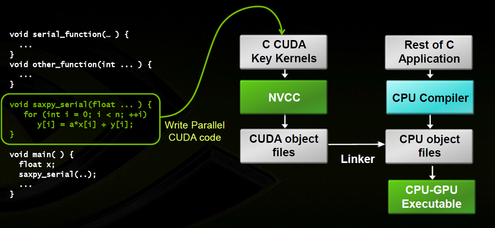

CUDA (Compute Unified Device Architecture) is a parallel computing platform and application programming interface (API) model created by NVIDIA. It enables developers to utilize the immense computational power of NVIDIA GPUs (Graphics Processing Units) for general-purpose processing tasks beyond graphics rendering.

Key features of CUDA programming include:

1. Parallelism: CUDA enables developers to exploit parallelism at multiple levels, including thread-level, instruction-level, and data-level parallelism, allowing for efficient computation on GPUs.
2. CUDA C/C++ Language Extensions: CUDA extends the C/C++ programming languages with additional keywords and constructs to facilitate programming for GPU architectures, making it easier to write parallel code.
3. CUDA Runtime API: The CUDA Runtime API provides a set of functions for managing GPU devices, memory allocation, data transfer between CPU and GPU, and launching kernel functions (the functions executed on the GPU).
4. CUDA Libraries: NVIDIA provides a collection of libraries optimized for GPU computing tasks, such as cuBLAS for linear algebra, cuFFT for Fast Fourier Transforms, cuDNN for deep neural networks, and more.
5. CUDA Toolkit: The CUDA Toolkit includes compilers, debuggers, profilers, and other development tools necessary for CUDA programming.

CUDA programming allows developers to harness the massive parallel processing power of GPUs to accelerate a wide range of computational tasks, including scientific simulations, image and video processing, machine learning, and more.

<!--truncate-->

## Prerequisites

Before you get get started with CUDA programming, please make sure:

- You have at least one NVIDIA GPU on your computer(Pascal or newer)
- [NVIDIA Driver](https://www.nvidia.com/download/index.aspx) is installed
- [CUDA Toolkit](https://developer.nvidia.com/cuda-toolkit) is installed, please also make sure you select also install [nsight](https://developer.nvidia.com/nsight-systems) when installing CUDA on windows, or install cuda-tools(which should include nsight system) separately when installing on linux.
- [`nvcc` Compiler](https://docs.nvidia.com/cuda/cuda-compiler-driver-nvcc/index.html) is ready (which should be ready itself after you have CUDA installed)

To **verify `nvcc`** (Nvidia CUDA Compiler, a proprietary compiler by Nvidia intended for use with CUDA) is ready, type `nvcc -V` in terminal and check the output:

```
> nvcc -v
nvcc: NVIDIA (R) Cuda compiler driver
Copyright (c) 2005-2023 NVIDIA Corporation
Built on Wed_Nov_22_10:17:15_PST_2023
Cuda compilation tools, release 12.3, V12.3.107
Build cuda_12.3.r12.3/compiler.33567101_0
```

:::success
The version of your `nvcc` compiler could vary from different environment you are using. Don't worry if your GPU is old, this tutorial should work on most microarchitecture of NVIDIA GPUs, even date back to Pascal GPUs.
:::

Besides, you should know the basics and fundamental knowledge about C/C++ programming.

:::danger
CUDA programming does support C++, and you can use C++ features and syntax in CUDA kernels. CUDA C/C++ is an extension of the C/C++ programming languages, allowing developers to write code for execution on NVIDIA GPUs.

**However**, regarding the C++ standard library, CUDA does support some components of it, but not all. In particular, many features of the C++ standard library that are dependent on host-side functionality may not be available for device code (code that runs on the GPU).

Some parts of the C++ standard library that are commonly used in CUDA device code include:

1. **Math functions**: CUDA provides math functions similar to those in `<cmath>` such as `sqrt`, `sin`, `cos`, etc., which can be used in device code.

2. **Utilities**: Some utilities from the C++ standard library, such as `std::numeric_limits`, `std::tuple`, `std::pair`, etc., are available for use in device code.

3. **Memory management**: CUDA provides memory management functions (`malloc`, `free`) which can be used in device code.

However, many other components of the C++ standard library, such as I/O operations (`iostream`), containers (`vector`, `map`, etc.), and algorithms (`sort`, `find`, etc.), are not directly usable in CUDA device code because they rely heavily on host-side functionality not available on the GPU.

CUDA developers often use CUDA-specific libraries and APIs for device-side operations, and they typically write host-side code in C or C++ to manage data transfers between the host and the GPU.
:::

## What does CUDA programming stand for

CUDA (Compute Unified Device Architecture) programming is not about game developing. While you may use DX12(a graphics API developed by Microsoft primarily for rendering graphics in Windows-based applications and games) for game developing, which also runs on GPU, CUDA enables developers to harness the power of NVIDIA GPUs for general-purpose computing tasks, not just graphics rendering. It allows programmers to write code in CUDA C/C++ or CUBA-accelerated libraries to perform tasks such as scientific simulations, data processing, machine learning, and more on the GPU.

One of the most important task for data scientists is matrix multiplication, since most of the calculation on machine learning is achieved this way. Consider a situation that you want to perform matrix multiplication on two matrix `A` and `B`:

$$
\mathbf{A}=\left[\begin{array}{ccc}
a_{1,1} & a_{1,2} & \ldots \\
a_{2,1} & a_{2,2} & \ldots \\
\vdots & \vdots & \ddots
\end{array}\right]=\left[\begin{array}{lll}
A_1 & A_2 & \ldots
\end{array}\right], \mathbf{B}=\left[\begin{array}{ccc}
b_{1,1} & b_{1,2} & \ldots \\
b_{2,1} & b_{2,2} & \cdots \\
\vdots & \vdots & \ddots
\end{array}\right]=\left[\begin{array}{c}
B_1 \\
B_2 \\
\vdots
\end{array}\right]
$$

Therefore:

$$
\mathbf{A B}=\left[\begin{array}{ccc}
a_{1,1}\left[\begin{array}{lll}
b_{1,1} & b_{1,2} & \ldots
\end{array}\right]+a_{1,2}\left[\begin{array}{lll}
b_{2,1} & b_{2,2} & \ldots
\end{array}\right]+\cdots \\
a_{2,1}\left[\begin{array}{lll}
b_{1,1} & b_{1,2} & \ldots
\end{array}\right]+a_{2,2}\left[\begin{array}{lll}
b_{2,1} & b_{2,2} & \ldots
\end{array}\right]+\cdots \\
\vdots
\end{array}\right]=A_1 B_1+A_2 B_2+\ldots
$$

Assume the shape of input matrix `A` is $(M\times K)$, `B` is $(K\times N)$, and the resulting matrix `C` $(M\times N)$.

In your computers, those matrix are stored linerly in logical memory. For example, a $3\times 3$ matrix looks like:


And basically programmers write c++ codes and run the program on CPU. The simplest(but not the fastest) way to do it is calculate via loops:

```cpp
void matmal(float *A, float *B, float *C, int M, int N, int K) {
  for (int x = 0; x < M; x++) {
    for (int y = 0; y < N; y++) {
      float sum = 0.0f;
      for (int i = 0; i < K; i++) {
        sum += A[x * K + i] * B[i * N + y];
      }
      C[x * N + y] = sum;
    }
  }
}
```

While this function performs `matmul` by simply simulate the procedure how human calculate `matmul` and It's very easy to understand, the code uses a single thread to perform the task, and it can be limited by the computation power of CPU single thread performance.

And, yes, you're thinking the right thing, doing multi-threading speeds up the calculation. However, the number of CPU threads is limited, and when the matrix is large enough, it can only provide limited acceleration. Moreover, context switching can be expensive for CPU, so it's not a good idea to create thousands of threads.

That's why we need GPUs. GPUs basiclly have much more cores than CPUs, and it is designed to do hevay multi-threading tasks with a huge number of threads. Here is how GPU calculates above mentioned `matmal`:

```cpp
__global__ void matmal(int M, int N, int K, float alpha, const float *A,
                       const float *B, float beta, float *C) {
  // compute position that this thread is responsible for
  const uint x = blockIdx.x * blockDim.x + threadIdx.x;
  const uint y = blockIdx.y * blockDim.y + threadIdx.y;

  // `if` condition is necessary for when M or N aren't multiples of 32.
  if (x < M && y < N) {
    float tmp = 0.0;
    for (int i = 0; i < K; ++i) {
      tmp += A[x * K + i] * B[i * N + y];
    }
    // C = α*(A@B)+β*C
    C[x * N + y] = alpha * tmp + beta * C[x * N + y];
  }
}
```

This above CUDA kernel function `matmal` is designed to perform matrix multiplication with certain optimizations to leverage parallel processing using the GPU.
:::success
DON'T worry if you do not understand the code, it was left here just for making an impression on how CUDA kernel function code would look like.
:::
Here's a breakdown of what it does:

- The kernel is invoked with a grid of blocks and threads. Each thread computes one element of the output matrix C.
- The dimensions of the matrices are passed as parameters: M, N, and K are the dimensions of matrices A (MxK) and B (KxN), and matrix C (MxN) to be computed.
- The coefficients alpha and beta are scalars used for scaling the result of the matrix multiplication and the existing values of C, respectively.
- The thread coordinates (x, y) within the grid are computed based on the block and thread indices.
- Before performing any computation, there's a boundary check (`if (x < M && y < N)`) to ensure that the thread does not access out-of-bounds memory.
- Inside the loop, each thread computes the dot product of the x-th row of matrix A and the y-th column of matrix B, storing the result in the temporary variable `tmp`.
- Finally, the computed result is scaled by alpha and added to the existing value of C at the corresponding position, which is then scaled by beta.

This piece of code is strange, it seems that the code only works on a single location of the output matrix. And yes, this is how CUDA kernel function looks like, you can take it as a function for a single thread, and when a CUDA kernel function is lunched, it is usually launched with a lot of threads and those threads run the same code. So when the code runs, in the given kernel, the computation of each element of the output matrix `C` is performed by a separate thread, with each thread responsible for computing one element.

:::success
You do not have to understand what is happening in the code above, we are going to talk about it later. What you should have been already understood is that programming on GPU with CUDA is mostly about multi-threading and parallelism, and that's the main difference compared to programming on CPU.
:::

## Intention of Parallelism

In most prevalent cases, the purposes of applying parallelism are:

- Decrease latency
- Increase bandwidth
- Increase throughput

Memory latency is the huge part of a computation process for most modern computers. Processor has to wait for memory latency until the data arrive, no matter how small the data is. Therefore, most applications won't run at a peak memory bandwidth.

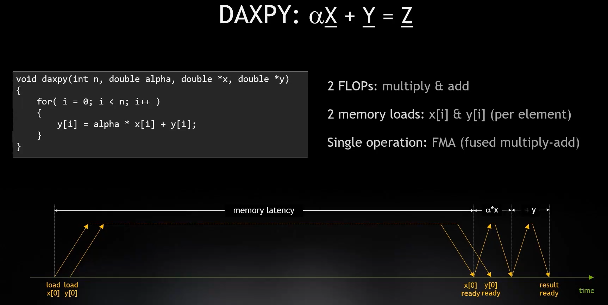
Figure: The calculation process of $Z = \alpha X + Y$, during which CPU loads the value of $X$ and $Y$ from memory, and do multiplication and plus operation. For those simple operations, CPU has to wait more time while reading from memory than doing operations on data. Most applications (approximately about $\frac{3}{4}$ of them) are reaching the limitation of memory speed (both latency of bancwidth), instead of running out of cores.

For CPUs and GPUs, they are two different extremes on the way of improving memory performance:

- CPU are expected to reduce memory latency. The expectation to CPU is to do a lot of work using a single thread, and it's really expensive to switch between those threads due to context switching. So CPUs are not expected to "wait" for coming data in the process of handling a lot of instructions, and they are designed to reduce the latency to run things fast, instead of adding more threads.
- GPUs typically have much higher bandwidth as well as much higher latency. The principle here is that the GPU is designed to run a lot of tasks at the same time so that it has much more threads available than regular processors. The key of CUDA device is to perform parallel computation on a large amount of data, and they read chunk of data from memory at once. Therefore, it's really important to do data parallel on GPU.

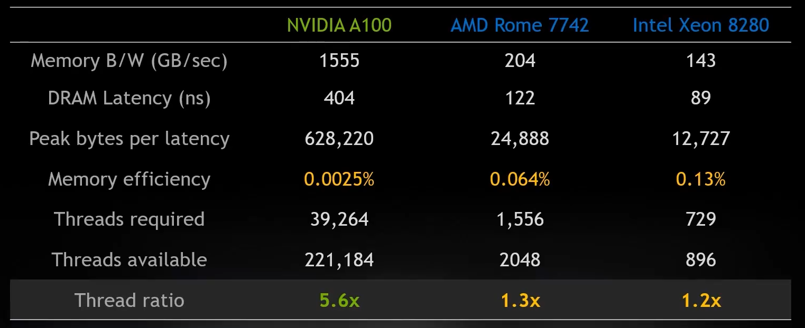

And, of course, there is an imbalance between computation power and memory speed, that's the main conflict while designing GPU programs. For NVIDIA GPUs, the time it takes to read unit-sized data from memory is long enough for the GPU core to perform several operations on the same-sized data. Therefore, CUDA programming mostly care about where is the data.

:::success
CPUs and GPUs use different types of physical memory. The key difference here is that CPUs are running with single thread and GPUs are running a single task using alot of threads. The differences reflect to the differences between memory design for CPUs and GPUs. For GPUs, GDDR (Graphics Double Data Rate, [SDRAM](https://en.wikipedia.org/wiki/Synchronous_dynamic_random-access_memory)) is a storage medium for graphics cards. To understand GDDR, you can use [DDR](https://en.wikipedia.org/wiki/DDR_SDRAM) for CPU as a reference comparison. At present, the mainstream memory modules in our computers are mainly DDR, and the most commonly used ones are DDR4/DDR5. As a RAM that serves the CPU, DDR meets the characteristics of CPU computing and is targeted at scenarios such as small data and multiple operations. Therefore, DDR memory modules are generally designed to have small latency and do not care about large bandwidth; The characteristics of GPU are large data and few operations, or large batches of data processing in a single operation. Therefore, based on ordinary DDR, GDDR increases the bandwidth. Besides, there is another type of memory called [HBM](https://en.wikipedia.org/wiki/High_Bandwidth_Memory) for GPUs.
:::

### Data Parallelism

Data parallel is a fundamental and one of the most important aspect of improving effeciency and make full use of memory bandwidth to reach the processor's peak performance. **Typically, you can run a lot of tasks symotenuously to keep memory busy.** Compilers may optimize pipline(e.g. loop unrolling) for better efficiency, but pipelining could be limited due to the archetecture, or the optimization clould be done by the programmer manually to achieve both paralelism and concurrency.

The first step in designing a data parallel program is to partition data across threads, with each thread working on a portion of the data.

In general, there are two approaches to partitioning data: block partitioning and cyclic partitioning. In block partitioning, many consecutive elements of data are chunked together. Each chunk is assigned to a single thread in any order, and threads generally process only one chunk at a time. In cyclic partitioning, fewer data elements are chun- ked together. Neighboring threads receive neighboring chunks, and each thread can handle more than one chunk. Selecting a new chunk for a thread to process implies jumping ahead as many chunks as there are threads.

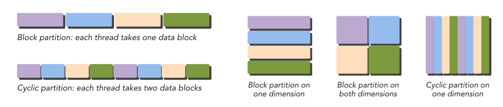
Figure: Examples of block partitioning and cyclic partitioning.

:::success
Specifically, for a machine consists of both CPU and GPU as well as their own memory, the topic of transfering data between physical memory of CPU and GPU is very important for the entire machine to util both CPU and GPU to do heterogeneous computing. There are typically two different types of data operation between devices:

- Host(CPU) $\leftarrow\rightarrow$ Device(GPU), via PCIE
- Device(GPU) $\leftarrow\rightarrow$ Device(GPU), via PCIE or NVLink
  :::

### Heterogeneous Computing

So far we know that CPUs and GPUs are designed for different purpose and they have their own advantages and disadvantages. Why don't let them cooperate for better efficiency?

Therefore, [Heterogeneous computing](https://en.wikipedia.org/wiki/Heterogeneous_computing) refers to systems that use more than one kind of processor or core. These systems gain performance or energy efficiency not just by adding the same type of processors, but by adding dissimilar coprocessors, usually incorporating specialized processing capabilities to handle particular tasks.

Thats how a system with both CPU and GPU looks like. For a regular computer with NVIDIA GPU, CUDA devices refer to the GPUs installed on PCIE slot.

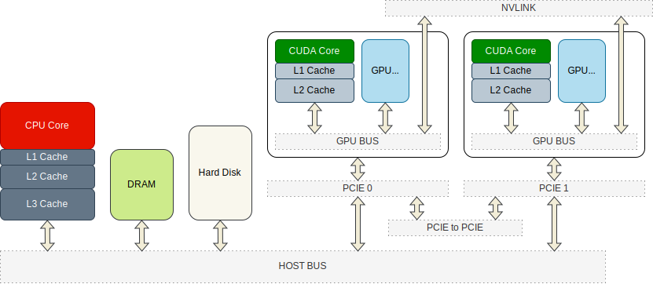
Figure: How a modern computer system hardware consists, in which all the components communicate via host bus.

:::success
A common sense is that the data transfer speeds between components such as cache, GPU memory, PCIE channels, etc. are very different. A computer system should reasonably coordinate these components to balance their speeds so that they can work together.

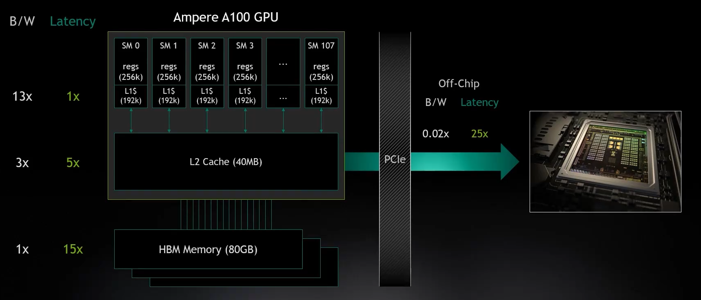

When writing a program, you should also consider whether the transfer of data between host memory and device memory will cause performance losses. This is also a key issue in CUDA programming.
:::

A heterogeneous environment consists of CPUs complemented by GPUs, each with its own memory separated by a PCI-Express bus. Therefore, you should note the following distinction:

- Host: the CPU and its memory (host memory)
- Device: the GPU and its memory (device memory)

Since CPU cores and CUDA cores have their own cache and physical memory, they of course run different code on their own, but they can transfer/share data via PCIE to cooperate a complex task. Since we are talking about CUDA programming here, so the key terms of a heterogeneous application consists of two parts:

- Host code (runs on CPU)
- Device code (runs on GPU)

## CUDA Programming Model

:::success
Now that you already know, in CUDA programming, data is divided into many parts, and each part is processed by a separate thread.
:::

The CUDA programming model provides the following special features to harness the computing power of
GPU architectures.

- A way to organize threads on the GPU through a hierarchy structure
- A way to access memory on the GPU through a hierarchy structure

A typical processing flow of a CUDA program follows this pattern:

1. Copy data from CPU memory to GPU memory.
2. Invoke kernels to operate on the data stored in GPU memory.
3. Copy data back from GPU memory to CPU memory.

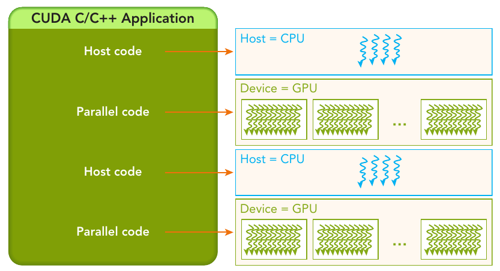
Figure: The serial code (as well as task parallel code) is executed on the host, while the parallel code is executed on the GPU device.

The host code is written in ANSI C, and the device code is written using CUDA C. You can put all the code in a single source file, or you can use multiple source files to build your application or libraries.

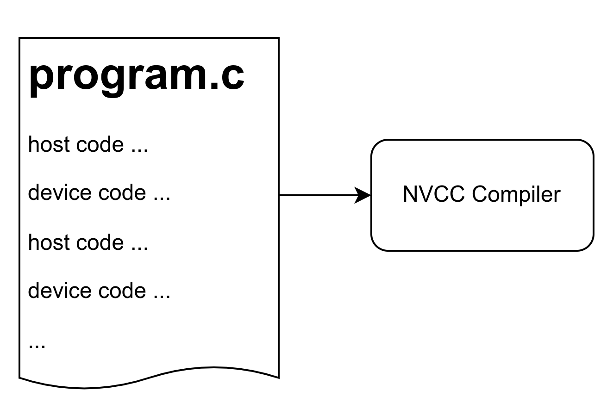
Figure: The NVIDIA C Compiler (nvcc) generates the executable code for both the host and device.

:::success
Instead of creating `.c` or `.cpp` files, you create `.cu` files for CUDA programming. You will use `nvcc` instead of `gcc` or `g++` to compile those files.
:::

For example, in `hello.cu`:

```cpp
#include <stdio.h>

__global__ void helloFromGPU(void) { printf("Hello World from GPU !\n"); }

int main(void) {
  printf("Hello World from CPU !\n"); // hello from cpu
  helloFromGPU<<<1, 10>>>();
  cudaDeviceReset();
  return 0;
}

```

Compile it with `nvcc`:

```
nvcc hello.cu -o hello
```

Run the generated executable:

```
hello
```

And you will see the expected output:

```
Hello World from CPU !
Hello World from GPU !
```

A typical CUDA program structure consists of five main steps:

1. Allocate GPU memories.
2. Copy data from CPU memory to GPU memory.
3. Invoke the CUDA kernel to perform program-specific computation.
4. Copy data back from GPU memory to CPU memory.
5. Destroy GPU memories.

In example above you only see the third step: Invoke the kernel. Don't worry about unfamiliar codes, we will talk about them later.

:::success
The CUDA `nvcc` compiler has similar semantics to gcc and other compilers. So you can add extra options such as `-o` for output file name or something you have been familar with in C/C++ programming.
:::

### Kernel function

A kernel function is the code to be executed on the device side. In a kernel function, you define the computation for a single thread, and the data access for that thread. When the kernel is called, many different CUDA threads perform the same computation in parallel. A kernel is defi ned using the `__global__` declaration specification. In CUDA programming, `__global__` and `__device__` are CUDA-specific keywords used to define functions that will be executed on the GPU.

1. `__global__`:
   - The `__global__` keyword is used to declare functions (called **kernel functions**) that will be executed on the GPU. These functions can be invoked from the CPU but run on the GPU. They can be called with a special syntax that includes grid and block dimensions to specify how the GPU should organize and execute these functions.
   - When a function is declared with `__global__`, it can be called from the CPU, but it executes on the GPU and can be launched in parallel by multiple threads. These functions typically operate on data stored in GPU memory.
   - Example:
     ```cppda
     __global__ void kernelFunction(int* array, int size) {
         int idx = blockIdx.x * blockDim.x + threadIdx.x;
         if (idx < size) {
             array[idx] *= 2;
         }
     }
     ```

:::danger
A kernel function **must have a `void` return type**. Besides, The following restrictions apply for all kernels:

- Access to device memory only
- Must have void return type
- No support for a variable number of arguments
- No support for static variables
- No support for function pointers
- Exhibit an asynchronous behavior
  :::

2. `__device__`:
   - The `__device__` keyword is used to declare functions that can be called and executed on the GPU, similar to `__global__` functions. However, `__device__` functions **are not kernel functions and cannot be launched directly from the CPU**. Instead, they are typically called from `__global__` or other `__device__` functions.
   - `__device__` functions are useful for breaking down complex computations into smaller parts that can be executed in parallel on the GPU.
   - Example:
     ```cppda
     __device__ int add(int a, int b) {
         return a + b;
     }
     ```
   - `__device__` functions can be called from within `__global__` functions or other `__device__` functions.

|  QUALIFIERS  |       EXECUTION        |                                       CALLABLE                                       |              NOTE              |
| :----------: | :--------------------: | :----------------------------------------------------------------------------------: | :----------------------------: |
| `__global__` | Executed on the device | Callable from the host, Callable from the device for devices of compute capability 3 | Must have a `void` return type |
| `__device__` | Executed on the device |                            Callable from the device only                             |                                |
|  `__host__`  |  Executed on the host  |                             Callable from the host only                              |       **Can be omitted**       |

:::success
The `__device__` and `__host__` qualifiers can be used together, in which case the function is compiled for both the host and the device.
:::

### Threads Hierarchy

CUDA programming is about to do a lot of work on data, and that's all about multi-threading. Fortunately, one of CUDA’s distinguishing features is that it exposes a two-level thread hierarchy through the programming model, and its relatively easier.

When a kernel function is launched from the host side, execution is moved to a device where a large number of threads are generated and each thread executes the statements specifi ed by the kernel function.

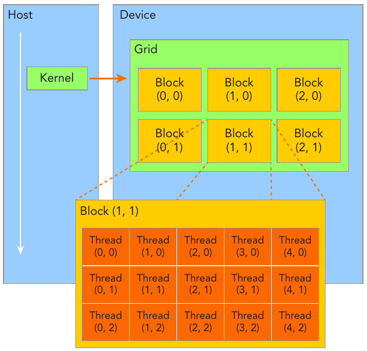
Figure: CUDA exposes a thread hierarchy abstraction to enable you to organize your threads. This is a two-level thread hierarchy decomposed into blocks of threads and grids of blocks.

:::danger
Figure above shows a simple kenel launched with $2\times 3$ blocks in each grids and $3\times 5$ threads in each block. Usually, a grid is organized as a 2D array of blocks, and a block is organized as a 3D array of threads. Both grids and blocks use the `dim3` type with three unsigned integer fields. The unused fields will be initialized to 1 and ignored.
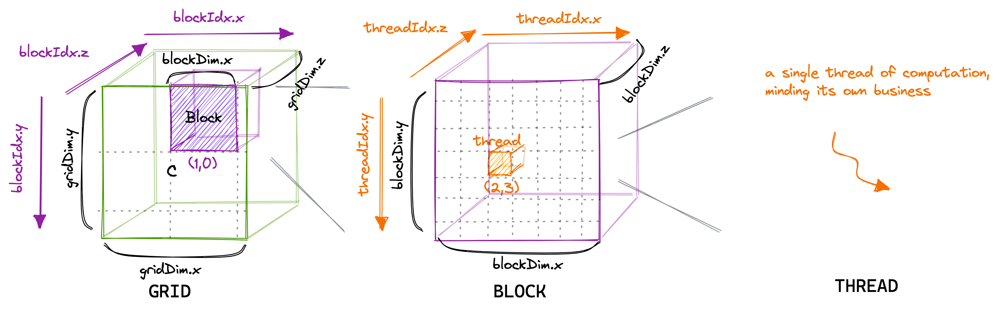
Figure: How it really looks like with grid and block size managed as `dim3` type.
Remember, Thread blocks can be configured to be one-, two-, or three-dimensional. **However, from the hardware perspective, all threads are arranged one-dimensionally.**
:::

Because the grid and block dimensionality of a kernel launch affect performance, exposing this simple abstraction provides the programmer with an additional avenue for optimization. There are several restrictions on the dimensions of grids and blocks. One of the major limiting factors on block size is available compute resources, such as registers, shared memory, and so on. Some limits can be retrieved by querying the GPU device.

Grids and blocks represent a logical view of the thread hierarchy of a kernel function, it gives you the ability to efficiently execute the same application code on different devices, each with varying amounts of compute and memory resources.

:::info
There are two distinct sets of grid and block variables in a CUDA program: manually-defined dim3 data type and pre-defined uint3 data type. On the host side, you defi ne the dimensions of a grid and block using a dim3 data type as part of a kernel invocation. When the kernel is executing, the CUDA runtime generates the corresponding built-in, pre-initialized grid, block, and thread variables, which are accessible within the kernel function and have type uint3. The manually-defined grid and block variables for the dim3 data type are only visible on the host side, and the built-in, pre-initialized grid and block variables of the uint3 data type are only visible on the device side.
:::

### Launching a CUDA kernel

You are familiar with the following C function call syntax:

```cpp
function_name (argument list);
```

Then, the CUDA kernel call semantics `<<<...>>>` are a specific syntax used to specify the execution configuration of a kernel function when launching it from the CPU. This syntax defines how the GPU threads are organized into a grid of thread blocks and how those thread blocks are organized into a grid of blocks.

:::success
A grid effectively represents a kernel launch, i.e., it contains all the blocks (and, thus, threads) that are to be run for one particular kernel launch.
:::

A CUDA kernel call is a direct extension to the C function syntax that adds a kernel’s execution configuration inside triple-angle-brackets:

```cpp
kernel_name <<<grid, block>>>(argument list);
```

Where:

- `kernelFunction` is the name of the kernel function to be executed on the GPU.
- `<<<gridDim, blockDim>>>` specifies the execution configuration.
- `gridDim` defines the dimensions of the grid of thread blocks.
- `blockDim` defines the dimensions of each thread block.
- `args` are the arguments passed to the kernel function.

For example, if you want to launch a kernel function `kernelFunction` with a grid of 2D blocks, each consisting of 16x16 threads, you would use:

```cppda
kernelFunction<<<dim3(gridDimX, gridDimY), dim3(blockDimX, blockDimY)>>>(args);
```

Where `gridDimX` and `gridDimY` specify the number of blocks in the x and y dimensions of the grid, and `blockDimX` and `blockDimY` specify the number of threads per block in the x and y dimensions, respectively. The CUDA runtime system uses this information to schedule the execution of the kernel function across the available GPU resources. The actual number of threads and blocks that can be launched depends on the capabilities of the GPU device.

As explained in the previous section, the CUDA programming model exposes the three-level hierarchy. With the execution configuration, you can specify how the threads will be scheduled to run on the GPU. The first value in the execution configuration is the grid dimension, the number of blocks to launch. The second value is the block dimension, the number of threads within each block. By specifying the grid and block dimensions, you configure:

- The total number of threads for a kernel
- The layout of the threads you want to employ for a kernel
  The threads within the same block can easily communicate with each other, and threads that belong to different blocks cannot cooperate. For a given problem, you can use a different grid and block layout to organize your threads. For example, suppose you have 32 data elements for a calculation.
  You can group 8 elements into each block, and launch four blocks as follows:

```cpp
kernel_name<<<4, 8>>>(argument list);
```


Terminologies and concepts here:

- All threads spawned by a single kernel launch are collectively called a grid. All threads in a grid share the same global memory space.
- A grid is made up of many thread blocks. A thread block is a group of threads that can cooperate with each other using:
  - Block-local synchronization
  - Block-local shared memory
- Threads from different blocks cannot cooperate.
- Threads rely on the following two unique coordinates to distinguish themselves from each other:
  - blockIdx (block index within a grid)
  - threadIdx (thread index within a block)

CUDA organizes grids and blocks in three dimensions. When a kernel function is executed, the coordinate variables blockIdx and threadIdx are assigned to each thread by the CUDA runtime. **Based on the coordinates, you can assign portions of data to different threads**. The coordinate variable is of type uint3, a CUDA built-in vector type, derived from the basic integer type. It is a structure containing three unsigned integers, and the 1st, 2nd, and 3rd components are accessible through the fields x, y, and z respectively. You can get them through variables:

```cpp
blockIdx.x
blockIdx.y
blockIdx.z

threadIdx.x
threadIdx.y
threadIdx.z
```

The dimensions of a grid and a block are specified by the following two built-in variables:

- `blockDim` (block dimension, measured in threads)
- `gridDim` (grid dimension, measured in blocks)

Example code:

```cpp
#include <cuda_runtime.h>
#include <cstdio>
__global__ void checkIndex(void) {
  printf("threadIdx:(%d, %d, %d) blockIdx:(%d, %d, %d) blockDim:(%d, %d, %d) "
         "gridDim:(%d, %d, %d)\n",
         threadIdx.x, threadIdx.y, threadIdx.z, blockIdx.x, blockIdx.y,
         blockIdx.z, blockDim.x, blockDim.y, blockDim.z, gridDim.x, gridDim.y,
         gridDim.z);
}
int main(int argc, char **argv) {
  // define total data element
  int nElem = 6;
  // define grid and block structure
  dim3 block(3);
  dim3 grid((nElem + block.x - 1) / block.x);
  // check grid and block dimension from host side
  printf("grid.x %d grid.y %d grid.z %d\n", grid.x, grid.y, grid.z);
  printf("block.x %d block.y %d block.z %d\n", block.x, block.y, block.z);
  // check grid and block dimension from device side
  checkIndex<<<grid, block>>>();
  // reset device before you leave
  cudaDeviceReset();
  return (0);
}
```

output:

```
grid.x 2 grid.y 1 grid.z 1
block.x 3 block.y 1 block.z 1
threadIdx:(0, 0, 0) blockIdx:(1, 0, 0) blockDim:(3, 1, 1) gridDim:(2, 1, 1)
threadIdx:(1, 0, 0) blockIdx:(1, 0, 0) blockDim:(3, 1, 1) gridDim:(2, 1, 1)
threadIdx:(2, 0, 0) blockIdx:(1, 0, 0) blockDim:(3, 1, 1) gridDim:(2, 1, 1)
threadIdx:(0, 0, 0) blockIdx:(0, 0, 0) blockDim:(3, 1, 1) gridDim:(2, 1, 1)
threadIdx:(1, 0, 0) blockIdx:(0, 0, 0) blockDim:(3, 1, 1) gridDim:(2, 1, 1)
threadIdx:(2, 0, 0) blockIdx:(0, 0, 0) blockDim:(3, 1, 1) gridDim:(2, 1, 1)
```

:::success
Remember,

- The size of a grid (number of blocks) is not constant and can be specified when launching the kernel.
- The number of threads in a block is constant and specified when launching the kernel, with a maximum limit determined by the GPU architecture.

Figure above shows a logical concept instead of a physical one. In CUDA programming, the size of a grid (i.e., the number of blocks in a grid) can vary depending on the problem being solved and the hardware constraints. When you launch a kernel in CUDA, you specify the dimensions of the grid using the `<<<...>>>` syntax, indicating the number of blocks in each dimension. For example:

```cpp
dim3 gridDim(2, 3); // 2 blocks in the x-dimension, 3 blocks in the y-dimension
kernel<<<gridDim, blockDim>>>(...);
```

This code snippet launches a kernel with a grid of 2x3 blocks, resulting in a total of 6 blocks.

The number of threads in a block is constant and is specified when launching the kernel. Each block can contain a maximum number of threads, which depends on the specific CUDA-capable GPU you are targeting. This maximum number is typically 512, **1024**, or 2048 threads per block, depending on the GPU architecture. You specify the number of threads per block when launching the kernel, like this:

```cpp
dim3 blockDim(256); // 256 threads per block
kernel<<<gridDim, blockDim>>>(...);
```

In this example, each block contains 256 threads.
:::

:::warning
It is important to distinguish between the host and device access of grid and block variables. For example, using a variable declared as block from the host, you define the coordinates and access them as follows:

```cpp
block.x , block.y, block.z
```

On the device side, you have pre-initialized, built-in block size variable available as:

```cpp
blockDim.x, blockDim.y, blockDim.z
```

In summary, you define variables for grid and block on the host before launching a kernel, and access them there with the x, y and z fields of the vector structure from the host side. When the kernel is launched, you can use the pre-initialized, built-in variables within the kernel.
:::

:::success
For more information about built-in variables in CUDA programming, please refer to CUDA official guide [CUDA C Programming Guide: built-in-variables](https://docs.nvidia.com/cuda/cuda-c-programming-guide/index.html#built-in-variables)
:::

:::danger
Unlike a C function call, all CUDA kernel launches are asynchronous. Control returns to the CPU immediately after the CUDA kernel is invoked. A kernel call is asynchronous with respect to the host thread. After a kernel is invoked, control returns to the host side immediately.

You can call the following function to force the host application to wait for all kernels to complete:

```cpp
cudaError_t cudaDeviceSynchronize(void);
```

Some CUDA runtime APIs perform an implicit synchronization between the host and the device. When you use cudaMemcpy to copy data between the host and device, implicit synchronization at the host side is performed and the host application must wait for the data copy to complete. It starts to copy after all previous kernel calls have completed. When the copy is finished, control returns to the host side immediately.
:::

### Memory Management

In the GPU memory hierarchy, the two most important types of memory are global memory and shared memory. Global memory is analogous to CPU system memory, while shared memory is similar to the CPU cache. However, GPU shared memory can be directly controlled from a CUDA C kernel.

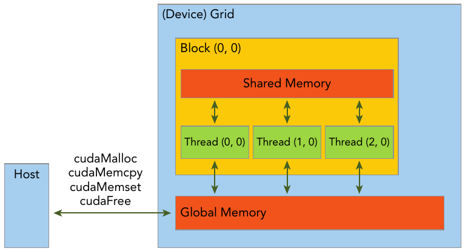

The CUDA programming model assumes a system composed of a host and a device, each with its own separate memory. Kernels operate out of device memory. To allow you to have full control and achieve the best performance, the CUDA runtime provides functions to allocate device memory, release device memory, and transfer data between the host memory and device memory.

| STANDARD C FUNCTIONS | CUDA C FUNCTIONS |
| :------------------: | :--------------: |
|        malloc        |    cudaMalloc    |
|        memcpy        |    cudaMemcpy    |
|        memset        |    cudaMemset    |
|         free         |     cudaFree     |

This function copies the specified bytes from the source memory area, pointed to by src, to the destination memory area, pointed to by dst, with the direction specified by kind, where kind takes one of the following types:

- cudaMemcpyHostToHost
- cudaMemcpyHostToDevice
- cudaMemcpyDeviceToHost
- cudaMemcpyDeviceToDevice

:::info
To help clearly designate the different memory spaces, example code in this page uses variable names that start with `h_` for host memory, and `d_` for device memory.
:::

Because the data is stored linearly in global memory, you can use the built-in variables `blockIdx.x` and `threadIdx.x` to:

- Identify a unique thread in the grid.
- Establish a mapping between threads and data elements.

Example:

host code:

```cpp
void sumArraysOnHost(float *A, float *B, float *C, const int N) {
    for (int i = 0; i < N; i++)
        C[i] = A[i] + B[i];
}
...
// call the function
sumArraysOnHost(float *A, float *B, float *C, const int N);
```

device code:

```cpp
__global__ void sumArraysOnGPU(float *A, float *B, float *C) {
    int i = threadIdx.x;
    C[i] = A[i] + B[i];
}
...
// launch kernel
sumArraysOnGPU<<<1,32>>>(float *A, float *B, float *C);
```

Code above launch the kernel function with 1 grid 32 threads. You can actually adjust how the kernel is launched to perform the task, for example, you can use 4 grids with 8 threads in each grid, thats 32 thread either:

```cpp
kernel_name<<<4, 8>>>(argument list);
```


Then you can access the correct data in kernel function via `blockDim` and `threadIdx`.

## Example: Summing Matrices with a 1D Grid and 1D Blocks

Here's an example CUDA code that demonstrates copying values of array `a` and `b` from CPU to GPU, performing an addition operation (`add`) on the GPU, and then copying the result `c` back from GPU to CPU and printing it to the console. In this example, we have 1000 values in array `a` and `b`, we use 1000 threads to calculate each of the sum of the elements from `a` and `b`:

File `add-with-1d-grid-1d-block.cu`:

```cpp
#include <stdio.h>

// CUDA kernel function to add two arrays element-wise
__global__ void add(int *a, int *b, int *c, int size) {
    int index = blockIdx.x * blockDim.x + threadIdx.x;
    if (index < size) {
        c[index] = a[index] + b[index];
    }
}

int main() {
    const int nElem = 1000; // Size of the arrays
    const int N = nElem * sizeof(int); // Size of memory in bytes

    // Allocate memory on CPU
    int *h_a, *h_b, *h_c;
    h_a = (int *)malloc(N);
    h_b = (int *)malloc(N);
    h_c = (int *)malloc(N);

    // Initialize input arrays
    for (int i = 0; i < nElem; ++i) {
        h_a[i] = i;
        h_b[i] = nElem - i;
    }

    // Allocate memory on GPU
    int *d_a, *d_b, *d_c;
    cudaMalloc((void **)&d_a, N);
    cudaMalloc((void **)&d_b, N);
    cudaMalloc((void **)&d_c, N);

    // Copy input arrays from CPU to GPU
    cudaMemcpy(d_a, h_a, N, cudaMemcpyHostToDevice);
    cudaMemcpy(d_b, h_b, N, cudaMemcpyHostToDevice);

    // Launch kernel function with 1D grid and block configuration
    int blockSize = 256;
    int numBlocks = (nElem + blockSize - 1) / blockSize;
    add<<<numBlocks, blockSize>>>(d_a, d_b, d_c, nElem);

    // Copy result array from GPU to CPU
    cudaMemcpy(h_c, d_c, N, cudaMemcpyDeviceToHost);

    // Print the result
    printf("Result:\n");
    for (int i = 0; i < nElem; ++i) {
        printf("%d + %d = %d\n", h_a[i], h_b[i], h_c[i]);
    }

    // Free memory
    free(h_a);
    free(h_b);
    free(h_c);
    cudaFree(d_a);
    cudaFree(d_b);
    cudaFree(d_c);

    cudaDeviceReset(); // release allocated resources
    return 0;
}

```

### Run the code

In terminal, move to your working directory, and type:

```bash
nvcc add-with-1d-grid-1d-block.cu -o add
```

Wait for `nvcc` complete, and run the generated executable:

```bash
./add
```

The output should be:

```
0 + 1000 = 1000
1 + 999 = 1000
2 + 998 = 1000
...
998 + 2 = 1000
999 + 1 = 1000
```

This code demonstrates:

1. Allocation and initialization of arrays `h_a` and `h_b` on the CPU.
2. Memory allocation for arrays `d_a`, `d_b`, and `d_c` on the GPU.
3. Copying the input arrays from CPU to GPU using `cudaMemcpy`.
4. Launching the `add` kernel function on the GPU with appropriate grid and block configuration.
5. Copying the result array `d_c` from GPU to CPU.
6. Printing the result to the console.

:::info
`cudaDeviceReset()` is a function provided by the CUDA runtime API which resets the current CUDA device. When you call `cudaDeviceReset()`, it cleans up and deallocates all resources associated with the current CUDA context, including memory allocations, streams, events, and any other runtime resources that may have been created. It also resets the device to its initial state. This function is particularly useful for cleaning up GPU resources at the end of a CUDA program. It's often called before the program exits to ensure that all resources are properly released.
It's important to note that after calling `cudaDeviceReset()`, any subsequent CUDA operations will require re-initialization of the CUDA context, such as device selection and memory allocation.
:::
:::danger
If you forget to reset the CUDA device at the end of your program, it may result in various issues, depending on the specifics of your program and the environment it's running in. Potential consequences include Resource Leakage, Resource Contention, System Instability and things like that. While forgetting to reset the CUDA device at the end of your program may not always cause immediate or catastrophic failures, it can lead to long-term issues such as resource leaks, performance degradation, and unpredictable behavior. It's good practice to properly clean up CUDA resources by calling `cudaDeviceReset()` at the end of your CUDA program to ensure proper resource management and system stability.
:::

## Organizing Threads

Wait bro, you should systematically understand the concepts of Thread, Block, and Grid in CUDA programming before you continue. Your NVIDIA GPU generally contains many SM(Stream Processor). Each SM is the basic computing unit in the CUDA architecture. It can be divided into several (such as 2~3) grids, and each grid contains several (such as 65535) Thread blocks, each thread block contains a number (such as 512) threads.

Among them, a Grid can contain multiple Blocks. The distribution mode of Blocks can be one-dimensional, two-dimensional, or three-dimensional; a Block contains multiple Threads, and the distribution mode of Threads can also be one-dimensional, two-dimensional, or three-dimensional.

### How many thread do you need?

Since you already know, in CUDA programming, data is divided into many parts, and each part is processed by a separate thread. So it is important that you know how many thread will it take to launch the kernel in order to perform computation on specific data.

In the very first example at the top of this page, when doing matrix multiplication, CUDA programmers usually assign one thread on computing each of the value in the output. Each call to the CUDA kernel creates a new grid, and you launch a kernel every time you want to perform a calculation task. So you should know how many threads, as well as how many blocks in the grid do you need before launching the kernel.

For the example of matrix multiplication, Assume the shape of input matrix `A` is $(M\times K)$, `B` is $(K\times N)$, and the resulting matrix `C` $(M\times N)$. Here is a simple way to calculate the required number of `gridDim` and `blockDim`:

```cpp
#define CEIL_DIV(M, N) (((M) + (N)-1) / (N))

dim3 gridDim(CEIL_DIV(M, 32), CEIL_DIV(N, 32), 1);
// 32 * 32 = 1024 thread per block
dim3 blockDim(32, 32, 1);
sgemm_naive<<<gridDim, blockDim>>>(M, N, K, alpha, A, B, beta, C);
```

**I'm trying to make the point that the number of thread you need depends on the number of element in your data**. You may assign different grid size and block size for a given data size, the general steps to determine the grid and block dimensions are:

1. Decide the block size.
2. Calculate the grid dimension based on the application data size and the block size.
   To determine the block dimension, you usually need to consider:

- Performance characteristics of the kernel
- Limitations on GPU resources

Example:

```cpp
#include <stdio.h>

int main(int argc, char **argv) {
  // define total data elements
  int nElem = 1024;
  // define grid and block structure
  dim3 block(1024);
  dim3 grid((nElem + block.x - 1) / block.x);
  printf("grid.x %d block.x %d \n", grid.x, block.x);
  // reset block
  block.x = 512;
  grid.x = (nElem + block.x - 1) / block.x;
  printf("grid.x %d block.x %d \n", grid.x, block.x);
  // reset block
  block.x = 256;
  grid.x = (nElem + block.x - 1) / block.x;
  printf("grid.x %d block.x %d \n", grid.x, block.x);
  // reset block
  block.x = 128;
  grid.x = (nElem + block.x - 1) / block.x;
  printf("grid.x %d block.x %d \n", grid.x, block.x);
  // reset device before you leave
  cudaDeviceReset();
  return (0);
}
```

Example above uses a 1D grid and 1D blocks to illustrate that when the block size is altered, the grid size will be changed accordingly.

Each call to the CUDA kernel creates a new grid consisting of multiple blocks. Each block consists of up to 1024 individual threads. These constants can be found in the CUDA Programming Guide. Threads within the same block can access the same shared memory area (SMEM).

### Thread ID with different Grid/Block Dimension

You may have seen the code line to get the thread id:

```cpp
const uint threadId = blockIdx.x * blockDim.x + threadIdx.x;
```

The code assume that the units in Block and Grid here are organized in a one-dimensional form, so when calculating tid, we only need the built-in variables with the .x suffix.

For two-dimensional and three-dimensional Block and Grid as well as other different sets of Block-Grid dimentions, the index of each thread is calculated as follows:

- 1 dimentional Grid and 1 dimentional Block:

```cpp
int threadId = blockIdx.x *blockDim.x + threadIdx.x;
```

- 1 dimentional Grid and 2 dimentional Block：

```cpp
int threadId = blockIdx.x * blockDim.x * blockDim.y +
              threadIdx.y * blockDim.x + threadIdx.x;
```

- 1 dimentional Grid and 3 dimentional Block：

```cpp
int threadId = blockIdx.x * blockDim.x * blockDim.y * blockDim.z +
              threadIdx.z * blockDim.y * blockDim.x +
              threadIdx.y * blockDim.x + threadIdx.x;
```

- 2 dimentional Grid and 2 dimentional Block：

```cpp
int blockId = blockIdx.x + blockIdx.y * gridDim.x;
int threadId = blockId * (blockDim.x * blockDim.y)
                       + (threadIdx.y * blockDim.x) + threadIdx.x;
```

- 3 dimentional Grid and 3 dimentional Block：

```cpp
int blockId = blockIdx.x + blockIdx.y * gridDim.x
             + gridDim.x * gridDim.y * blockIdx.z;

int threadId = blockId * (blockDim.x * blockDim.y * blockDim.z)
                       + (threadIdx.z * (blockDim.x * blockDim.y))
                       + (threadIdx.y * blockDim.x) + threadIdx.x;
```

Those are only examples and you should calculate the thread id properly depending on your situation.

### Example: Summing Matrices with a 2D Grid and 2D Blocks

In this section, you will write a matrix addition kernel that uses a 2D grid with 2D blocks.

File `add-with-2d-grid-2d-block.cu`:

```cpp
#include <cstdlib>
#include <stdio.h>

// Function to initialize data in a float array
void initialDataFloat(float *src, size_t nElem) {
  // Loop through the array and assign each element a value based on its index
  for (int i = 0; i < nElem; i++)
    src[i] = static_cast<float>(i); // Cast index to float and store in array
}

// Kernel function to perform element-wise addition of two matrices on the GPU
__global__ void sumMatrixOnGPU2D(float *MatA, float *MatB, float *MatC, int nx,
                                 int ny) {
  // Calculate the global indices in 2D grid
  unsigned int ix = threadIdx.x + blockIdx.x * blockDim.x; // Column index
  unsigned int iy = threadIdx.y + blockIdx.y * blockDim.y; // Row index
  unsigned int idx = iy * nx + ix; // Global index in 1D array

  // Check if the calculated indices are within the matrix dimensions
  if (ix < nx && iy < ny)
    // Perform matrix addition and store result in MatC
    MatC[idx] = MatA[idx] + MatB[idx];
}

int main(int argc, char **argv) {
  // Define matrix dimensions (nx x ny)
  int nx = 1 << 5; // 2^5 = 32
  int ny = 1 << 5; // 2^5 = 32
  int nxy = nx * ny; // Total number of elements in the matrix
  int nBytes = nxy * sizeof(float); // Total memory required for one matrix in bytes
  printf("Matrix size: nx %d ny %d\n", nx, ny);

  // Allocate memory for host-side matrices (MatA, MatB, MatC)
  float *h_A, *h_B, *h_C;
  h_A = (float *)malloc(nBytes);
  h_B = (float *)malloc(nBytes);
  h_C = (float *)malloc(nBytes);

  // Initialize data in host-side matrices (MatA, MatB)
  initialDataFloat(h_A, nxy); // Initialize MatA
  initialDataFloat(h_B, nxy); // Initialize MatB
  memset(h_C, 0, nBytes); // Initialize MatC to zero

  // Allocate memory for device-side matrices (d_MatA, d_MatB, d_MatC)
  float *d_MatA, *d_MatB, *d_MatC;
  cudaMalloc((void **)&d_MatA, nBytes);
  cudaMalloc((void **)&d_MatB, nBytes);
  cudaMalloc((void **)&d_MatC, nBytes);

  // Transfer data from host to device
  cudaMemcpy(d_MatA, h_A, nBytes, cudaMemcpyHostToDevice);
  cudaMemcpy(d_MatB, h_B, nBytes, cudaMemcpyHostToDevice);

  // Configure grid and block dimensions for GPU kernel execution
  int dimx = 32;
  int dimy = 32;
  dim3 block(dimx, dimy); // 2D block of threads
  dim3 grid((nx + block.x - 1) / block.x, (ny + block.y - 1) / block.y); // 2D grid of blocks

  // Launch kernel for matrix addition on GPU
  sumMatrixOnGPU2D<<<grid, block>>>(d_MatA, d_MatB, d_MatC, nx, ny);

  // Wait for kernel to finish execution
  cudaDeviceSynchronize();

  // Copy result (MatC) from device to host
  cudaMemcpy(h_C, d_MatC, nBytes, cudaMemcpyDeviceToHost);

  // Print result (MatC)
  for (size_t i = 0; i < nxy; i++) {
    printf("%f + %f = %f\n", h_A[i], h_B[i], h_C[i]); // Print element-wise addition
  }

  // Print kernel launch configuration
  printf("sumMatrixOnGPU2D <<<(%d,%d), (%d,%d)>>>\n", grid.x, grid.y, block.x,
         block.y);

  // Free device memory
  cudaFree(d_MatA);
  cudaFree(d_MatB);
  cudaFree(d_MatC);

  // Free host memory
  free(h_A);
  free(h_B);
  free(h_C);

  // Reset device
  cudaDeviceReset();

  return (0);
}
```

Have a look at those three lines:

```cpp
int nx = 1 << 5; // 2^5 = 32
int ny = 1 << 5; // 2^5 = 32
int nxy = nx * ny; // Total number of elements in the matrix
```

it defines that the size of the matrices is $32\times 32$. Therefore, when you run the program, the output would be:

```
...
1021.000000 + 1021.000000 = 2042.000000
1022.000000 + 1022.000000 = 2044.000000
1023.000000 + 1023.000000 = 2046.000000
sumMatrixOnGPU2D <<<(1,1), (32,32)>>>
```

If you change `nx` and `ny` from `1 << 5` to `1 << 6`, you're essentially increasing the size of the matrices from $32 \times 32$ to $64 \times 64$, and your output would be:

```
...
4093.000000 + 4093.000000 = 8186.000000
4094.000000 + 4094.000000 = 8188.000000
4095.000000 + 4095.000000 = 8190.000000
sumMatrixOnGPU2D <<<(2,2), (32,32)>>>
```

You can see an increment of grid size from $(1,1)$ to $(2,2)$ when you changed `nx` and `ny` from `1 << 5` to `1 << 6`. We should know the reason.

In CUDA programming, the launch configuration for kernels involves specifying the number of blocks and threads per block. These parameters are crucial for efficiently utilizing the computational resources of the GPU. In code above, the launch configuration for the kernel is determined as follows:

```cpp
dim3 grid((nx + block.x - 1) / block.x, (ny + block.y - 1) / block.y);
```

Here, `grid` represents the number of blocks in each dimension. The number of blocks is calculated by dividing the total number of elements in each dimension by the number of threads per block in that dimension. The expression `(nx + block.x - 1) / block.x` calculates the number of blocks needed to cover the `nx` elements with `block.x` threads in the x-dimension. Similarly, `(ny + block.y - 1) / block.y` calculates the number of blocks needed in the y-dimension.

When `nx` and `ny` change from `1 << 5` to `1 << 6`, the total number of elements in each dimension doubles. Consequently, the number of blocks required to cover these elements also doubles in each dimension. Therefore, the `grid` dimensions change accordingly.

Before the change (`1 << 5`):

- Total elements in each dimension: \(32\)
- Number of blocks needed in each dimension: \(1\)

After the change (`1 << 6`):

- Total elements in each dimension: \(64\)
- Number of blocks needed in each dimension: \(2\)

As a result, the `grid` configuration changes from `<<<(1,1), (32,32)>>>` to `<<<(2,2), (32,32)>>>`. This means that the kernel will now be executed with a grid consisting of \(2 \times 2\) blocks, where each block contains \(32 \times 32\) threads. This adjustment ensures that the kernel is applied to all elements of the matrices while utilizing the available computational resources effectively.

## Example: Matrix Mmultiplication

So far we have already talked about the basics of operating data with CUDA. Now we are going to have another example of matrix multiplication.

File name `matmul.cu`:

```cpp
#include <cstddef>
#include <stdio.h>

__global__ void matmal(int M, int N, int K, float alpha, const float *A,
                       const float *B, float beta, float *C) {
  // compute position that this thread is responsible for
  const uint x = blockIdx.x * blockDim.x + threadIdx.x;
  const uint y = blockIdx.y * blockDim.y + threadIdx.y;

  // `if` condition is necessary for when M or N aren't multiples of 32.
  if (x < M && y < N) {
    float tmp = 0.0;
    for (int i = 0; i < K; ++i) {
      tmp += A[x * K + i] * B[i * N + y];
    }
    // C = α*(A@B)+β*C
    C[x * N + y] = alpha * tmp + beta * C[x * N + y];
  }
}

template <class T> void printMatrix(T *src, size_t row, size_t column) {
  for (size_t i = 0; i < row; i++) {
    for (size_t j = 0; j < column; j++)
      printf("%.2f,", static_cast<float>(src[i * column + j]));
    printf("\n");
  }
}

#define CEIL_DIV(M, N) (((M) + (N)-1) / (N))

int main(int argc, char **argv) {
  size_t M = 31, K = 1, N = 32; // Size of the input arrays
  float alpha = 1.0, beta = 1.0;
  // Allocate memory on CPU
  float *h_a, *h_b, *h_c;
  h_a = (float *)malloc(M * K * sizeof(float));
  h_b = (float *)malloc(K * N * sizeof(float));
  h_c = (float *)malloc(M * N * sizeof(float));
  // Initialize input arrays
  for (size_t i = 0; i < M * K; ++i)
    h_a[i] = i * 0.1;
  for (size_t i = 0; i < K * N; ++i)
    h_b[i] = i * 0.1;
  // Allocate memory on GPU
  float *d_a, *d_b, *d_c;
  cudaMalloc((void **)&d_a, M * K * sizeof(float));
  cudaMalloc((void **)&d_b, K * N * sizeof(float));
  cudaMalloc((void **)&d_c, M * N * sizeof(float));
  // Copy input arrays from CPU to GPU
  cudaMemcpy(d_a, h_a, M * K * sizeof(float), cudaMemcpyHostToDevice);
  cudaMemcpy(d_b, h_b, K * N * sizeof(float), cudaMemcpyHostToDevice);
  dim3 block_dim(32, 32, 1); // 32 * 32 = 1024 thread per block
  dim3 grid_dim(CEIL_DIV(M, 32), CEIL_DIV(N, 32),
                1); // calculate gridDim depending on blockDim 32x32
  printf("grid dim: %d,%d,%d\n", grid_dim.x, grid_dim.y, grid_dim.z);
  printf("block dim: %d,%d,%d\n", block_dim.x, block_dim.y, block_dim.z);
  matmal<<<grid_dim, block_dim>>>(M, N, K, alpha, d_a, d_b, beta, d_c);
  // Copy result array from GPU to CPU
  cudaMemcpy(h_c, d_c, M * N * sizeof(float), cudaMemcpyDeviceToHost);
  printf("Result:\n");
  printMatrix<float>(h_c, M, N);
  // Free memory
  free(h_a);
  free(h_b);
  free(h_c);
  cudaFree(d_a);
  cudaFree(d_b);
  cudaFree(d_c);

  cudaDeviceReset(); // release allocated resources
  return 0;
}
```

The output should be a $32\times 32$ float array.

### Breakdown the code of kernel function `matmal`

```cpp
__global__ void matmal(int M, int N, int K, float alpha, const float *A,
                       const float *B, float beta, float *C) {
```

- `__global__` is a CUDA specifier indicating that this function is a kernel function, which will be executed on the GPU.
- `void` signifies that the function does not return a value.
- `matmal` is the name of the function.
- `int M, int N, int K` are the dimensions of the matrices A, B, and C, respectively.
- `float alpha` is the scaling factor for the result of the matrix multiplication.
- `const float *A, const float *B` are pointers to the input matrices A and B, which are passed by reference and are marked as `const` to prevent modification.
- `float beta` is the scaling factor for the existing values in the result matrix C.
- `float *C` is a pointer to the output matrix C, which will store the result of the matrix multiplication.

```cpp
    const uint x = blockIdx.x * blockDim.x + threadIdx.x;
    const uint y = blockIdx.y * blockDim.y + threadIdx.y;
```

- These lines compute the global indices (`x` and `y`) of the current thread within the grid.
- `blockIdx` gives the block index within the grid, and `threadIdx` gives the thread index within the block.
- `blockDim` gives the dimensions of the block (the number of threads in each dimension).

```cpp
    if (x < M && y < N) {
```

- This `if` condition ensures that the thread operates within the bounds of the output matrix dimensions (M x N).

```cpp
        float tmp = 0.0;
        for (int i = 0; i < K; ++i) {
            tmp += A[x * K + i] * B[i * N + y];
        }
```

- This loop computes the dot product of the corresponding row of matrix A and column of matrix B to get the value of the resulting matrix C at position `(x, y)`.
- `tmp` accumulates the sum of products of corresponding elements of rows of A and columns of B.

```cpp
        C[x * N + y] = alpha * tmp + beta * C[x * N + y];
```

- Finally, the scaled sum of the dot product is stored in the output matrix C.

Overall, the `matmal` function implements a basic matrix multiplication algorithm using CUDA, leveraging parallelism offered by the GPU to compute the result efficiently.

### Breakdown the code of main function

- Memory is allocated for the input and output matrices on both the CPU and GPU.
- Input matrices `h_a` and `h_b` are initialized with some values.
- Memory is allocated on the GPU using `cudaMalloc`, and data is copied from the CPU to the GPU using `cudaMemcpy`.
- Grid and block dimensions are defined. In this case, a block of 32x32 threads is created, and the grid dimensions are calculated based on the size of the matrices and the block size.
- The kernel function `matmal` is invoked using `<<<>>>` syntax, specifying the grid and block dimensions.
- The result matrix `h_c` is copied from the GPU to the CPU using `cudaMemcpy`.
- The result matrix is printed using the `printMatrix` function.
- Memory allocated on both the CPU and GPU is freed, and resources are released using `cudaDeviceReset()`.

## Debugging and error handling

### Checking Errors

Since many CUDA calls are asynchronous, it may be difficult to identify which routine caused an error. Defining an error-handling macro to wrap all CUDA API calls simplifies the error checking process:

```cpp
#define CHECK(call)                                                            \
  {                                                                            \
    const cudaError_t error = call;                                            \
    if (error != cudaSuccess) {                                                \
      printf("Error: %s:%d, ", __FILE__, __LINE__);                            \
      printf("code:%d, reason: %s\n", error, cudaGetErrorString(error));       \
      exit(1);                                                                 \
    }                                                                          \
  }                                                                            \
```

For example, you can use the macro on the following code:

```cpp
CHECK(cudaMemcpy(d_C, gpuRef, nBytes, cudaMemcpyHostToDevice));
```

If the memory copy or a previous asynchronous operation caused an error, the macro reports the error code, prints a human readable message, and then stops the program. It also can be used after a kernel invocation in the following way to check for kernel errors:

```cpp
kernel_function<<<grid, block>>>(argument list);
CHECK(cudaDeviceSynchronize());
```

`CHECK(cudaDeviceSynchronize())` blocks the host thread until the device has completed all preceding requested tasks, and ensures that no errors occurred as part of the last kernel launch.

:::danger
This technique should be used just for debugging purposes, because adding this check point after kernel launches will block the host thread and make that point a global barrier.
:::

### Check your device

If you got errors about device such as `invalid device ordinal`, you can check and change the device your CUDA program is using. To check `device 0`, you can use `CHECK` mentioned above:

```cpp
// set up device
int dev = 0;
cudaDeviceProp deviceProp;
CHECK(cudaGetDeviceProperties(&deviceProp, dev));
printf("Using Device %d: %s\n", dev, deviceProp.name);
CHECK(cudaSetDevice(dev));
```

Since I'm using RTX 3090 at the time, my output is:

```
Using Device 0: NVIDIA GeForce RTX 3090
```

Your output could varies depending on the GPU model you are using. If your CUDA device(your NVIDIA GPU) is not `device 0`, you can change the value of `dev`, such as changing the line from `int dev = 0;` to `int dev = 1;` to check `device 1` until you get the valid result.

:::success
You can always add those lines at the begining of your every CUDA program to ensure your program is running on the right device.
:::

Besides, NVIDIA provides several means by which you can query and manage GPU devices. You can use the Runtime API to query GPU information:

```cpp
cudaError_t cudaGetDeviceProperties(cudaDeviceProp* prop, int device);
```

The properties of the GPU device are returned in the [cudaDeviceProp](https://docs.nvidia.com/cuda/cuda-runtime-api/structcudaDeviceProp.html#structcudaDeviceProp) structure. Here is the example code to get your CUDA device information:

File `check-device-info.cu`

```cpp
#include <cuda_runtime.h>
#include <stdio.h>

int main(int argc, char **argv) {
  int deviceCount = 0;
  cudaError_t error_id = cudaGetDeviceCount(&deviceCount);
  if (error_id != cudaSuccess) {
    printf("cudaGetDeviceCount returned %d\n-> %s\n", (int)error_id,
           cudaGetErrorString(error_id));
    printf("Result = FAIL\n");
    exit(EXIT_FAILURE);
  }
  if (deviceCount == 0) {
    printf("There are no available device(s) that support CUDA\n");
  } else {
    printf("Detected %d CUDA Capable device(s)\n", deviceCount);
  }
  int dev, driverVersion = 0, runtimeVersion = 0;
  dev = 0;
  cudaSetDevice(dev);
  cudaDeviceProp deviceProp;
  cudaGetDeviceProperties(&deviceProp, dev);
  printf("Device %d: \"%s\"\n", dev, deviceProp.name);
  cudaDriverGetVersion(&driverVersion);
  cudaRuntimeGetVersion(&runtimeVersion);
  printf(" CUDA Driver Version / Runtime Version % d.% d / % d.%d\n ",
         driverVersion / 1000, (driverVersion % 100) / 10,
         runtimeVersion / 1000, (runtimeVersion % 100) / 10);
  printf(" CUDA Capability Major/Minor version number:% d.%d\n ",
         deviceProp.major, deviceProp.minor);
  printf(" Total amount of global memory:% .2f MBytes(%llu bytes)\n",
         (float)deviceProp.totalGlobalMem / (pow(1024.0, 3)),
         (unsigned long long)deviceProp.totalGlobalMem);
  printf(" GPU Clock rate:% .0f MHz(% 0.2f GHz)\n ",
         deviceProp.clockRate * 1e-3f, deviceProp.clockRate * 1e-6f);
  printf(" Memory Clock rate:% .0f Mhz\n ", deviceProp.memoryClockRate * 1e-3f);
  printf(" Memory Bus Width:% d bit\n ", deviceProp.memoryBusWidth);
  if (deviceProp.l2CacheSize) {
    printf(" L2 Cache Size:% d bytes\n ", deviceProp.l2CacheSize);
  }
  printf(" Max Texture Dimension Size (x,y,z): 1D = (% d), 2D = (% d, % d), 3D "
         "= (% d, % d, % d)\n ",
         deviceProp.maxTexture1D, deviceProp.maxTexture2D[0],
         deviceProp.maxTexture2D[1], deviceProp.maxTexture3D[0],
         deviceProp.maxTexture3D[1], deviceProp.maxTexture3D[2]);
  printf(" Max Layered Texture Size (dim) x layers: 1D = (% d) x % d, 2D = (% "
         "d, % d) x % d\n ",
         deviceProp.maxTexture1DLayered[0], deviceProp.maxTexture1DLayered[1],
         deviceProp.maxTexture2DLayered[0], deviceProp.maxTexture2DLayered[1],
         deviceProp.maxTexture2DLayered[2]);
  printf(" Total amount of constant memory: %lu bytes\n ",
         deviceProp.totalConstMem);
  printf(" Total amount of shared memory per block: %lu bytes\n ",
         deviceProp.sharedMemPerBlock);
  printf(" Total number of registers available per block: %d\n",
         deviceProp.regsPerBlock);
  printf(" Warp size: %d\n", deviceProp.warpSize);
  printf(" Maximum number of threads per multiprocessor: %d\n",
         deviceProp.maxThreadsPerMultiProcessor);
  printf(" Maximum number of threads per block: %d\n",
         deviceProp.maxThreadsPerBlock);
  printf(" Maximum sizes of each dimension of a block: %d x %d x %d\n",
         deviceProp.maxThreadsDim[0], deviceProp.maxThreadsDim[1],
         deviceProp.maxThreadsDim[2]);
  printf(" Maximum sizes of each dimension of a grid: %d x %d x %d\n",
         deviceProp.maxGridSize[0], deviceProp.maxGridSize[1],
         deviceProp.maxGridSize[2]);
  printf(" Maximum memory pitch: %lu bytes\n", deviceProp.memPitch);

  exit(EXIT_SUCCESS);
}
```

Output on my computer:

```
Detected 1 CUDA Capable device(s)
Device 0: "NVIDIA GeForce RTX 3090"
 CUDA Driver Version / Runtime Version  12. 3 /  12.3
  CUDA Capability Major/Minor version number: 8.6
  Total amount of global memory: 23.67 MBytes(25414860800 bytes)
 GPU Clock rate: 1860 MHz( 1.86 GHz)
  Memory Clock rate: 9751 Mhz
  Memory Bus Width: 384 bit
  L2 Cache Size: 6291456 bytes
  Max Texture Dimension Size (x,y,z): 1D = ( 131072), 2D = ( 131072,  65536), 3D = ( 16384,  16384,  16384)
  Max Layered Texture Size (dim) x layers: 1D = ( 32768) x  2048, 2D = ( 32768,  32768) x  2048
  Total amount of constant memory: 65536 bytes
  Total amount of shared memory per block: 49152 bytes
  Total number of registers available per block: 65536
 Warp size: 32
 Maximum number of threads per multiprocessor: 1536
 Maximum number of threads per block: 1024
 Maximum sizes of each dimension of a block: 1024 x 1024 x 64
 Maximum sizes of each dimension of a grid: 2147483647 x 65535 x 65535
 Maximum memory pitch: 2147483647 bytes
```

You should get different output depending on the GPU model you are using.

### Verifying result of kernel function

Besides many useful debugging tools, there is a very basic but useful means by
which you can verify your kernel code, that is, you can write a host function that has the same functionality to verify the result from the kernel by comparing the result of the kernel function and the regular host function:

```cpp
void checkResult(float *hostRef, float *gpuRef, const int N) {
  double epsilon = 1.0E-8;
  int match = 1;
  for (int i = 0; i < N; i++) {
    if (abs(hostRef[i] - gpuRef[i]) > epsilon) {
      match = 0;
      printf("Arrays do not match!\n");
      printf("host %5.2f gpu %5.2f at current %d\n", hostRef[i], gpuRef[i], i);
      break;
    }
  }
  if (match)
    printf("Arrays match.\n\n");
  return;
}
```

Besides many useful debugging tools, you can also set the execution configuration to `<<<1,1>>>`, so you force the kernel to run with only one block and one thread. This emulates a sequential implementation. This is useful for debugging and verifying correct results. Also, this helps you verify that numeric results are bitwise exact from run-to-run if you encounter order of operations issues.

### Using a CPU timer

Knowing how long a kernel takes to execute is helpful and critical during the performance turning of kernels. There are several ways to measure kernel performance.

The simplest method is to use a CPU timer to measure kernel executions from the host side.

```cpp
#include <sys/time.h>
double cpuSecond() {
  struct timeval tp;
  gettimeofday(&tp, NULL);
  return ((double)tp.tv_sec + (double)tp.tv_usec * 1.e-6);
}
```

Code above allows you to get the time from CPU. Basically, you can measure running time of any code using a CPU timer:

```cpp
double iStart = cpuSecond();
... things you want to measure
double iElaps = cpuSecond() - iStart;
```

If you want to time a CUDA kernel launch, you can:

```cpp
double iStart = cpuSecond();
kernel_name<<<grid, block>>>(argument list);
cudaDeviceSynchronize();
double iElaps = cpuSecond() - iStart;
```

:::danger
Don't forget to add `cudaDeviceSynchronize()` when time it with a CPU timer. Although all GPU-related tasks placed in one stream (which is the default behavior) are executed sequentially on GPU side, CUDA kernel launches are asynchronous to CPU, so the code just goes to the next line when you start the kernel at the line `kernel_name<<<grid, block>>>(argument list);`. `cudaDeviceSynchronize()` ensures your CPU timer will record the right time running the kernel.
:::

For the example of `matmul` we have already mentioned above, in the main function, add a CPU timer here:

```cpp
...
double iStart = cpuSecond();
matmal<<<grid_dim, block_dim>>>(M, N, K, alpha, d_a, d_b, beta, d_c);
cudaDeviceSynchronize();
double iElaps = cpuSecond() - iStart;
printf("Time used: %f", iElaps);
...
```

My output is:

```
Time used: 0.000072
```

Your output should be a different value. Besides, if you want to measure time cost while doing memory copy between CPU and GPU, you should also include related code lines between `iStart` and `iElaps`.

## Frequently Asked Questions

- [When to call cudaDeviceSynchronize?](https://stackoverflow.com/questions/11888772/when-to-call-cudadevicesynchronize)

## References

https://www.cs.utexas.edu/~rossbach/cs380p/papers/cuda-programming.pdf  
https://docs.nvidia.com/cuda/cuda-c-programming-guide  
https://cuda.keter.top/prev_concept
