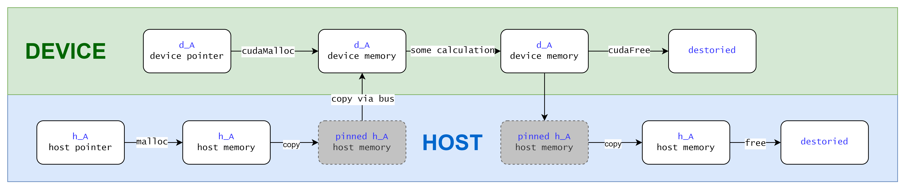
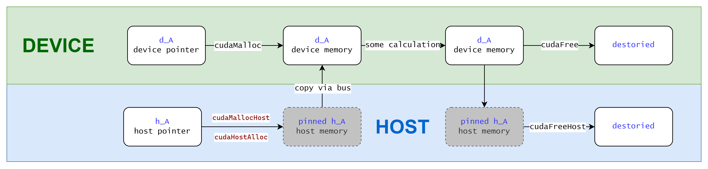
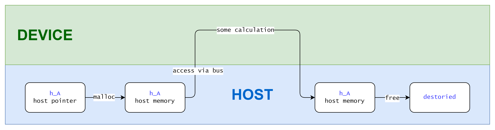

In CUDA programming, memory management functions are essential for optimizing data transfer between the host (CPU) and the device (GPU).

## Copy from/to Pageable Memory



In this case you move data manually from host/device side to the other side.

You first `malloc` memory on host and copy it to device via `cudaMemcpy`. When the computation on device is finished, you copy the result back via `cudaMemcpy` again.

<!--truncate-->

`cudaMemcpy`

- **Description**: Copies data between host and device memory.
- **Use Case**: Transfer data from host to device or vice versa.

Load data on host and move to device:

```cpp
int* h_a, *d_a;
h_a = (int*)malloc(sizeof(int) * N);
cudaMemcpy(d_a, h_a, sizeof(int) * N, cudaMemcpyHostToDevice);

// ... do some calculation on d_a
```

Pageable memory is the default type of memory allocation in a host system, your host side programm runs with pageable memory. When transferring data from pageable host memory to device memory, the CUDA driver first allocates temporary page-locked or pinned host memory, copies the source host data to pinned memory, and then transfers the data from pinned memory to device memory.

When you finish your tasks performed on `d_a`, you need to copy it back to host side so that host side code can access the data. Then free the device side memory:

```cpp
cudaMemcpy(h_a, d_a, sizeof(int) * N, cudaMemcpyDeviceToHost);
cudaFree(d_a);

// ... access h_a on host
free(h_a);
```

## Copy from/to Pinned Memory



You've seen the difference, yes, you can use CUDA APIs (`cudaMallocHost` and `cudaHostAlloc`) to allocate pinned memory directly so that DMA can work directly on your host memory, no need for extra temporary pinned memory anymore. Pinned memory has the property that it cannot be moved to some where else nor swapped out to disk, making data transfers faster because the memory is always accessible.

API `cudaMallocHost`:

- **Description**: Allocates pinned (page-locked) host memory. This type of memory is allocated on the host but cannot be paged out to disk, resulting in faster and more predictable transfers to and from the device.
- **Use Case**: Optimizes data transfer performance between host and device, particularly for frequently transferred data.

API `cudaHostAlloc`:

- **Description**: Allocates host memory with more control over allocation flags, providing options such as portable memory or mapped memory.
- **Use Case**: Offers more flexibility compared to `cudaMallocHost` for advanced memory management scenarios.
- **Flags**:

  - `cudaHostAllocDefault`: Default behavior, similar to `cudaMallocHost`.
  - `cudaHostAllocPortable`: Allocates portable pinned memory that can be accessed by multiple CUDA contexts.
  - `cudaHostAllocMapped`: Allocates pinned memory that is also mapped into the device’s address space, allowing direct access from the device without copying.
  - `cudaHostAllocWriteCombined`: Allocates write-combined memory for fast writes from the host (but slower reads).

```cpp
cudaMallocHost((void**)&h_pinned_data, size);
cudaMemcpy(d_data, h_pinned_data, size, cudaMemcpyHostToDevice);

// do some calculation on device...

cudaMemcpy(h_pinned_data, d_data, size, cudaMemcpyDeviceToHost);
```

It's actually similar to how you copy from/to pageable memory, but you generally have better control on implicit temporary pinned memory allocation by manually manage it.

:::warning
When you allocates non-pageable memory, it uses more physical memory because it cannot be paged out.
::::

## Zero-Copy Memory



Zero copy can be achieve by using `cudaHostAlloc` with specific flag `cudaHostAllocMapped`.

```cpp
int *h_data, *d_data;
cudaHostAlloc(&h_data, size, cudaHostAllocMapped);
cudaHostGetDevicePointer(&d_data, h_data, 0);

// do some calculation on d_data...

// access h_data on host and it has the same content as d_data

cudaFreeHost(h_data);
```

In the code `cudaHostGetDevicePointer` gets the device pointer to the allocated host memory. So that `d_data` can be used in device code to access `h_data`.

:::warning
Zero-copy memory access can introduce overhead due to PCIe transactions, so its performance benefits depend on the specific use case
:::

## Unified Memory

With CUDA 6.0, a new feature called Unified Memory was introduced to simplify memory management in the CUDA programming model. Unified Memory creates a pool of managed memory, where each allocation from this memory pool is accessible on both the CPU and GPU with the same memory address.

The CUDA runtime manages the movement of data between the CPU and GPU, which simplifies programming. Data is transferred between the CPU and GPU as needed, potentially leading to more efficient use of memory bandwidth.

Staticlly allocate unified memory:

```cpp
__device__ __managed__ int a;
```

Dynamically allocate unified memory: `cudaMallocManaged`:

```cpp
cudaMallocManaged(&data, N * sizeof(int));

// do some calculation on data...

cudaFree(data);
```

`cudaMallocManaged`

- **Description**: Allocates managed memory that is automatically accessible by both the host and the device. The Unified Memory management system automatically migrates data between the host and device as needed.
- **Use Case**: Simplifies memory management when you want to share data between the host and the device without manually copying data back and forth.

## Summary

Summary of used APIs

- **`cudaMallocManaged`**: Easiest to use for sharing data between host and device with automatic management but may have performance overhead.
- **`cudaMallocHost`**: Allocates pinned host memory for fast, reliable transfers, best for scenarios with frequent data movement between host and device.
- **`cudaHostAlloc`**: Provides flexible memory allocation with multiple flags, suitable for advanced use cases like direct GPU access and multi-context scenarios.
