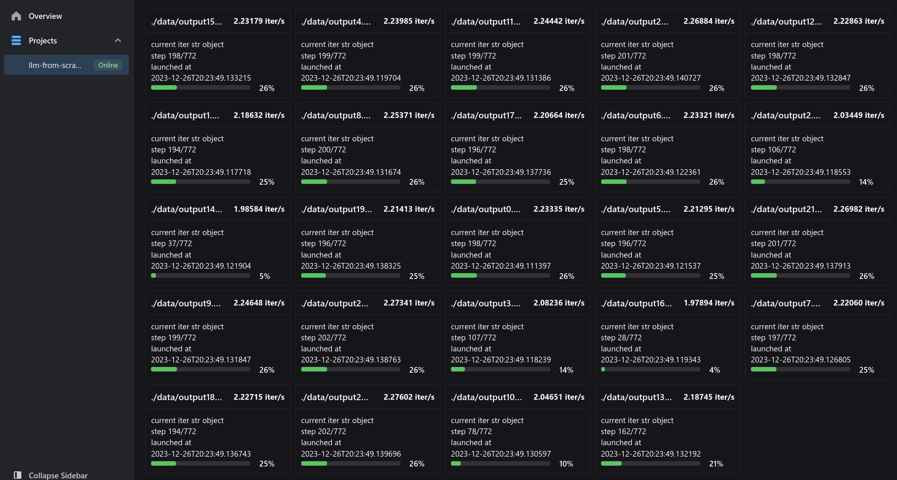
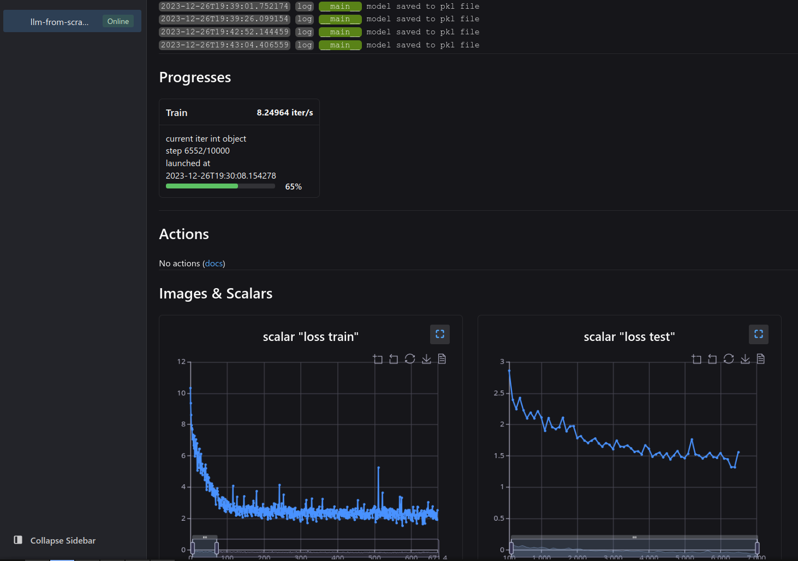

## Abstract

The main purpose of this article is to **use basic self-attention blocks to build a simple large language model for learning purposes**. Due to limitations in model scale and embedding methods, the model built in this article will not be very effective, but this does not affect the ability to learn various basic concepts of language models similar to Transformer through the code provided in this article.

What happens on this page:

- [x] get full code of a basic Large(?) Language Model (data preparation, model architecture, model training and predicting)
- [x] understand the general architecture of transformer with a few illustrations
- [x] understand how self regressive training works
- [x] understand how to load very large text dataset into limited memory (OpenWebTextCorpus)
- [x] train and observe the training procedure
- [x] load the trained model into a simple ask-and-answer interactive script

## Get full code

Code available at [github.com/visualDust/naive-llm-from-scratch](https://github.com/visualDust/naive-llm-from-scratch)

:::warning
Download the code via git clone before continue.
:::

<!--truncate-->


## Prepare data

We use **[OpenWebText Corpus](https://skylion007.github.io/OpenWebTextCorpus)** as dataset for training. Download and learn to convert and read dataset from file in this section.

The OpenWebText Corpus is a large-scale, open-source text corpus that was created as a response to the increasing need for large text datasets. It is not a large one from the perspective of modern NLP, but it is large enough to train a simple language model.

The corpus contains a large volume of text, encompassing a wide range of genres, topics, and styles. This includes news articles, blog posts, essays, and more, providing a rich resource for training language models. OpenWebText Corpus gathers its content from the internet, specifically from web pages linked by Reddit posts that received a certain level of popularity or engagement. This approach ensures a diverse range of topics and writing styles, representing the broad array of content available on the web.

### Download dataset

cd into `data` folder

```bash
cd data
```

Initialize Git LFS for Large Files

```bash
git lfs install
```

Clone the dataset:

```bash
git clone https://huggingface.co/datasets/Skylion007/openwebtext
```

Unzip dataset:

```python
bash unzip.sh
```

We are not using the `dataset` library to load the dataset, we are going to do it manually because we are doing this from **scratch**.

### Convert data into texts

back to project root folder, in terminal:

```bash
python convert_data.py
```

It converts all the `.xz` files in `data/openwebtext/subsets` and put the converted `.txt` files in folder `data/extracted`.

:::tip

We are using [neetbox](https://neetbox.550w.host) for monitoring, open [localhost:20202](http://localhost:20202/) (neetbox's default port) in your browser and you can check the progresses. If you are working on a remote server, you can use `ssh -L 20202:localhost:20202 user@remotehost` to forward the port to your local machine, or you can directly access the server's IP address with the port number.

:::


Wait all the convert process to finish:



:::tip

**The vocabulary table**

A vocabulary table is a list or dictionary where each unique word or  token in the training dataset is assigned a unique integer index. This table forms the basis for converting text data into numerical form that a machine learning model can understand. `convert_data.py` generates vocabulary table file by counting every character that appears in training data, so we are using **character-level tokenization**. This is not the most efficient way to build a vocabulary table, but it is simple to implement.

:::

Optionally, the script will ask you if you'd like to delete the original `.xz` files to save disk space. If you want to keep them, type `n` and press Enter.

## Model architecture

Self-attention and the Transformer architecture represent significant advancements in the field of neural networks, particularly for tasks involving natural language processing. 

### Self-Attention Mechanism

Self-attention, also known as intra-attention, is a mechanism that allows each position in a sequence to attend to all positions within the same sequence. It's a vital component in Transformer models. Self-attention is a way for a model to weigh the importance of different words in a sentence when trying to understand or generate text. It helps the model to focus on relevant parts of the input when making predictions.

1. **Components**:
   - **Query, Key, and Value**: These are three vectors derived from the input. For each word in the sentence, the model computes a Query, a Key, and a Value. These are created using linear transformations (matrices) of the input embedding vector.
   - **Attention Scores**: The model computes a score by taking the dot product of the Query with all Keys. This score determines how much focus to place on other parts of the input sequence when encoding a particular word.
   - **Softmax Layer**: The attention scores are then passed through a softmax layer to normalize them into probabilities.
   - **Weighted Sum**: Finally, the model computes a weighted sum of the Values based on these probabilities. This sum is the output of the self-attention layer for each word, representing a blend of information from all words in the sentence.

2. **Significance**:
   - **Contextual Understanding**: Self-attention allows the model to consider the entire context of a sentence, rather than just focusing on adjacent words. This leads to a richer understanding of the text.
   - **Parallel Computation**: Unlike RNNs, self-attention can process all words simultaneously, making it highly efficient for parallel computation.

### Transformer Architecture

The Transformer, introduced in the paper "Attention Is All You Need" by Vaswani et al., revolutionized the field of NLP. It's based entirely on attention mechanisms, foregoing the traditional recurrent layers.

1. **Structure**:
   - **Encoder-Decoder Architecture**: The Transformer consists of encoders and decoders. The encoder reads the input text, and the decoder produces the output text.
   - **Multiple Layers**: Both the encoder and decoder are composed of multiple layers, each containing self-attention and feed-forward neural networks.
2. **Encoder**:
   - Each encoder layer has two sub-layers: a self-attention layer and a feed-forward neural network.
   - There is a residual connection around each of the two sub-layers, followed by layer normalization.
3. **Decoder**:
   - The decoder also has self-attention and feed-forward networks.
   - It includes an additional attention layer that focuses on the encoder's output.
   - Decoders in the Transformer also prevent positions from attending to subsequent positions, which is crucial for tasks like language modeling.
4. **Positional Encoding**:
   - Since the Transformer doesn't use recurrence, it requires positional encodings to understand the order of the words.
   - Positional encodings are added to the input embeddings at the bottoms of the encoder and decoder stacks.

Self-attention mechanism provide a powerful framework for handling sequential data, especially in the domain of natural language processing. Its ability to process sequences in parallel and its focus on the entire context of the input sequence make it a significant advancement over previous RNN and LSTM-based models.

:::tip

GPT-2, like its predecessor GPT (Generative Pretrained Transformer) and its successor GPT-3, is indeed based on the Transformer architecture, but with a key modification: it uses only the decoder part of the Transformer. The reasons for this design choice are:

1. **Unidirectional Context**: The decoder in a Transformer model is inherently unidirectional. It is designed to generate text one token at a time, from left to right. This unidirectional nature is useful for certain types of language modeling, particularly those that involve generating text. In the context of GPT models, this means each token can only attend to previous tokens in the sequence. This is a natural fit for many language generation tasks, like text completion, where the model predicts the next word based on the previous context.
2. **Simplification and Specialization**: By using only the decoder, GPT models specialize in generation tasks. This simplification allows the model to be more focused and efficient for these specific tasks. The architecture is streamlined for language modeling and generation, without the additional complexity of handling an encoder which is more suited for tasks that require understanding and encoding an input sequence before generating an output.
3. **Pretraining and Fine-Tuning**: GPT models are pretrained on a large corpus of text using unsupervised learning. This pretraining involves predicting the next word in a sentence, which naturally aligns with a decoder-only architecture. The model can then be fine-tuned on a variety of downstream tasks, including those that traditionally might seem more suited to an encoder-decoder framework. The versatility of the pretrained model allows it to adapt to these tasks effectively.
4. **Scalability**: The decoder-only architecture is also beneficial from a scalability perspective. Since GPT models (especially GPT-2 and GPT-3) are designed to be large-scale models with a vast number of parameters, simplifying the architecture helps in managing the computational complexity.
5. **Language Modeling Focus**: The primary goal of GPT models is advanced language modeling. By focusing on the decoder, which is naturally suited for generating coherent and contextually relevant text, these models excel in generating high-quality, fluent text.

GPT-2 uses only the decoder part of the Transformer architecture to  specialize in language generation tasks, leveraging the unidirectional  nature of decoders for effective text completion and generation. This  design choice aligns with its primary goal of advanced language modeling and allows for a more efficient and scalable architecture, particularly when dealing with large models like GPT-2 and GPT-3.

:::

### Code it

Code available at [github.com/visualDust/naive-llm-from-scratch](https://github.com/visualDust/naive-llm-from-scratch) demonstrates a transformer-based  language models and showcases the essential components for building such models. This structure is quite similar to the architecture  of models like GPT-2 and GPT-3, although it's a simplified version.


The `SelfAttentionHead` class implements the self-attention  mechanism, which is central to transformer models. It includes key,  query, and value projections, along with a no-look-ahead mask for causal (unidirectional) attention:

```python
class SelfAttentionHead(nn.Module):
    def __init__(
        self, head_size, block_size, n_embed, dropout_rate=0.2, **kwargs
    ) -> None:
        super().__init__(**kwargs)
        self.key = nn.Linear(n_embed, head_size, bias=False)
        self.value = nn.Linear(n_embed, head_size, bias=False)
        self.query = nn.Linear(n_embed, head_size, bias=False)
        self.register_buffer(
            "tril", torch.tril(torch.ones(block_size, block_size))
        )  # no-look-ahead-mask
        self.dropout = nn.Dropout(dropout_rate)

    def forward(self, x):
        # input of size (batch, time-step, channels)
        # output of size (batch, time-step, head_size)
        B, T, C = x.shape
        # T is actually block size
        k = self.key(x)
        q = self.query(x)
        # conpute self attention scores:
        # dot product, and then scaling by 1/sqrt{length of a row in the keys or queries matrix}
        weighted_attention: torch.Tensor = q @ k.transpose(-2, -1) * k.shape[-1] ** -0.5
        # = (B,T,head_size)@(B,T,head_size).transpose(-2,-1)
        # = (B,T,head_size)@(B,head_size,T) -> (B,T,T)
        weighted_attention = weighted_attention.masked_fill(
            self.tril[:T, :T] == 0, float("-inf")
        )  # B,T,T, here T is block size
        weighted_attention = F.softmax(weighted_attention, dim=-1)
        weighted_attention = self.dropout(weighted_attention)
        # perform weighted aggregation of the values
        v = self.value(x)  # (B,T,head_size)
        out = weighted_attention @ v  # (B,T,T)@(B,T,head_size) -> (B,T,head_size)
        return out
```
The `MultiHeadAttention` class combines multiple  self-attention heads, allowing the model to jointly attend to  information from different representation subspaces:

```python
class MultiHeadAttention(nn.Module):
    def __init__(
        self, n_head, head_size, block_size, n_embed, dropout_rate=0.2, **kwargs
    ) -> None:
        super().__init__(**kwargs)
        self.heads = (
            nn.ModuleList(  # using ModuleList so that Heads are running in parallel
                [
                    SelfAttentionHead(
                        head_size=head_size, block_size=block_size, n_embed=n_embed
                    )
                    for _ in range(n_head)
                ]
            )
        )
        self.projection = nn.Linear(head_size * n_head, n_embed)
        self.dropout = nn.Dropout(dropout_rate)

    def forward(self, x):
        out = torch.cat([h(x) for h in self.heads], dim=-1)
        out = self.projection(out)
        out = self.dropout(out)
        return out
```
The `FeedForward` class implements a two-layer feed-forward network with a ReLU activation in the middle, commonly used in transformer models:

```python
class FeedForward(nn.Module):
    def __init__(self, n_embed, dropout_rate=0.2, **kwargs) -> None:
        super().__init__(**kwargs)
        self.net = nn.Sequential(
            nn.Linear(n_embed, 4 * n_embed),
            nn.ReLU(),
            nn.Linear(4 * n_embed, n_embed),
            nn.Dropout(dropout_rate),
        )

    def forward(self, x):
        return self.net(x)
```
The `SelfAttentionBlock` class integrates the multi-head attention and feed-forward network, including residual connections and layer normalization:

```python
class SelfAttentionBlock(nn.Module):
    def __init__(self, n_head, block_size, n_embed, **kwargs) -> None:
        super().__init__(**kwargs)
        head_size = n_embed // n_head
        self.sa = MultiHeadAttention(
            n_head=n_head, block_size=block_size, head_size=head_size, n_embed=n_embed
        )
        self.ffwd = FeedForward(n_embed)
        self.ln1 = nn.LayerNorm(n_embed)
        self.ln2 = nn.LayerNorm(n_embed)

    def forward(self, x):
        y = self.sa(x)  # multi head attention
        x = self.ln1(x + y)  # residual (add and norm)
        y = self.ffwd(x)  # feedforward
        x = self.ln2(x + y)  # residual (add and norm)
        return x
```


## Train a model

in terminal:

```bash
python train.py --config config/gptv1_l.toml
```

:::tip

With neetbox, open [localhost:20202](http://localhost:20202/) (neetbox's default port) in your browser and you can check the progresses.

:::



### Self-regressive training

Self-regressive training, often used in sequence modeling (like language models), is the **key approach of training language model in which the model predicts the next element in a sequence based on its preceding elements**. Self-regressive models learn by predicting the next item in a sequence.  For language models, this means predicting the next word or token in a  sentence based on the previous words. These models are typically trained on vast amounts of text data. They  process this data sequentially, learning patterns and relationships  between words. In self-regressive models, the output at each step becomes the input for the next step. This makes them inherently sequential and  autoregressive. There are two key features of self-regressive training:

1. **Sequential Prediction**:
   - In self-regressive training, the model is trained to predict one part of the sequence at a time, usually the next item given the previous items.
   - For example, in text generation, given a sequence of words ("The cat sat on the"), the model predicts the next word ("mat").

2. **Use of Previous Predictions as Context**:
   - The model uses its own predictions as part of the input for subsequent predictions. This means that each new prediction is based not just on the original input, but also on whatever the model has predicted so far.
   - This approach helps the model to build and maintain a coherent context as it generates a sequence.

#### Common training process of self-regressive training

1. **Data Preparation**: The training data for a self-regressive model is usually prepared by creating many overlapping sequences from the original dataset, where each sequence is the same as the previous one but shifted by one position. For text, this could mean creating sequences like "The cat sat", "cat sat on", "sat on the", and so on.
2. **Teacher Forcing**: During training, a technique called "teacher forcing" is often used. Here, the true previous output is fed into the model rather than using the model’s own prediction. This helps in faster convergence and more stable training. However, during inference (actual usage), the model relies on its own predictions to generate sequences.
3. **Objective Function**: The objective function typically used is the likelihood of the next item in the sequence, given the previous items. The model is trained to maximize this likelihood across the training data. This is usually achieved using a cross-entropy loss function between the predicted probabilities and the actual next item in the sequence.

#### Advantages

- **Coherence and Relevance**: By considering the entire preceding context, self-regressive models can generate sequences that are coherent and contextually relevant.
- **Flexibility**: This method is flexible and can be applied to any kind of sequential data.
- **Simplicity in Modeling**: The approach simplifies the modeling process, as it breaks down the complex task of sequence generation into a series of simpler prediction tasks.


## Chat with the trained model

in terminal:

```bash
python inference.py --config config/gptv1_s.toml
```

> source code of `inference.py`: [inference.py](https://github.com/visualDust/naive-llm-from-scratch/blob/main/inference.py)

Open [localhost:20202](http://localhost:20202/) (neetbox's default port) in your browser and feed text to your model via action button.


