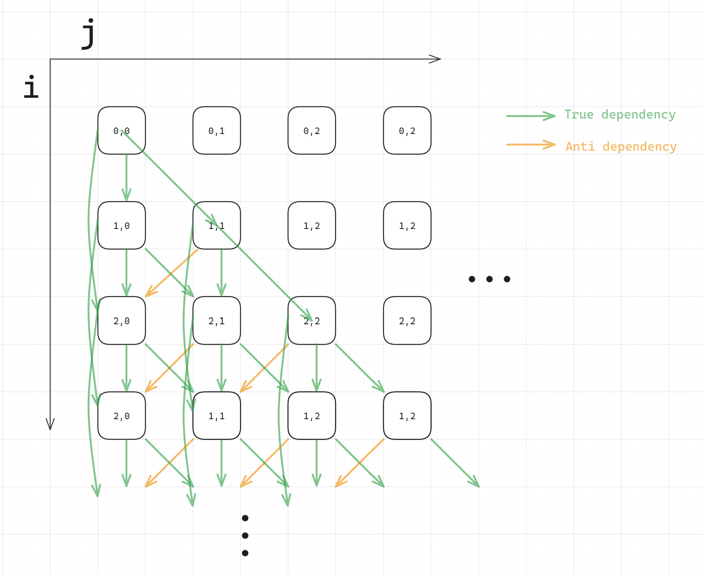
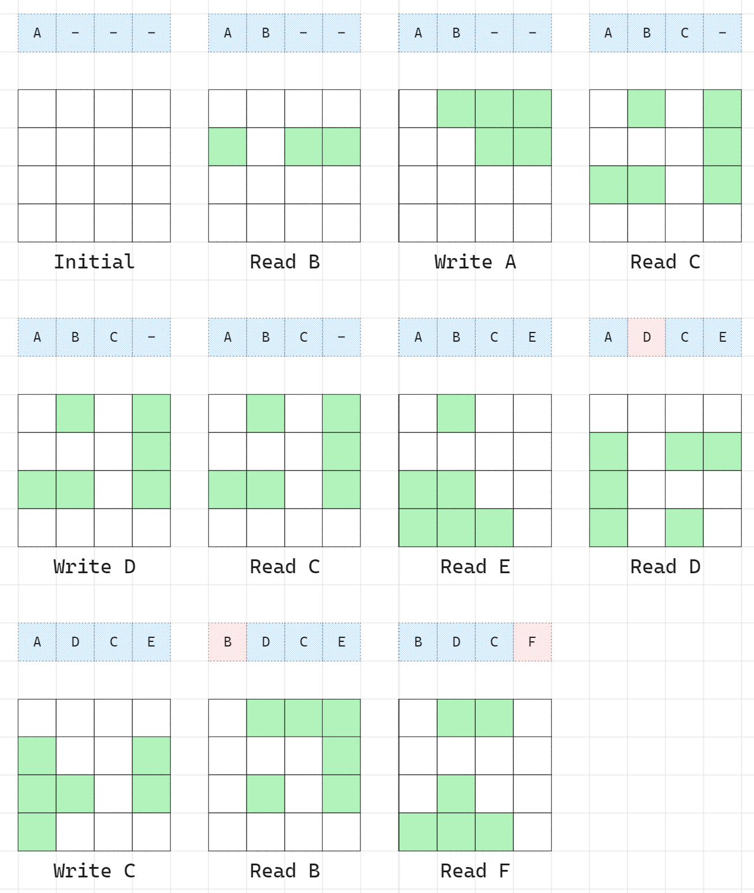

> [!question] Q1 Loop-carried dependences
> For this question, we will describe a loop-carried dependence as coming from some statement in iteration `(i,j)` to some other iteration `(x,y)`, where `x` and `y` are written as expressions involving `i` and `j` (e.g., `(i,j+1)`). For example, there could be a loop-carried dependence from **`S4(i,j)`** to **`S5(i+1,j)`**. Note that the first statement must come before the second statement in program order.
> Consider the code below, where all variables have been previously declared.
>
> ```cpp
> ...
> for (i=1; i <= N; i++) {
>   for (j=1; j <= i; j++) {
>     S1: a[i][j] = b[i][j] + c[i][j];
>     S2: b[i][j] = a[i-1][j-1] * b[i+1][j-1] * c[i-1][j];
>     S3: c[i+1][j] = a[i][j];
>   }
> }
> ...
> ```

Thinking

- Finding dependencies inside iteration:
  - $S_{1} \mathop{\to}^T S_{3}$
  - $S_{1} \mathop{\to}^{A} S_{2}$
- Finding dependencies across iterations
  - $S_{1}[i,j]\mathop{\to}^T S_{2}[i+1,j+1]$
  - $S_{2}[i,j]\mathop{\to}^A S_{2}[i+1,j-1]$
  - $S_{3}[i,j]\mathop{\to}^T S_{1}[i+1,j]$
  - $S_{3}[i-1,j]\mathop{\to}^T S_{2}[i+1,j]$, normalized to $S_{3}[i,j]\mathop{\to}^T S_{2}[i+2,j]$

> [!question] Q1.1 LDG
> Draw LDG for this loop nest

LDG does not reflect loop-independent dependency, each node in LDG represents all statements in a particular iteration. Therefore, only dependencies across iterations should be included:


Figure: LDG of Q1

> [!danger]
> Notice that the loop variable `j <= i`, therefore, there are no data dependences below the diagonal of the graph.

> [!success] Answer from TA
> 

> [!question] Q2 Variable scope analysis
> Consider the code below. All matrices have dimension $N\times N$, all vectors have dimension $N$, and assume that $N$ is divisible by $2$.
>
> ```cpp
> ...
> for (i=0; i<N; i++) {
>   k = C[N-1-i];
>   for (j=0; j<N; j++) {
>     A[i][j] = k * A[i][j] * B[i/2][j];
>   }
> }
> ...
> ```

> [!question] Q2.1 $i$-loop
> By default, all variables are shared. If the $i$-loop is converted to a parallel loop, indicate which variables should be private.

Thinking:
Applying parallelism on $i$ loop, $i$ should be private to each thread, and things related to $i$ should be private too.

- $i$: each thread should have its own $i$. Make $i$ private.
- $j$: its originally private if $i$ loop is parallel
- $k$: its assigned within $i$ loop but not $j$ loop. Make $k$ private.\
- $A$: its being read and written, but since the access index $i,j$ is private, then access to $A$ is thread safe. So $A$ can be shared.
- $B$: its read only, can be shared.
- $C$: its read only, can be shared.
  Therefore, $i$, $j$, $k$ are private.

> [!question] Q2.2 $j$-loop
> By default, all variables are shared. If the $j$-loop is converted to a parallel loop, indicate which variables should be private.

Thinking:
Applying parallelism on $j$ loop, $j$ should be private to each thread, and things related to $j$ should be private.

- $i$: it has the same value and its read only for $j$ loops inside the same $i$ loop iteration, can be shared.
- $j$: each thread should have its own $j$. Make $j$ private.
- $k$: same as $i$, can be shared.
- $A$: The same as $i$ loop parallelism, no race condition between different $j$.
- $B$: its read only, can be shared.
- $C$: its read only, can be shared.
  Therefore, $j$ is private.

> [!question] Q3 Average access latency
> Suppose you have a one-level (L1) cache. The L1 latency is 2 cycles, and memory latency is 80 cycles.

> [!question] Q3.1 Calculate AAT
> If the L1 miss rate is 0.05, what is the average latency for a memory operation?

$$
AAT = T_{L_{1}} + M_{L_{1}}\cdot T_{Mem} = 2+0.05\times 80 = 6 (cycles)
$$

> [!question] Q3.2 Calculate miss rate
> What must the miss rate be in order to achieve an average access latency of 10 cycles?

$$
\begin{align}
AAT = T_{L_{1}} + M_{L_{1}}\cdot T_{Mem} = 2+M_{L_{1}}\cdot 80 = 10 \\
M_{L_{1}} = \frac{10-2}{80} = 0.1

\end{align}
$$

> [!question]  Q4 Average access latency (two-level)
> Suppose you have a two-level cache. The L1 access latency is 2 cycles. The L2 access latency is 10 cycles. The memory access latency is 80 cycles.

> [!question] Q4.1 Calculate AAT
> If the L1 miss rate is 0.1, and the L2 miss rate is 0.5, what is the average access latency?

$$
\begin{align}
ATT &= T_{L_{1}} + M_{L_{1}} \cdot T_{L_{2}} + M_{L_{1}}\cdot M_{L_{2}} \cdot T_{Mem} \\
&=2+0.1\times 10 + 0.1\times 0.5 \times 80 \\
&=7(cycles)
\end{align}
$$

> [!question] Q4.2 Calculate L2 miss rate
> If the L1 miss rate is 0.05, what must the L2 miss rate be to achieve an average access latency of 4 cycles?

$$
\begin{align}
ATT &= T_{L_{1}} + M_{L_{1}} \cdot T_{L_{2}} + M_{L_{1}}\cdot M_{L_{2}} \cdot T_{Mem} &=4\\
&=2+0.05\times 10 + 0.05\times M_{L_{2}} \times 80 &=4 \\
M_{L_{2}}&=\frac{4-2-0.05\times 10}{80\times 0.05}=0.375
\end{align}
$$

> [!question] Q5 Replacement policy
> You have a fully-associative cache with a capacity of four blocks. Blocks are stored in positions 0, 1, 2, 3 in the set, from left to right in the figure. To write the content of the cache, list the block addresses in left-to-right order, and use a single hypen (-) to denote a block position that does not contain a valid block.
> 
> Empty blocks are filled from left to right. As shown, the initial cache state is **A,-,-,-**.
>
> The cache uses LRU replacement and has a write-no-allocate policy. After each memory operation below, show the state of the cache.
> Access sequence: Read B, Write A, Read C, Write D, Read C, Read E, Read D, Write C, Read B, Read F

It has a write no allocate policy, therefore write miss will not cause the block to be loaded into cache, only read miss will.


