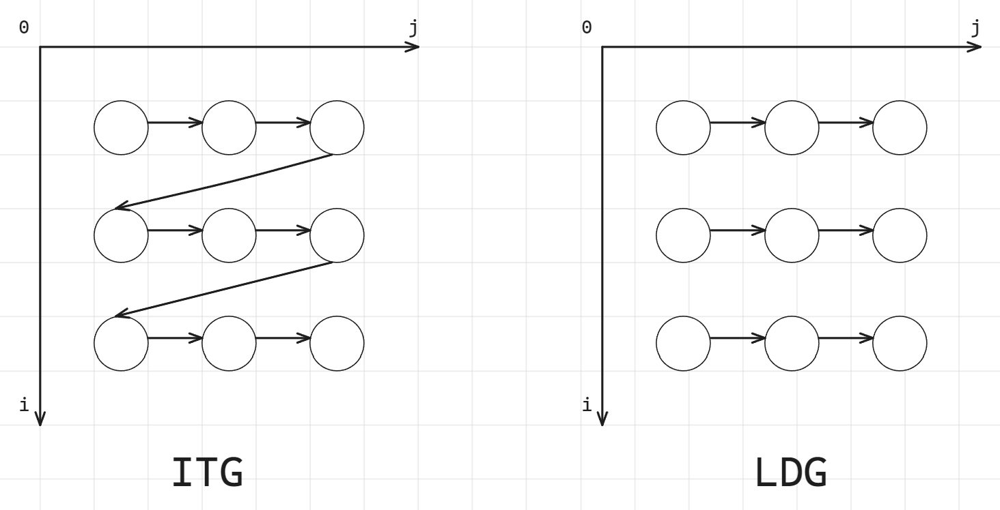

> [!danger]
> This note is written by someone(`Gavin Gong, zgong6@ncsu.edu`) attending this class, not by the instructor(`Dr.Greg Byrd, gbyrd@ncsu.edu`) of the course(`CSC506`). There might be errors.

> [!info] Instructor said
> The exam will be closed-book and closed-notes, and no electronic devices are allowed. The material for the quiz comes from lectures and material covered in the text. In particular, all sections of the text listed in the Reading Assignments on Moodle will be the source of content for the exam.

---

> [!question] Question 01
> Given some sequential code and a description of how to execute the code on multiple processors, discuss how the parallel version would be implemented using the **shared memory** and **message passing** models, using pseudocode to express distribution of data, communication, and synchronization among threads.

> [!cite]
> For shared memory and message passing parallel programming model, see [Lecture - Parallel Programming Models](Lecture%20-%20Parallel%20Programming%20Models.md)

Summary on this problem


|     Scheme      | Data Distribution                                                                                                    | Communication                                                                                         | Synchronization                                                                                                     |
| :-------------: | -------------------------------------------------------------------------------------------------------------------- | ----------------------------------------------------------------------------------------------------- | ------------------------------------------------------------------------------------------------------------------- |
|  Shared Memory  | Partition the data among threads, each thread processes a portion of the data                                        | Communication is implicit through shared variables, threads read and write to shared memory locations | barriers among thread to check if they reach the same point, or locks when accessing critical section               |
| Message Passing | Distribute data to each process, often by sending data over a network, each process works on its local data segment. | Use message passing functions to send and receive data. Communication is explicit                     | Synchronization occurs through message exchanges. Processes may use barriers or collective communication operations |

Pseudo code example of shared memory:

```cpp
int a, b, signal; // all shared variables

void dosum(){
 while(signal == 0){};
 printf("child thread > sum is %d\n", a + b);
 signal = 0;
}

int main(int argc, char** argv){
 signal = 0;
 thread_create(&dosum);
 a = 5;
 b = 3;
 signal = 1;
 while(signal == 1){};
 printf("Done\n");
 return 0;
}
```

Pseudo code example of message passing:

```cpp
int a, b;

void dosum(){
 recv(mainTid, &a, &b); // receive a and b from main thread
 printf("child process > sum is %d\n", a + b);
}

int main(int argc, char** argv){
 if(fork == 0){ // if in sub thread
  dosum();
 }else{ // if in main thread
  a = 5;
  b = 3;
  send(childTid, a, b);
  wait(childTid);
  print("Done\n");
 }
 return 0;
}
```

---

> [!question] Question 02
> Define and give examples of data dependences, including **true**, **anti**, and **output dependences**.

> [!cite]
> For detailed definition of above mentioned dependencies, see [Lecture - Data Dependency](Lecture%20-%20Data%20Dependency.md).

They are:

- Anti-dependency (Write After Read)
- True dependency (Read After Write)
- Output dependency (Write After Write)

Example of anti-dependency:

```psuedo
S1: x = y + z
S2: z = 6
```

It's $S_{1}\mathop{\to}^A S_{2}$

Example of true-dependency:

```psuedo
S1: z = 6
S2: x = y + z
```

It's $S_{1}\mathop{\to}^T S_{2}$

Example of output-dependency:

```psuedo
S1: z = 6
S2: z = x + y
```

It's $S_{1}\mathop{\to}^O S_{2}$

---

> [!question] Question 03
> Given sequential code, identify all data dependences between statements in the code. Distinguish between **loop-carried** and **loop-independent** dependences.

> [!cite]
> For details about loop-carried dependencies, see [Lecture - Data Dependency](Lecture%20-%20Data%20Dependency.md).

Example code:

```cpp
for (i = 1; i <= N; i++) {
    S1: A[i] = B[i] + C;
    S2: B[i+1] = A[i] * D;
    S3: D = B[i] + E;
}
```

Loop-independent dependencies:

- $S_{1}\mathop{\to}^T S_{2}$ via `A[i]`
- $S_{2}\mathop{\to}^A S_{3}$ via `D`
  Loop-carried dependencies:
- $S_{2}[i]\mathop{\to}^T S_{1}[i+1]$ via `B[i]`
- $S_{2}[i]\mathop{\to}^T S_{3}[i+1]$ via `B[i]`

---

> [!question] Question 04
> Given sequential loop-based code, draw its **iteration-space traversal graph (ITG)** and/or its **loop-carried dependence graph (LDG)**.

> [!cite]
> For details about ITG and LDG, see [Lecture - Data Dependency](Lecture%20-%20Data%20Dependency.md).

Example code

```cpp
for (i = 1; i <= N; i++) {
 for (j = 1; j <= N; j++){
     S1: A[j] = B[j] + C;
     S2: B[j+1] = A[j] * D;
     S3: D = B[j] + E;
 }
}
```

Loop-independent dependencies:

- $S_{1}\mathop{\to}^T S_{2}$ via `A[j]`
- $S_{2}\mathop{\to}^A S_{3}$ via `D`
  Loop-carried dependencies:
- $S_{2}[j]\mathop{\to}^T S_{1}[j+1]$ via `B[j]`
- $S_{2}[j]\mathop{\to}^T S_{3}[j+1]$ via `B[j]`



> [!cite]
> There is another example of this question in [Homework - 1](Homework%20-%201.md).

---

> [!question] Question 05
> Given sequential loop-based code, discuss an appropriate parallelization strategy to achieve parallel speedup. Consider **DOALL**, **DOACROSS**, **loop distribution**, and **DOPIPE** parallel strategies. If necessary, show how code would be transformed to achieve the desired parallelism. Estimate the potential speedup of different strategies.

> [!cite]
> For DOALL, DOACROSS, loop distribution, and DOPIPE parallel strategies, see [Lecture - Loop Level Parallelism](Lecture%20-%20Loop%20Level%20Parallelism.md).

Their differences:

- DOALL: loop-independent, each iteration has private `i`
- DOACROSS: iterations will be executed simultaneously, they will do some parallel run but later they will have to wait on some line before they can continue.
- DOPIPE: decoupled stages run parallel and send result to each other
- Loop distribution: split loop into independent loops and run each of the split loop with parallelism

Moreover, in order to avoid race condition, see also variable scope section in [Lecture - Loop Level Parallelism](Lecture%20-%20Loop%20Level%20Parallelism.md) and [Lecture - OpenMP Clauses](Lecture%20-%20OpenMP%20Clauses.md).

> [!example] Example 1: Image Blurring
>
> ```cpp
> // Sequential code for image blurring using a simple filter
> #define N 1024
> unsigned char image[N][N], blurred_image[N][N];
>
> void image_blur() {
> #pragma omp parallel for collapse(2)
>     for (int i = 1; i < N - 1; i++) { // Loop over image rows
>         for (int j = 1; j < N - 1; j++) { // Loop over image columns
>             blurred_image[i][j] = (
>                 image[i - 1][j] + image[i + 1][j] +
>                 image[i][j - 1] + image[i][j + 1] +
>                 image[i][j]
>             ) / 5;
>         }
>     }
> }
> ```

Since array `image` is readonly, a simple DOALL on `i` loop and `j` loop can be applied:

```cpp
// Sequential code for image blurring using a simple filter
#define N 1024
unsigned char image[N][N], blurred_image[N][N];

void image_blur() {
#pragma omp parallel for collapse(2)
    for (int i = 1; i < N - 1; i++) { // Loop over image rows
        for (int j = 1; j < N - 1; j++) { // Loop over image columns
            blurred_image[i][j] = (
                image[i - 1][j] + image[i + 1][j] +
                image[i][j - 1] + image[i][j + 1] +
                image[i][j]
            ) / 5;
        }
    }
}
```

> [!example] Example 2: Whatever data processing pipeline
>
> ```cpp
> // Sequential code for a data processing pipeline
> #define N 1000
> double raw_data[N], stage1[N], stage2[N], result[N];
>
> void data_pipeline() {
>     for (int i = 0; i < N; i++) {
>         stage1[i] = raw_data[i] / 100.0; // Stage 1: Data normalization
>         stage2[i] = sqrt(stage1[i]); // Stage 2: Compute square roots
>         result[i] = (stage2[i] > 0.5) ? stage2[i] : 0.0; // Stage 3: Thresholding
>     }
> }
> ```

Parallelization Strategy: Loop Distribution and DOALL:

```cpp
// Sequential code for a data processing pipeline
#define N 1000
double raw_data[N], stage1[N], stage2[N], result[N];

void data_pipeline() {
    // Stage 1: Data normalization
    #pragma omp parallel for
    for (int i = 0; i < N; i++) {
        stage1[i] = raw_data[i] / 100.0;
    }

    // Stage 2: Compute square roots
    #pragma omp parallel for
    for (int i = 0; i < N; i++) {
        stage2[i] = sqrt(stage1[i]);
    }

    // Stage 3: Thresholding
    #pragma omp parallel for
    for (int i = 0; i < N; i++) {
        result[i] = (stage2[i] > 0.5) ? stage2[i] : 0.0;
    }
}
```

> [!example] Example 3: Histogram Calculation
>
> ```cpp
> #define N 100000
> #define BINS 256
> unsigned char image_data[N];
> int histogram[BINS] = {0};
>
> void calculate_histogram() {
>     for (int i = 0; i < N; i++) {
>         histogram[image_data[i]]++;
>     }
> }
> ```

Parallelization Strategy: DOALL with Private Histograms:

```cpp
#include <omp.h>
#define N 100000
#define BINS 256
unsigned char image_data[N];
int histogram[BINS] = {0};

void calculate_histogram() {
    int local_histograms[omp_get_max_threads()][BINS] = {0};

    #pragma omp parallel
    {
        int thread_id = omp_get_thread_num();
        int *local_histogram = local_histograms[thread_id];

        #pragma omp for
        for (int i = 0; i < N; i++) {
            local_histogram[image_data[i]]++;
        }
    }

    // Combine local histograms
    for (int i = 0; i < BINS; i++) {
        for (int t = 0; t < omp_get_max_threads(); t++) {
            histogram[i] += local_histograms[t][i];
        }
    }
}
```

> [!example] Example 4: Whatever loop with loop carried dependency
>
> ```cpp
> #define N 1000
> double data[N];
>
> void dependent_loop() {
>     data[0] = 1.0;
>     for (int i = 1; i < N; i++) {
>         data[i] = data[i - 1] * 1.01;
>     }
> }
> ```

Parallelization Strategy: Transform to Remove Dependency:

```cpp
#include <omp.h>
#include <math.h>
#define N 1000
double data[N];

void dependent_loop() {
    data[0] = 1.0;
    #pragma omp parallel for
    for (int i = 1; i < N; i++) {
        data[i] = data[0] * pow(1.01, i);
    }
}
```

---

> [!question] Question 06
> Given sequential loop-based code, modify the code using OpenMP `pragmas` to express DOALL parallelism.

> [!cite]
> For OpenMP clauses, see [Lecture - OpenMP Clauses](Lecture%20-%20OpenMP%20Clauses.md).

> [!example] Example 1: Matrix Multiplication
>
> ```cpp
> // Sequential code for matrix multiplication
> #define N 500
> double A[N][N], B[N][N], C[N][N];
>
> void matrix_multiplication() {
>     for (int i = 0; i < N; i++) {            // Loop 1
>         for (int j = 0; j < N; j++) {        // Loop 2
>             C[i][j] = 0.0;
>             for (int k = 0; k < N; k++) {    // Loop 3
>                 C[i][j] += A[i][k] * B[k][j];
>             }
>         }
>     }
> }
> ```

Strategy: DOALL on `i` loop and `j` loop:

```cpp
#include <omp.h>
#define N 500
double A[N][N], B[N][N], C[N][N];

void matrix_multiplication() {
    #pragma omp parallel for collapse(2) //apply parallelism on loop i and j
    for (int i = 0; i < N; i++) {
        for (int j = 0; j < N; j++) {
            double sum = 0.0; // private sum to avoid race condation on C[i][i]
            for (int k = 0; k < N; k++) {
                sum += A[i][k] * B[k][j];
            }
            C[i][j] = sum;
        }
    }
}
```

> [!danger]
> You cannot apply `#pragma omp for reduction(+:sum)` on inner `k` loop. This nesting can lead to unexpected behavior because by default, OpenMP does not enable nested parallelism. The inner `#pragma omp for` will not create new threads; instead, it will run serially within each thread handling the `(i, j)` iteration.

> [!tip]
> Although **not covered in this quiz**, but using `#pragma omp simd` can do vectorization on the inner `k` loop:
>
> ```cpp
> #pragma omp parallel for collapse(2)
> for (int i = 0; i < N; i++) {
>     for (int j = 0; j < N; j++) {
>         double sum = 0.0;
>         #pragma omp simd reduction(+:sum)
>         for (int k = 0; k < N; k++) {
>             sum += A[i][k] * B[k][j];
>         }
>         C[i][j] = sum;
>     }
> }
> ```

---

> [!question] Question 07
> Define the following aspects of thread scheduling in OpenMP: **static**, **dynamic**, **chunk size**.

> [!cite]
> For OpenMP scheduling aspects, see [Lecture - OpenMP Clauses](Lecture%20-%20OpenMP%20Clauses.md).

Static scheduling, dynamic scheduling, and chunk size:

- **static scheduling** divides loop iterations into chunks of a specified size and assigns these chunks to threads in a predetermined, fixed manner before the loop execution begins. The assignment is typically done in a round-robin fashion. If no chunk size is specified, the iterations are divided as equally as possible among the available threads. This scheduling is best suited for loops where each iteration takes approximately the same amount of time, as it minimizes the overhead of assigning iterations during runtime.
- **dynamic scheduling** assigns iterations to threads on-the-fly during the loop execution. The loop iterations are divided into chunks (as specified by the chunk size), and when a thread finishes processing its current chunk, it dynamically requests the next available chunk. This approach is beneficial for loops where the execution time of iterations varies significantly, as it helps in balancing the load across threads by redistributing work from busier threads to idle ones.
- **chunk size** in OpenMP scheduling refers to the number of loop iterations assigned to a thread at one time. It is a parameter that can be specified with both static and dynamic scheduling strategies. In static scheduling, the chunk size determines the fixed number of consecutive iterations assigned to each thread in a cyclic manner. In dynamic scheduling, the chunk size determines how many iterations a thread will process before requesting more work, allowing for more flexible load balancing.

---

> [!question] Question 08
> Given sequential loop-based code, determine which variables should be **shared** and which should be **private** to achieve the best parallel execution. Describe how private variables can be implemented in a shared-memory multiprocessor system.

> [!cite]
> To distinguish which variables should be shared and which should be private, commonly seen variable usage in code with loops please refer to variable scope section in [Lecture - Loop Level Parallelism](Lecture%20-%20Loop%20Level%20Parallelism.md).

Commonly seen variable usage in loop codes are:

- read only (shared)
- loop index variable (private)
- temporary variable in loop (private)
- reduction variable (private, reduction supported by OpenMP)
- modified shared variable (private, critical section)
- modified shared array with data parallel (shared, with proper data parallel)

In a shared memory system, all threads have access to the same global memory space. To implement private variables, the system ensures that each thread has its own separate instance of these variables, preventing concurrent access to the same memory location. Private variables are isolated to each thread, eliminating the need for synchronization when accessing them.

To achieve private variable in high level programming perspective, OpenMP runtime can creates copies of private variables for each thread, or do reduction after parallel execution. Please also read [Lecture - OpenMP Clauses](Lecture%20-%20OpenMP%20Clauses.md).

> [!example]
>
> ```cpp
> float sum = 0.0;
> int i;
> for (i = 0; i < N; i++) {
>     float temp = compute(i);
>     sum += temp;
> }
> ```
>
> The parallel version of the code:
>
> ```cpp
> float sum = 0.0;
> #pragma omp parallel for private(i, temp) reduction(+:sum)
> for (i = 0; i < N; i++) {
>     float temp = compute(i);
>     sum += temp;
> }
> ```
>
> Variables in code:
> • `sum`: Accumulates results; needs to be shared with reduction.
> • `i`: Loop index; should be private.
> • `temp`: Temporary variable; should be private.

> [!cite]
> There is another example on this question in [Homework - 1](Homework%20-%201.md).

---

> [!question] Question 09
> Define the following terms related to **cache memories**: cache block, cache line, set, associativity, hit, miss, replacement policy, LRU, write allocation policy, multi-level, inclusion, dirty, write-back, write-through.

> [!cite]
> For cache size, cache block, cache line, set, associativity, block size, and things related to **cache organization**, see [Lecture - Memory Hierarchy](Lecture%20-%20Memory%20Hierarchy.md).

Cache block and cache line:

- Cache block is basic, minimal unit of read/write in memory and cache, it typically contains a fixed number of bytes depending on memory architecture.
- Cache line is almost the same concept as cache block, but strictly speaking, cache line refers to not only the containing cache block data but also the metadata used for cache management.

Consider a cache device is a table, then:

- num of columns refers to num of ways, a.k.a. associativity
- num of rows refers to num of set, each set contains num of ways cache block


Block address format:


When you look for data:

1. The cache uses the index bits to go to the right set or row.
2. Then, it compares the tag bits of your address with the tag stored in that row.
3. If the tags match, it means the data you need is in the cache (a cache hit). If they don’t match, the data is not in the cache (a cache miss).

To determine how to split an address into **Tag**, **Index**, and **Block Offset** bits for cache addressing, follow these steps:

1. **Determine the number of Block Offset bits** based on the block size.
2. **Determine the number of Index bits** based on the number of cache sets.
3. **Calculate the number of Tag bits** by subtracting the sum of Index and Block Offset bits from the total address bits.

> [!question] Question 9 Example 1 by ChatGPT
>
> - **Total Address Bits**: 32 bits (typical for a 32-bit address space)
> - **Cache Size**: 16 KB (16,384 bytes)
> - **Block Size**: 64 bytes
> - **Associativity**: 4-way set associative

1. Determine block offset bits: block size 64 bytes, access unit is byte, then $\log_{2}(64)=6$ bits are required
2. Determine index bits:
   - Given total cache size 16 KB, block size 64 bytes, there are $\frac{16k}{64}=256$ blocks.
   - Given 4 ways associativity, there is $\frac{256}{4}=64$ sets
   - Therefore, the index takes $\log_{2}(64)=6$ bits
3. Determine tag bits: given total address bits 32, tag bits takes $32-6-6=20$ bits

> [!cite]
> For **replacement policy**(basically LRU), **write policy**(includes write back, write through), and **inclusion policy**, see [Lecture - Memory Hierarchy](Lecture%20-%20Memory%20Hierarchy.md).

Write policy:

- write through means that any bytes being written by a single write event will be immediately **propagated** to outer level of memory hierarchy component.
- write back means changes are allowed to stay without being propagated to outer level. Only wen the block is being evicted(typically due to coherence) it will be propagated to outer level.

Replacement policy:

- Optimal: Replace block that will be accessed furthest in the future
- Random: easy to implement, not optimal
- Least Recent Used (LRU)

LRU replacement policy can be simulated with a LRU matrix with size `num_ways * num_ways` for each set of cache:

- Accessing way $i$ will sets the $i$th row bits to $1$ and $i$th column bits to $0$ in LRU matrix.
- Find the row with least number of $1$'s, which is the least recent used block.

Approach 1: LRU matrix (for each set)


> [!example]
>
> Approach 2: LRU Stack
>
> 

> [!cite]
> There is another example of LRU working procedure listed in [Homework - 1](Homework%20-%201.md).

Inclusion:

- inclusive: any cache line present in L1 cache will also be present in L2 cache
- exclusive: any cache line may either present in L1 cache or L2 cache, but not both.

> [!tip]
> For multi level cache, inclusion policy is strongly related to coherence issue, typically due to write propagation. For example, for a 2 level cache(has L1 and L2, and memory) system, when L2 snooped some bus request that will invalidate a block:
>
> - with inclusive, L2 can directly determine wether or not to evict and notify L1 to do the same
> - with exclusive, L2 have to store extra tags to check if the target block is in L1

> [!cite]
> For **cache miss**, **cache performance matrix**(AAT, CPI), see [Lecture - Memory Hierarchy](Lecture%20-%20Memory%20Hierarchy.md).

Cache miss happens when:

- cold miss (a.k.a. compulsory miss): this block has never been loaded before
- capacity miss: cache is full and some of blocks are being evicted
- conflict miss: the cache block is loaded but was evicted since another block want to use this location in cache table
- coherence miss: cache block is being invalidated by some snooped bus instruction.

How cache parameters affect the different types of misses:

|        Parameter         |     Cold     |         Conflict          |         Capacity          | Coherence            |
| :----------------------: | :----------: | :-----------------------: | :-----------------------: | -------------------- |
|  $\uparrow$ cache size   |      -       |             -             |       $\downarrow$        | not directly related |
|  $\uparrow$ block size   | $\downarrow$ | $\downarrow$ / $\uparrow$ | $\downarrow$ / $\uparrow$ | not directly related |
| $\uparrow$ associativity |      -       |       $\downarrow$        |             -             | not directly related |

**Average Access Time (AAT)** is calculated by (for a system with $2$ levels of caches):

$$
AAT = T_{L1} + M_{L1}\cdot T_{L2} + M_{L1}\cdot M_{L2} \cdot T_{Mem}
$$

- $T_{L1}, T_{L2}, T_{Mem}$ denote the access time of the $L1, L2$ cache and memory.
- $M_{L1},M_{L2}$ are the cache miss rates of the $L1$ and $L2$ cache

> [!cite]
> There is another example of AAT listed in [Homework - 1](Homework%20-%201.md).

**Cycles per Instruction (CPI)** is calculated by:

$$
CPI = {CPI}_{ideal} + f_{mem}\times ATT
$$

- ${CPI}_{ideal}$ is CPI for ideal memory hierarchy, in which $L1$ cache never suffers from miss and has $0$ access latency.
- $f_{mem}$ is the fraction of instructions that reference memory.
- $ATT$ is average access time we talked about above.

---

> [!question] Question 10
> Given a **sequence of processor requests** (loads/reads, stores/writes) in a uniprocessor system, and a description of the memory hierarchy (cache organization, policies, latencies), show the action taken and the latency required to satisfy each request, including the state of the cache after each transaction is completed.

> [!cite]
> There is another example of this question listed in [Homework - 1](Homework%20-%201.md).

> [!question] Question 10 Example 1 by ChatGPT
> Cache Configuration:
>
> - Cache Type: Direct-mapped cache with 8 cache lines.
> - Cache Size:
>   - Cache Line Size: 1 word (32bit)
> - Main Memory Size 64 words
> - Write Policy: Write-back with write-allocate.
> - Replacement Policy: Inherent in direct-mapped (no choice).
> - Latencies:
>   - Cache hit: 1 cycle
>   - Cache miss (memory access): 10 cycles
>   - Write back memory: 10 cycles
>
> Processor Requests Sequence:
>
> 1. Read address 0
> 2. Write address 8
> 3. Read address 0
> 4. Write address 0
> 5. Read address 8
> 6. Read address 16
> 7. Write address 0
> 8. Write address 16
> 9. Read address 0
>
> Initial Cache State: All cache lines are invalid (empty)

Actions per request:

|     Request      |       Index (set)       |                       Tag                       | Status | Action                                                             | Latency |
| :--------------: | :---------------------: | :---------------------------------------------: | :----: | ------------------------------------------------------------------ | :-----: |
|  Read address 0  | $0 \mathop{mod} 8 = 0$  | $\left\lfloor  \frac{0}{8}  \right\rfloor = 0$  |  MISS  | Fetch address 0                                                    |  10+1   |
| Write address 8  | $8 \mathop{mod} 8 = 0$  | $\left\lfloor  \frac{8}{8}  \right\rfloor = 1$  |  MISS  | Fetch address 8<br>Write cache address 8                           |  10+1   |
|  Read address 0  | $0 \mathop{mod} 8 = 0$  | $\left\lfloor  \frac{0}{8}  \right\rfloor = 0$  |  MISS  | Write back address 8<br>Fetch address 0                            | 10+10+1 |
| Write address 0  | $0 \mathop{mod} 8 = 0$  | $\left\lfloor  \frac{0}{8}  \right\rfloor = 0$  |  HIT   | Write cache address 0                                              |    1    |
|  Read address 8  | $8 \mathop{mod} 8 = 0$  | $\left\lfloor  \frac{8}{8}  \right\rfloor = 1$  |  MISS  | Write back address 0<br>Fetch address 8                            | 10+10+1 |
| Read address 16  | $16 \mathop{mod} 8 = 0$ | $\left\lfloor  \frac{16}{8}  \right\rfloor = 2$ |  MISS  | Fetch address 16                                                   |  10+1   |
| Write address 0  | $0 \mathop{mod} 8 = 0$  | $\left\lfloor  \frac{0}{8}  \right\rfloor = 0$  |  MISS  | Fetch address 0<br>Write cache address 0                           |  10+1   |
| Write address 16 | $16 \mathop{mod} 8 = 0$ | $\left\lfloor  \frac{16}{8}  \right\rfloor = 2$ |  MISS  | Write back address 0<br>Fetch address 16<br>Write cache address 16 | 10+10+1 |
|  Read address 0  | $0 \mathop{mod} 8 = 0$  | $\left\lfloor  \frac{0}{8}  \right\rfloor = 0$  |  MISS  | Write back address 16<br>Fetch address 0                           | 10+10+1 |

---

> [!question] Question 11
> Discuss the differences between **logical and physical cache organizations**, including physically united, physically distributed, logically shared, and logically private.

> [!cite]
> Cache organization see [Lecture - Cache Design in Multicore Architecture](Lecture%20-%20Cache%20Design%20in%20Multicore%20Architecture.md).

**Physical cache organization**

- **Physically united**
- **Physically distributed**
  **Logical cache organization**
- **logically shared**
- **logically private**

**Physically United, Logically Shared** - Single central cache, unified view, use as is, suitable for small scale multiprocessors - Ease of coherence, but becomes bottleneck under heavy load, scalability is limited.

- **Physically United, Logically Private**
  - Single central cache, but private accessed by each processor
  - This is strange... does anyone who use this?
- **Physically Distributed, Logically Shared**
  - Each processor has a local cache, which is a part of a logically shared cache memory space.
  - Coherence protocol is needed. This is commonly used in modern multiprocessor and multicore systems.
- **Physically Distributed, Logically Private**
  - Each processor has its own cache, both physically and logically isolated.
  - It requires explicit data sharing between processors. This is suitable for distributed systems and cluster computing.

The most commonly used scheme in modern multiprocessor systems is physically distributed logically shared scheme. This can be achieved by:

- Crossbar switch
- Interconnected network
- Shared bus

---

> [!question] Question 12
> Discuss the **cache coherence problem**, and the properties required to guarantee that a cache system is coherent.

> [!cite]
> For cache coherence issue, see [Lecture - Cache Coherence](Lecture%20-%20Cache%20Coherence.md).

As mentioned in previous question, cache coherence problem occurs when using a physically distributed, logically shared cache organization. In this case there might be multiple copy of the same memory address, if some of the processor change the value of such an address in it's (physically private) cache, then other processors should be notified.

Two properties are required for maintaining coherence, they are **write propagation** and **transaction serialization**, which will be discussed in the next question.

---

> [!question] Question 13
> Define the following terms related to cache coherence: **write propagation**, **transaction serialization**.

Write propagation and transaction serialization are used to make sure multiple processors are reading from and writing to the same memory locations concurrently.

- Write propagation: a write operation to a shared memory location(cache line) performed by one of the processor will be visible to all other processors. For example, via bus requests in bus based systems.
- Transaction serialization: all memory operations(transactions) issued by all processors are in consistent and sequential order. It ensures that concurrent memory access do not lead to inconsistency views of memory across processors.

---

> [!question] Question 14
> Discuss how cache coherence is maintained in a bus-based multiprocessor system using the following protocols: **write-through**, **MSI**, **MESI**, **MOESI**, **Dragon**. Draw the state diagram for each protocol.

> [!question] Question 15
> Define the following terms related to **bus-based coherent caches**: intervention, invalidation, upgrade, downgrade, arbitration, clean sharing, dirty sharing, snoop, snoop response.

> [!note]
> Some extra notes for snooping, since both processor side and bus side need access to tags, one way to achieve that is to duplicate the tags(this requires coordination when tag change); while another solution is to filter snoops(e.g. keep track of recent snoop misses).

|                                  Regular                                   |                                 Duplicated                                 |                                  Filtered                                  |
| :------------------------------------------------------------------------: | :------------------------------------------------------------------------: | :------------------------------------------------------------------------: |
|  |  |  |

> [!question] Question 17
> Given a **proposed change/optimization** for one of the protocols, draw the new state diagram and analyze the change in performance achieved, compared to the original protocol.

Question 14, 15 and 17 are strongly related, they are discussed at once.

> [!cite]
> For cache coherence issue in bus based systems, see [Lecture - Cache Coherence in Bus-based Multiprocessors](Lecture%20-%20Cache%20Coherence%20in%20Bus-based%20Multiprocessors.md).

Basically, in a multiprocessor system, with some level of cache that is physically distributed and logically shared, their might be multiple copies of same memory address. All the processor that holds a copy should be notified when some of the processor changed the value of the memory location. This is achieved by bus requests in bus based systems. Each cache has its own states, and the states can be changed by request from processor or request from bus.

The baseline here is the **basic write-through invalidate-based protocol**. It uses write no allocate policy. Write through ensures that `PrWr` is immediately propagated out with a `BusWr`:


Problem here is that the write through policy cause a `BusWr` every `PrWr`(even though there might be no one who need to be notified), which consumes bandwidth.

So we turn to write through policy. Write back policy introduces dirty state. The baseline here is the **MSI** (Modified, Shared, Invalid) protocol:


Key changes here are `M`(Modified) state of cache which means it is dirty, and `BusRdX` which notify others a block is dirty. Besides, if a `BusRd` is snooped on a dirty block address, a `Flush` will occur for write propagation. There is one thing to be improved, if the processor want to write to a address, it have to post a `BusRdX`, even if it already has the block.

If the processor already has the block, then put the data on the bus is not necessary. Therefore, a `BusUpgr` is added. If the processor already has the block and want to write to it, a `BusUpgr` is posted instead of a `BusRdX`, therefore the data is not necessarily to be put on the bus which causes waste of bandwidth:


> [!note]
> There will be no `BusUpgr` snooped when the cache is held in `M` state since there should not be other valid copies.

There is still two more things to be improved. (1) A `BusUpgr` has to be sent, even if there is no other copies (the reason here is that the processor does not know if there are or are not other copies). (2) Write propagation is expensive on limited memory bandwidth, but the memory will be written every time `Flush` happens (which can be avoided by dirty sharing).

Therefore, a new protocol called **MESI** (Modified, Exclusive, Shared, Invalid) is proposed, which introduces a new state **E** (Exclusive) of cache, to represent the state that is valid, clean, and only reside in only one cache. (It can be seen as an extreme case of shared state, only one processor is sharing this with itself), it requires a dedicated bus line called **COPIES-EXIST** bus line (represented by `C` if it is asserted or `!C` if it is not asserted). MESI also introduces a new bus request `FlushOpt`, which enables dirty sharing, It does not trigger write propagation to outer memory, it means that the block is put on the bus to supply it to another processor who want it.


However, there is a problem caused by clean sharing. That is, by keep clean sharing, the main memory is updated too many times when there is a successive read and write requests from different processors to the same address.

To solve the problem, **MOESI** protocol is proposed which allows dirty sharing. It introduces a `O`(Owned) state of block, the cache who own the block will provide the block via `Flush` if a `BusRd` or `BusRdX` is snooped, and the main memory will not respond to `Flush` but only `FlushWB` in dirty sharing. If the block in `O` state is evicted, it will go back to clean sharing, the main memory will take the responsibility to provide the block, and listen to `Flush` but ignores `FlushOpt`.
The FSM of **MOESI** protocol:


> [!note]
> Who will own the block? Here we assume that the last processor who writes to the address will own the block.

MSI, MESI, MOESI has made a lot of improvement compared to baseline write-through protocol. However, they are all invalidate based protocol and they suffer from a high number of coherence misses. Each read to a block that has been invalidated incurs a cache miss, and the latency to serve the miss can be quite high.

Therefore, we can overcome the overhead by removing the `I` state. The **Dragon** protocol which is a update-based protocol, does not have a `I` state.

> [!cite]
> For Dragon protocol, please read [Lecture - Cache Coherence in Bus-based Multiprocessors](Lecture%20-%20Cache%20Coherence%20in%20Bus-based%20Multiprocessors.md), it's a little bit long to put it here.

The FSM diagram of Dragon protocol:


> [!note]
>
> - Note that there is no invalid state. Hence, an arrow that goes from nowhere to a state represents a newly loaded block.
> - Since only `PrRdMiss` will cause a `BusRd` being posted on bus, therefore the entire block is needed to be put on bus when a `BusRd` is snooped.
> - The `M` state can only be obtained when nobody else has a copy, and the movement to this state always include a `!C` asserted on bus. If there are other copies, write to a block will cause the state move to `Sm`.
> - A `BusUpd` cannot occur when the block is in `E` state because there are no other caches that have the block, and nobody else can update the block.
> - Only when a block is in `M` or `Sm` state(which means it is possibly dirty), it will respond to `BusRd` with a `Flush`. Otherwise memory should provide the block.

---

> [!question] Question 16
> Given a sequence of processor requests in a multiprocessor system using one of the bus-based coherence protocols above, and a description of the memory hierarchy (cache organization, policies, latencies), show the action taken and the latency required to satisfy each request, including the state of all caches after each transaction is completed.

This question is strongly related to question 14 and 15.

> [!cite]
> For cache coherence issue in bus based systems, see [Lecture - Cache Coherence in Bus-based Multiprocessors](Lecture%20-%20Cache%20Coherence%20in%20Bus-based%20Multiprocessors.md).

> [!example] > 

> [!note]
> Note that on step 3, the `BusRd` from `P3` is snooped by `P1`, both `P1` and memory will try to provide the block, but the `Flush` from `P1` is snooped by memory so the memory will cancel the fetch attempt. Memory will also pick the `Flush` request and update the memory.
> Therefore, the data supplier of step 3 is `P1's cache`.

> [!example] > 

> [!example] > 

> [!note]
> Note that since we introduced cache-to-cache transfer and `FlushOpt` in MESI protocol, all the share holders of the block will try to supply the block, and one of them wins and supplies the block eventually. Since it's hard to know who will win, then the data supplier is `P1/P3`'s cache in the last request of this example.

> [!example] > 

> [!example] > 

---

> [!question] Question 18
> Discuss how **multi-level caches** maintain coherence in a bus-based multiprocessor.

> [!cite]
> For coherence in multi-level cache, see [Lecture - Cache Coherence in Bus-based Multiprocessors](Lecture%20-%20Cache%20Coherence%20in%20Bus-based%20Multiprocessors.md)

Write propagation must be performed downstream (towards outer memory, going out of private cache) and also upstream (snooped cache state change, update with inner cache).

|                   | Downstream                                                                 | Upstream                                                                   |
| :---------------: | -------------------------------------------------------------------------- | -------------------------------------------------------------------------- |
| Write Propagation |  |  |
| Read Propagation  |  |  |

---

> [!question] Question 19
> Discuss how **snoopy coherence protocols can be implemented in systems that do not use a centralized bus interconnect**. (Specific consideration for ring-based interconnection topologies will not be included on this exam.) Reason about how the requirements for cache coherence can be satisfied. Given a proposed coherence protocol (high-level, not specific state diagrams), explain how the proposal does or does not achieve coherence.

> [!cite]
> Broadcast protocol with P2P interconnect, see [Lecture - Cache Coherence in Bus-based Multiprocessors](Lecture%20-%20Cache%20Coherence%20in%20Bus-based%20Multiprocessors.md)

To maintain transaction serialization and write propagation:

- Interconnect are used to propagate data from one processor to another.
- A sequencer is responsible for managing the service ordering of upcoming requests.

> [!example] Example: 6-node system P2P interconnected, simultaneous write
>
> Assume each node to have a processor/core and a cache. Now suppose that node A and B simultaneously want to write to a block that they already cached in a clean state. Suppose that node S is assigned the role of sequencing requests for the block.
>
> 
>
> Suppose that the request from node A arrives at node S before the request from node B.
> Here is what happens:
>
> - (b) A and B sent `Upgr` to S.
> - (c) S needs to ensure that the write by A is seen by all cores as happening before the write by B. To achieve that, S serves the request from A, but replies to B with a **negative acknowledgment (`Nack`)** so B can retry its request at a later time.
> - (c) To process the write request from A, S can broadcast an **invalidation (`Inv`)** message to all nodes as shown in part.
> - (d) All nodes receive the invalidation message, invalidate the copy of the block if the block is found in the local cache, and send **invalidation acknowledgment (`InvAck`)** to node A.
> - (e) After receiving all invalidation acknowledgement messages, A knows it is safe to transition the block state to modifed, and to write to the block. It then sends a notice of completion to the sequencer S
> - (f) Upon S receiving the notice from A, the sequencer knows the write by A is completed, it then proceed next to the request from B.

> [!example] Example: 6-node system P2P interconnected, simultaneous read
>
> Suppose that node A and B simultaneously want to read to a block that they do not fnd in their local caches.
> This situation is unique since it does not involve a write request, therefore we are not dealing with two different versions (or values) for the data block. Thus, **it is possible to overlap the processing of the two requests**.
>
> 
>
> - (a) Both node A and B send the read request to node S. Suppose that request from node A arrives earlier in node S, and hence it is served first by S. The sequencer S can mark the block to indicate that the read has not completed.
> - (b) S does not know if the block is currently cached or not, or which cache may have the block. So it has to send an intervention message to all nodes (except the requester A), inquiring if any of them has the data block.
> - (c) Suppose that node C has the block and supplies the block to A, while other nodes reply with NoData message to A.
> - (d) In the mean time, let us suppose that the sequencer receives a new read request by node B. Since this is a read request, the sequencer can overlap the processing safely, without waiting for the completion of the outstanding transaction. It sends intervention message to all nodes except the requester B.
> - (e) Nodes A and C have a copy of the block, and hence both may send the data block to node B.
