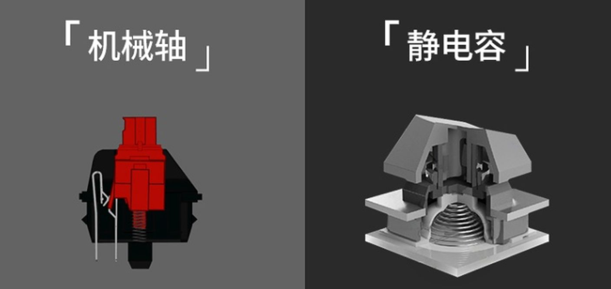
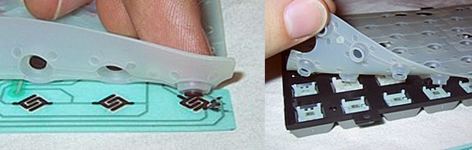
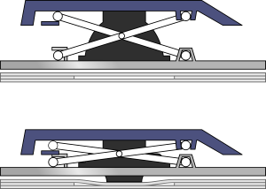

# 键盘技术概论

电脑键盘可以按照其按键开关所使用的技术进行分类。大部分电脑键盘有80到110个按键开关，其段落感、键程（输入字符所需的按键距离）因技术而异。种类上，键盘可分为静电容键盘、机械开关键盘（也就是常说的机械键盘）、薄膜键盘、霍尔效应键盘、光学键盘。这里主要对静电容键盘、机械开关和薄膜键盘进行说明。

## 机械开关键盘

机械键盘（英语：Mechanical Keyboard）是一种键盘的类型，每一个按键都由一个独立的微动开关（Switch，通称为“轴”）组成。机械键盘于薄膜键盘之前被发明，是世界上最早使用的键盘型式，随着PC的发明，机械键盘也随之引进做为PC的标准输入装置，其盛行期约在1980至1995年，随着橡胶帽薄膜键盘低制造成本与盛行，造价相对高昂的机械键盘逐渐被薄膜键盘所取代。目前市面上销售的机械键盘绝大多数使用Cherry公司的MX轴，在专利保护结束之后，开始有越来越多不同的轴体出现在市面上（如：凯华）。MX系列轴体常见的有茶轴、青轴、黑轴以及红轴四种，并有白轴、灰轴、绿轴等少见或停产轴体。

通常情况下，用户一般关注机械开关（轴体）的如下几种参数：

- cN (centi Newton)：百分之一牛顿或厘牛顿，也叫厘牛、克力；1N=100cN。  
- 触发：开关闭合，计算机接收到键盘电子信号。  
- 总行程：开关的轴芯(十字柱)完成整个运动过程的位移长度。  
- 触发行程：轴芯部分完成触发的位移长度。  
- 初始压力：外物下按开关在轴芯即将发生位移时受到的压力。  
- 触发压力：外物下按开关到触发时受到的压力。  
- 段落压力：外物下按开关到段落点时受到的压力。  
- 触底压力：外物下按开关到底部时受到的压力。  
- 触发声音：外物下按开关到触发时的声音。  

## 静电容键盘

静电容键盘（英文：Capacitive Keyboard），是一种键盘的类型，从触发原理来说。静电容键盘是利用电容容量的变化来判断按键的开和关，在按下按键后，开关中电容容量发生改变，从而实现触发，整个过程不需要开关的闭合。正是由于无物理接触点就可以实现敲击，因而磨损更小，使用寿命更长。更稳定、迅速、全键无冲突、无比灵敏。通常在大型医疗设备上能够见到也可作为比较昂贵的高端游戏外设。

静电容键盘是利用电容容量的变化来判断按键的开和关，在按下按键后，导电胶内的空气电容容量发生改变，从而实现触发，整个过程无物理接触点就可以实现敲击动作。根据检测与控制改变电容容量的方式，又可以分为平行式触发结构与垂直式触发结构。

在触发原理上，静电容键盘可以分为：

- 平行式  
    采用左右水平两个电极，利用装在键帽中的弹簧结构，随着敲击过程中弹簧的上下移动， 水平两个电极的距离也会改变，以此来检测电容值的变化。
- 垂直式  
    采用上下垂直两个电极，键帽中无弹簧结构，直接通过敲击过程中纵向间隙的空气层厚薄变化来改变电容值，以此判断键值，

传统的静电容键盘的内部有一个橡胶碗一样的结构，例如老牌的realforce。和薄膜键盘有些相似，但是它并不像薄膜键盘那样对按键起支撑作用，起支撑作用的其实是内部的锥形弹簧。既然是通过弹簧来支撑按键，那么只要调节弹簧的弹力，就能对按键压力进行调节了，这就是传统静电容键盘的另一个特性：分区压力。从图1我们可以看到，淡绿色部分的按键压力要轻一些，主要是对应小指的按键，这样点击起来更加轻松，在大量的文字录入时不会感到特别疲劳。

事实上，电容量式键盘的发展历史也很悠久。在早期曾经是大型键盘厂商想要对使用在打字机上的传统机械式开关键盘进行成本简化的一个方案。德国CHERRY美国Keytronic早在1980年代都有申请许多相关专利，其中Keytronic的电容量式曾经一度是该厂商的最高级键盘。Keytronic和Topre都有一个特点.这两家厂商都取得了相当多的碗型橡胶的专利。因为除了通过传统机械式键盘所使用的各种轴心，簧片机构来达成具确认感的触感之外。碗型橡胶是众多厂商想到最容易也最直接产生压力段落差的机构，而且容易大量生产造价低廉。因此keytronic将这些碗型橡胶专利使用在后来能大量生产的便宜薄膜式键盘上。也就成了许多传奇经典作品。

:::note
静电容键盘直到今天依然受到一部分用户群体的欢迎。
:::

## 薄膜键盘

薄膜键盘（英语：Membrane Keyboard）经常由三层组成。顶层薄膜由一个框架支撑，其底部涂有一些导电的材料。底层中有一些断开的导电材料。当顶层薄膜被按下导致两层接触时，电路被接通。最基本的平板薄膜键盘常见于微波炉、复印机等需要防水防尘的电器。

由于此类键盘没有段落感，这些电器多有按键音或按键灯提示。一些早期的个人电脑，如Sinclair ZX80、ZX81、Atari 400，也使用这类键盘。后来的薄膜键盘通过修改顶层薄膜的结构和机制，提高了键程和段落感。这些键盘使用一个带柄的吸盘按下顶层薄膜。

剪刀脚开关（英语：Scissor Switch）是在拱形开关的基础上增加了剪刀形机械支撑的键盘。

